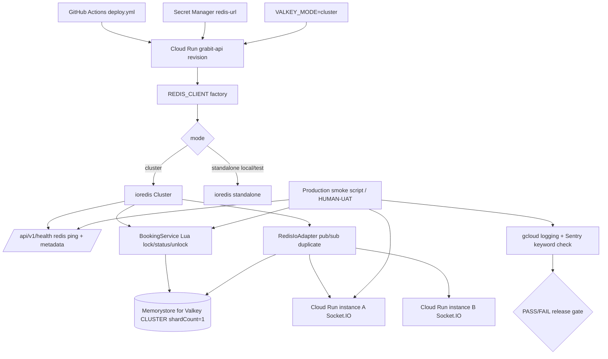

# Phase 20: Valkey Production Connectivity Contract - Research

**Researched:** 2026-04-30 [VERIFIED: system current date]
**Domain:** Cloud Run -> Google Memorystore for Valkey runtime contract, ioredis Cluster client selection, Socket.IO Redis adapter propagation, production smoke/UAT evidence [VERIFIED: .planning/phases/20-valkey-production-connectivity-contract/20-CONTEXT.md]
**Confidence:** HIGH for code/config/test/GCP shape; MEDIUM for production fixture execution until an operator supplies safe showtime/seat credentials [VERIFIED: local code audit + gcloud describe] [ASSUMED]

<user_constraints>
## User Constraints (from CONTEXT.md)

All content in this section is copied from `.planning/phases/20-valkey-production-connectivity-contract/20-CONTEXT.md` and constrains planning scope. [VERIFIED: .planning/phases/20-valkey-production-connectivity-contract/20-CONTEXT.md]

### Locked Decisions

## Implementation Decisions

### Production Mode Contract

- **D-01:** Production Valkey mode must be explicit and observable. The current implicit contract of `new IORedis(url)` is not enough for Phase 20 because the audit gap is specifically about whether production cluster-mode behavior is equivalent to local/testcontainer evidence.
- **D-02:** The planner should implement a deployment/runtime contract that declares or detects the expected mode (`standalone` vs `cluster`) and validates it against the live server. The exact shape is flexible (`REDIS_MODE`, `VALKEY_MODE`, startup probe, health detail, or smoke command), but a mismatch must fail the smoke and block release.
- **D-03:** Keep the Phase 7/17 production safety invariant: `NODE_ENV=production` with missing `REDIS_URL` must hard-fail. Production must never fall back to `InMemoryRedis`.
- **D-04:** Until Phase 20 evidence proves otherwise, treat Google Memorystore for Valkey as potentially cluster-mode even with `shard-count=1`. Multi-key Lua must continue to use explicit `KEYS` and shared hash tags.
- **D-05:** If the live probe shows the standalone ioredis client is not sufficient, scope the client change narrowly to the `REDIS_CLIENT` provider and tests. Do not require service-layer rewrites.

### Production Smoke Evidence

- **D-06:** Phase 20 must produce a repeatable production smoke procedure, not just code-level tests. Evidence should include command, timestamp, Cloud Run service/revision, target URL, sanitized output, and PASS/FAIL result.
- **D-07:** Required smoke truths are:
  1. `/api/v1/health` reports `redis` up on the deployed API revision.
  2. The production seat lock Lua path can lock, read status, and unlock or observe TTL expiry against the live Valkey backend.
  3. Socket.IO `seat-update` propagates through the Redis adapter across two API instances, not only within one process.
  4. A realistic idle/cold-start interval still reconnects successfully for health, lock, and pub/sub.
  5. Cloud Run and Sentry logs show no `CROSSSLOT`, `MOVED`, `ASK`, persistent `ECONNRESET`, or subscription failure during the smoke window.
- **D-08:** If private PSC networking prevents CI from performing the smoke, a human/operator artifact is acceptable and expected. The artifact must be concrete enough to close the audit's `human_needed` status.
- **D-09:** Do not write secrets, full `REDIS_URL`, phone numbers, payment data, JWTs, or private customer data into planning artifacts. Redact connection strings and any PII-like payloads.

### Socket.IO Multi-Instance Proof

- **D-10:** Multi-instance Socket.IO pub/sub propagation is a Phase 20 requirement. Existing unit tests for `RedisIoAdapter` are necessary but not sufficient.
- **D-11:** The smoke should force or observe at least two Cloud Run API instances for the propagation check. A temporary scale/traffic setup is acceptable if the runbook also restores the previous state.
- **D-12:** Do not permanently raise `min-instances` solely to make the test easier. The project constraint remains cost-minimized Cloud Run with scale-to-zero where possible.
- **D-13:** Production adapter failure must be visible. Local fallback to the default in-process adapter can remain for `InMemoryRedis`, but production should not silently run without Redis pub/sub when `REDIS_URL` is configured.

### Idle Reconnect And Rollback

- **D-14:** Idle reconnect validation should cover the path users actually depend on after Cloud Run idles or cold-starts: health ping, Lua lock path, and Socket.IO subscription path.
- **D-15:** The rollback checklist must cover revision rollback, `REDIS_URL`/mode contract rollback, `/health` verification, lock-path verification, Socket.IO smoke, and post-rollback log/Sentry checks.
- **D-16:** Failure modes to name explicitly in the checklist: startup hard-fail, health red, cluster mode mismatch, `CROSSSLOT`, `MOVED`/`ASK`, `ECONNRESET`, `ETIMEDOUT`, duplicate/subscriber connection loss, and persistent adapter fallback.

### Test Contract

- **D-17:** Preserve the Phase 14 cluster-mode testcontainers guard pattern for multi-key Lua/hash-tag behavior. Standalone Valkey containers alone do not prove cluster-mode safety.
- **D-18:** Add focused automated tests only for code introduced in this phase: mode parsing/probing, `REDIS_CLIENT` factory behavior, health metadata, adapter visibility, and smoke script formatting if applicable.
- **D-19:** Split verification cleanly: local/CI tests prove code contracts; production smoke proves Cloud Run -> Valkey runtime contracts.

### Scope Guardrails

- **D-20:** Do not change Phase 19's lock ownership decisions. Active per-seat Valkey ownership remains the source of truth for reservation/payment boundaries.
- **D-21:** Do not re-open Phase 7 migration scope unless production evidence shows the current client contract is wrong.
- **D-22:** Do not fold Phase 24 tech-debt items into Phase 20 unless they block the connectivity smoke. Cache `KEYS` invalidation and `getMyLocks()` TTL edge cases remain separate follow-ups.

### the agent's Discretion

- Exact environment variable names, probe endpoint shape, smoke command implementation, and artifact file names are flexible if they satisfy D-01 through D-19.
- The planner may choose whether the smoke is a Node script, documented CLI sequence, Playwright/socket harness, or a combination.
- The planner may decide whether to write `20-HUMAN-UAT.md`, extend `20-VERIFICATION.md`, or use both, as long as downstream audit evidence is concrete.

### Deferred Ideas (OUT OF SCOPE)

## Deferred Ideas

- Cache invalidation `KEYS` -> `SCAN` or indexed invalidation for large keyspaces. This is already tracked as tech debt and should not be pulled into Phase 20 unless it blocks the smoke.
- `getMyLocks()` TTL/null edge hardening if not directly needed for the production smoke.
- Permanent Cloud Run `min-instances` changes for traffic readiness.
- Queueing/waiting-room or high-traffic admission control.
- Re-provisioning or renaming the existing Memorystore Valkey instance for brand cleanup.
</user_constraints>

## Summary

Phase 20 should be planned as a narrow runtime-contract phase, not as a broad Valkey rewrite. The existing API already centralizes Valkey access through `REDIS_CLIENT`, exposes `/api/v1/health`, uses hash-tagged booking Lua keys, and wires Socket.IO through `RedisIoAdapter`; the missing work is making production mode explicit, using the right client shape for the verified live Memorystore mode, and leaving deployable smoke evidence. [VERIFIED: apps/api/src/modules/booking/providers/redis.provider.ts] [VERIFIED: apps/api/src/health/redis.health.indicator.ts] [VERIFIED: apps/api/src/modules/booking/booking.service.ts] [VERIFIED: apps/api/src/modules/booking/providers/redis-io.adapter.ts]

The live GCP target currently reports `grabit-valkey` as `ACTIVE`, `MODE=CLUSTER`, `SHARD_COUNT=1`, `ENGINE_VERSION=VALKEY_8_0`; the live `grabit-api` Cloud Run service is on revision `grabit-api-00022-drz`, has `REDIS_URL` bound from Secret Manager, and has Direct VPC egress annotations for `default/default` with `private-ranges-only`. [VERIFIED: gcloud memorystore instances list --location=asia-northeast3] [VERIFIED: gcloud run services describe grabit-api --region=asia-northeast3]

**Primary recommendation:** Add `VALKEY_MODE=cluster` as the production deployment contract, switch only `REDIS_CLIENT` to create `new Cluster([{ host, port }], ...)` when that mode is selected, expose sanitized mode/client metadata through health or smoke output, keep local/test standalone and `InMemoryRedis` behavior unchanged, and require a production smoke artifact proving health, Lua lock/status/unlock, two-instance Socket.IO propagation, idle reconnect, and clean logs. [VERIFIED: gcloud memorystore CLUSTER mode] [CITED: Context7 /redis/ioredis Cluster docs] [CITED: https://socket.io/docs/v4/redis-adapter/]

## Architectural Responsibility Map

| Capability | Primary Tier | Secondary Tier | Rationale |
|------------|--------------|----------------|-----------|
| Valkey mode declaration | API / Backend | Cloud Run Deployment | The API selects `IORedis` vs `Cluster`, while Cloud Run injects `VALKEY_MODE` and `REDIS_URL`. [VERIFIED: apps/api/src/modules/booking/providers/redis.provider.ts] [VERIFIED: .github/workflows/deploy.yml] |
| Live Memorystore mode validation | Cloud Run / Operations | Database / Storage | The smoke can compare `gcloud memorystore` mode with API health metadata without granting the app GCP admin APIs. [VERIFIED: gcloud memorystore instances list] |
| VPC egress contract | Cloud Run / Infrastructure | API / Backend | Networking is owned by Cloud Run flags and verified by `/api/v1/health` ping from the deployed revision. [VERIFIED: .github/workflows/deploy.yml] [CITED: https://docs.cloud.google.com/run/docs/configuring/vpc-direct-vpc] |
| Lua seat lock path | API / Backend | Database / Storage | `BookingService` owns lock/status/unlock behavior; Valkey provides atomic EVAL and TTL state. [VERIFIED: apps/api/src/modules/booking/booking.service.ts] |
| Socket.IO `seat-update` propagation | API / Backend | Valkey pub/sub, Browser clients | `BookingGateway` emits room events and `RedisIoAdapter` distributes them between API instances through Redis adapter pub/sub. [VERIFIED: apps/api/src/modules/booking/booking.gateway.ts] [CITED: https://socket.io/docs/v4/redis-adapter/] |
| Idle reconnect evidence | Cloud Run / Operations | API / Backend | Only a deployed revision after idle/cold-start can prove the health, Lua, and subscription paths recover under production networking. [VERIFIED: .planning/phases/07-valkey/07-VERIFICATION.md] |
| Redacted evidence and rollback | Operations / Docs | API logging | Planning artifacts must record revision, command, PASS/FAIL, and sanitized output without secrets or customer data. [VERIFIED: .planning/phases/20-valkey-production-connectivity-contract/20-CONTEXT.md] |

## Project Constraints (from AGENTS.md)

- Responses and project-facing explanations should be Korean while keeping technical terms and code identifiers in English. [VERIFIED: user-provided AGENTS.md instructions]
- Grabit's core value is a stable discovery -> seat selection -> booking completion flow; seat locking reliability is service-critical. [VERIFIED: AGENTS.md]
- The project is one-person development, so plans should minimize complexity and prefer the existing modular monolith over distributed rewrites. [VERIFIED: AGENTS.md]
- The stack is fixed by project architecture: NestJS 11, ioredis, Socket.IO, Cloud Run, and Google Cloud Seoul region. [VERIFIED: AGENTS.md] [VERIFIED: apps/api/package.json]
- Cloud Run is cost-minimized with `min-instances=0` where possible; Phase 20 may temporarily scale for smoke but must restore state. [VERIFIED: AGENTS.md] [VERIFIED: .planning/phases/20-valkey-production-connectivity-contract/20-CONTEXT.md]
- `.env` belongs at the monorepo root for local development, while Cloud Run production receives variables/secrets through Cloud Run/Secret Manager, not `.env`. [VERIFIED: AGENTS.md]
- Direct repo edits outside GSD workflow are disallowed; this `20-RESEARCH.md` is the GSD research artifact requested by the phase workflow. [VERIFIED: AGENTS.md]

<phase_requirements>
## Phase Requirements

| ID | Description | Research Support |
|----|-------------|------------------|
| VALK-02 | Google Memorystore for Valkey provisioning with PSC + Direct VPC Egress. [VERIFIED: .planning/REQUIREMENTS.md] | Live `grabit-valkey` exists in `asia-northeast3` as `ACTIVE CLUSTER shardCount=1`; deploy workflow already sets Cloud Run network/subnet/vpc-egress. [VERIFIED: gcloud memorystore instances list] [VERIFIED: .github/workflows/deploy.yml] |
| VALK-03 | Seat lock Lua script Valkey compatibility verified/fixed. [VERIFIED: .planning/REQUIREMENTS.md] | Existing standalone Valkey integration exists; Phase 20 should add a booking Lua cluster-mode integration using the Phase 14 single-shard cluster pattern and production smoke lock/status/unlock; Valkey's EVAL docs require scripts to receive all accessed key names through key arguments for standalone and clustered deployments. [VERIFIED: apps/api/src/modules/booking/__tests__/booking.service.integration.spec.ts] [VERIFIED: apps/api/test/sms-cluster-crossslot.integration.spec.ts] [CITED: https://valkey.io/commands/eval/] |
| VALK-04 | Socket.IO Redis adapter with ioredis Valkey pub/sub works. [VERIFIED: .planning/REQUIREMENTS.md] | Existing adapter duplicates the ioredis client and has unit tests; Phase 20 must add production two-instance propagation evidence. [VERIFIED: apps/api/src/modules/booking/providers/redis-io.adapter.ts] [VERIFIED: apps/api/src/modules/booking/__tests__/redis-io.adapter.spec.ts] |
| VALK-05 | Cloud Run -> Valkey VPC networking setup. [VERIFIED: .planning/REQUIREMENTS.md] | Deploy annotations and secret binding exist; `/api/v1/health` ping and idle reconnect smoke close the runtime gap. [VERIFIED: gcloud run services describe grabit-api] [VERIFIED: apps/api/src/health/health.controller.ts] |
| SC-1 | Audit-linked success criterion affected by Cloud Run -> Valkey runtime proof; Phase 14 defines SC-1 as production real-device SMS success, but Phase 20 should close only the shared Valkey runtime portion. [VERIFIED: .planning/phases/14-sms-otp-crossslot-fix-sms-valkey-cluster-hash-tag/14-CONTEXT.md] [VERIFIED: .planning/v1.1-MILESTONE-AUDIT.md] | Validate production Valkey Cluster health/log cleanliness; do not reopen SMS UI unless the smoke exposes Valkey runtime failure. [VERIFIED: .planning/phases/20-valkey-production-connectivity-contract/20-CONTEXT.md] |
| SC-2 | Audit-linked cluster-mode Valkey guard criterion. [VERIFIED: .planning/phases/14-sms-otp-crossslot-fix-sms-valkey-cluster-hash-tag/14-CONTEXT.md] | Reuse the single-shard `valkey/valkey:8` + `IORedis.Cluster` pattern for booking Lua keys, including same-slot proof and `CROSSSLOT` negative guard where useful. [VERIFIED: apps/api/test/sms-cluster-crossslot.integration.spec.ts] |
| SC-3 | Audit-linked test green criterion. [VERIFIED: .planning/phases/14-sms-otp-crossslot-fix-sms-valkey-cluster-hash-tag/14-CONTEXT.md] | Add focused Vitest unit/integration coverage for mode parsing, provider, health metadata, adapter production visibility, and smoke formatting. [VERIFIED: apps/api/package.json] |
| SC-4 | Audit-linked user-visible/system-error distinction criterion. [VERIFIED: .planning/phases/14-sms-otp-crossslot-fix-sms-valkey-cluster-hash-tag/14-CONTEXT.md] | Phase 20 should satisfy this through sanitized operator artifacts and log checks for Valkey failure keywords; no frontend phone-verification changes are in Phase 20 scope. [VERIFIED: .planning/phases/20-valkey-production-connectivity-contract/20-CONTEXT.md] |
</phase_requirements>

## Standard Stack

### Core

| Library / Service | Version | Purpose | Why Standard |
|-------------------|---------|---------|--------------|
| `ioredis` | 5.10.1, published 2026-03-19 | TCP Valkey client, standalone and Cluster client. | Project already uses it; Socket.IO Redis adapter has official ioredis examples; Context7 confirms `Cluster` constructor and `clusterRetryStrategy`. [VERIFIED: npm view ioredis version] [VERIFIED: apps/api/package.json] [CITED: Context7 /redis/ioredis] |
| `@socket.io/redis-adapter` | 8.3.0, published 2024-03-13 | Multi-instance Socket.IO pub/sub adapter. | Official adapter pattern uses pub/sub clients with `duplicate()` and supports ioredis/Cluster examples. [VERIFIED: npm view @socket.io/redis-adapter version] [CITED: https://socket.io/docs/v4/redis-adapter/] |
| `socket.io` | 4.8.3, published 2025-12-23 | API WebSocket server for booking namespace. | Existing Nest gateway uses Socket.IO; Cloud Run WebSockets require external pub/sub when instances scale. [VERIFIED: npm view socket.io version] [VERIFIED: apps/api/package.json] [CITED: https://docs.cloud.google.com/run/docs/triggering/websockets] |
| `@nestjs/terminus` | 11.1.1 current, project range `^11.1.0` | Health endpoint and custom Redis indicator. | Terminus v11 custom indicator API is already used and documented through `HealthIndicatorService.check().up()/down()`. [VERIFIED: npm view @nestjs/terminus version] [VERIFIED: apps/api/src/health/redis.health.indicator.ts] [CITED: Context7 /nestjs/docs.nestjs.com] |
| Google Cloud Run | Managed service | Runs `grabit-api` with VPC egress and Secret Manager env injection. | Existing deploy workflow owns the production runtime contract and live service metadata is available through `gcloud run services describe`. [VERIFIED: .github/workflows/deploy.yml] [VERIFIED: gcloud run services describe] |
| Google Memorystore for Valkey | VALKEY_8_0 | Production Valkey backend. | Live instance is `ACTIVE CLUSTER shardCount=1`; Phase 20 must plan against cluster mode rather than standalone assumptions. [VERIFIED: gcloud memorystore instances list] |

### Supporting

| Library / Tool | Version | Purpose | When to Use |
|----------------|---------|---------|-------------|
| `testcontainers` | 11.14.0, published 2026-04-08 | Valkey cluster-mode integration tests. | Use for CI/local cluster guard mirroring Phase 14, not default fast tests. [VERIFIED: npm view testcontainers version] [VERIFIED: apps/api/test/sms-cluster-crossslot.integration.spec.ts] |
| `vitest` | 3.2.4 resolved | Unit and integration test runner. | Use `vitest.config.ts` for fast unit tests and `vitest.integration.config.ts` for Docker-backed Valkey tests. [VERIFIED: pnpm --filter @grabit/api list vitest --depth 0] [VERIFIED: apps/api/vitest.integration.config.ts] |
| `socket.io-client` | 4.8.3 in web app | Production smoke Socket.IO client. | Use for operator smoke if writing a Node/Web harness that joins `/booking` and observes `seat-update`. [VERIFIED: apps/web/package.json] |
| `gcloud` CLI | 564.0.0 installed | Deployment/runtime evidence collection. | Use for Memorystore mode, Cloud Run revision, VPC annotations, temporary scaling, rollback, and log checks. [VERIFIED: gcloud --version] |
| `gh` CLI | 2.89.0 installed | Optional PR/workflow evidence lookup. | Use only if the smoke artifact wants GitHub Actions status links. [VERIFIED: gh --version] |

### Alternatives Considered

| Instead of | Could Use | Tradeoff |
|------------|-----------|----------|
| `ioredis.Cluster` for production `cluster` mode | Existing `new IORedis(url)` standalone client | Live Memorystore mode is `CLUSTER`; relying on standalone behavior would leave the original audit gap unresolved. [VERIFIED: gcloud memorystore instances list] [CITED: Context7 /redis/ioredis] |
| Socket.IO Redis adapter | Hand-built Redis pub/sub relay | The official adapter already handles inter-server broadcast semantics; custom relay would duplicate hard failure modes. [CITED: https://socket.io/docs/v4/redis-adapter/] |
| App-level production smoke | `valkey-cli` from local machine | `valkey-cli` is not installed and PSC/private endpoint is not generally reachable from local/CI; app-level smoke proves the user path through Cloud Run. [VERIFIED: valkey-cli not found] [VERIFIED: .planning/phases/07-valkey/07-VERIFICATION.md] |
| Permanent `min-instances=2` | Temporary scaling for smoke | Project constraints require cost-minimized scale-to-zero; temporary scale plus restoration satisfies multi-instance proof without changing steady state. [VERIFIED: AGENTS.md] [VERIFIED: 20-CONTEXT.md] |

**Installation:**
```bash
# No new runtime package is required if the smoke uses existing app dependencies.
# If the smoke script lives under apps/api and imports socket.io-client directly:
pnpm --filter @grabit/api add -D socket.io-client@4.8.3
```
[VERIFIED: apps/web/package.json already has socket.io-client] [ASSUMED]

**Version verification:** `npm view` verified `ioredis@5.10.1`, `@socket.io/redis-adapter@8.3.0`, `socket.io@4.8.3`, `@nestjs/terminus@11.1.1`, and `testcontainers@11.14.0` on 2026-04-30. [VERIFIED: npm view commands]

## Architecture Patterns

### System Architecture Diagram


[VERIFIED: local code audit] [VERIFIED: gcloud live metadata] [CITED: Socket.IO Redis adapter docs]

### Recommended Project Structure

```text
apps/api/src/config/redis.config.ts                         # add explicit mode, redacted config metadata [VERIFIED: existing file]
apps/api/src/modules/booking/providers/redis.provider.ts    # create standalone vs Cluster client [VERIFIED: existing file]
apps/api/src/health/redis.health.indicator.ts               # ping plus sanitized mode/client metadata [VERIFIED: existing file]
apps/api/src/modules/booking/providers/redis-io.adapter.ts  # production adapter failure visibility [VERIFIED: existing file]
apps/api/src/main.ts                                        # bootstrap hard-fail when production adapter is not wired [VERIFIED: existing file]
apps/api/test/booking-cluster-lua.integration.spec.ts       # new cluster-mode booking Lua guard [ASSUMED]
scripts/smoke-valkey-production.mjs                         # optional operator smoke harness [ASSUMED]
.planning/phases/20-valkey-production-connectivity-contract/20-HUMAN-UAT.md # production evidence artifact [ASSUMED]
```

### Pattern 1: Explicit `VALKEY_MODE` Contract

**What:** Add a typed mode enum, default local/test to `standalone`, require production to set an explicit mode, and set production to `cluster` because the live Memorystore instance is verified as `CLUSTER`. [VERIFIED: gcloud memorystore instances list] [VERIFIED: redis.config.ts current shape]

**When to use:** Use for all production Cloud Run revisions and any smoke target; local development can keep `standalone`/`InMemoryRedis` to avoid forcing local Valkey. [VERIFIED: 20-CONTEXT.md]

**Example:**
```typescript
// Source: project pattern + Context7 ioredis Cluster docs
export type ValkeyMode = 'standalone' | 'cluster';

export const redisConfig = registerAs('redis', () => ({
  url: process.env['REDIS_URL'] ?? '',
  mode: process.env['VALKEY_MODE'] as ValkeyMode | undefined,
}));
```
[VERIFIED: apps/api/src/config/redis.config.ts] [CITED: Context7 /redis/ioredis]

### Pattern 2: Keep the Client Switch Inside `REDIS_CLIENT`

**What:** Parse `REDIS_URL` once, redact it for errors/logs, and create `new Cluster([{ host, port }], { lazyConnect, redisOptions })` only when `VALKEY_MODE=cluster`. [CITED: Context7 /redis/ioredis]

**When to use:** Use for Phase 20 because all booking, cache, health, and Socket.IO code already reaches Valkey through the provider symbol. [VERIFIED: apps/api/src/modules/booking/providers/redis.provider.ts]

**Example:**
```typescript
// Source: Context7 /redis/ioredis Cluster Constructor
import IORedis, { Cluster } from 'ioredis';

function createRedisClient(url: string, mode: 'standalone' | 'cluster') {
  const parsed = new URL(url);
  if (mode === 'cluster') {
    return new Cluster([{ host: parsed.hostname, port: Number(parsed.port || 6379) }], {
      lazyConnect: true,
      redisOptions: { maxRetriesPerRequest: 3 },
      clusterRetryStrategy: (times) => (times > 5 ? null : Math.min(times * 500, 5000)),
    });
  }

  return new IORedis(url, {
    lazyConnect: true,
    maxRetriesPerRequest: 3,
    retryStrategy: (times) => (times > 5 ? null : Math.min(times * 500, 5000)),
  });
}
```
[CITED: Context7 /redis/ioredis] [VERIFIED: existing retry options in redis.provider.ts]

### Pattern 3: Production Adapter Failure Must Abort Startup

**What:** Preserve local fallback for `InMemoryRedis`, but fail production bootstrap if `RedisIoAdapter.connectToRedis()` returns false or adapter setup throws. [VERIFIED: 20-CONTEXT.md] [VERIFIED: apps/api/src/main.ts]

**When to use:** Use in `main.ts` because that is where the adapter is wired and production startup already hard-fails invalid `FRONTEND_URL`. [VERIFIED: apps/api/src/main.ts]

**Example:**
```typescript
// Source: existing RedisIoAdapter boolean contract
const redisPubSubReady = redisIoAdapter.connectToRedis();
if (process.env['NODE_ENV'] === 'production' && !redisPubSubReady) {
  throw new Error('[redis] Socket.IO Redis adapter is required in production.');
}
app.useWebSocketAdapter(redisIoAdapter);
```
[VERIFIED: apps/api/src/modules/booking/providers/redis-io.adapter.ts] [VERIFIED: apps/api/src/main.ts]

### Pattern 4: Cluster-Mode Lua Guard Mirrors Phase 14

**What:** Use `valkey/valkey:8`, `--cluster-enabled yes`, `CLUSTER ADDSLOTSRANGE 0 16383`, dynamic `natMap`, and `IORedis.Cluster` to run booking Lua against a single-shard cluster. [VERIFIED: apps/api/test/sms-cluster-crossslot.integration.spec.ts]

**When to use:** Use for `BookingService.lockSeat`, `getSeatStatus`, `unlockSeat`, and Phase 19 ownership helpers because standalone Valkey tests do not prove cluster hash-slot safety. [VERIFIED: apps/api/src/modules/booking/__tests__/booking.service.integration.spec.ts] [VERIFIED: 20-CONTEXT.md]

### Anti-Patterns to Avoid

- **Implicit production mode:** Do not rely on `new IORedis(url)` as a production CLUSTER contract; live GCP says the instance mode is `CLUSTER`. [VERIFIED: gcloud memorystore instances list]
- **Silent production in-process Socket.IO:** Do not allow production to continue when Redis adapter wiring returns false. [VERIFIED: 20-CONTEXT.md]
- **Standalone-only Lua validation:** Do not treat `valkey/valkey:8-alpine` standalone tests as enough for cluster-mode multi-key EVAL. [VERIFIED: 14-CONTEXT.md] [VERIFIED: 14-VERIFICATION.md]
- **Full connection string evidence:** Do not write `REDIS_URL`, Secret Manager values, JWTs, cookies, phone numbers, or payment data into artifacts. [VERIFIED: 20-CONTEXT.md]
- **Permanent scale changes for proof:** Do not leave `min-instances` elevated after propagation smoke. [VERIFIED: AGENTS.md] [VERIFIED: 20-CONTEXT.md]

## Don't Hand-Roll

| Problem | Don't Build | Use Instead | Why |
|---------|-------------|-------------|-----|
| Redis Cluster routing | Custom slot map, manual `MOVED`/`ASK` retry logic | `ioredis.Cluster` | ioredis already owns cluster startup nodes, retry strategy, and pub/sub client behavior. [CITED: Context7 /redis/ioredis] |
| Socket.IO inter-instance propagation | Custom Redis channel relay | `@socket.io/redis-adapter` | The official adapter broadcasts packets between Socket.IO servers with pub/sub clients. [CITED: https://socket.io/docs/v4/redis-adapter/] |
| Production Valkey proof | Raw local `valkey-cli` tests | App-level Cloud Run smoke through `/health`, booking endpoints, and Socket.IO | PSC/private endpoint and Cloud Run networking are exactly what must be proven. [VERIFIED: 07-VERIFICATION.md] |
| Health framework | Custom Express `/health` JSON path | Existing NestJS Terminus controller and `RedisHealthIndicator` | The project already uses Terminus v11 patterns. [VERIFIED: apps/api/src/health/health.controller.ts] [CITED: Context7 /nestjs/docs.nestjs.com] |
| Cluster Lua safety | Ad hoc string/key grep only | Testcontainers cluster guard with hash-tagged keys | Phase 14 already found standalone tests can miss `CROSSSLOT`; Valkey EVAL docs require all accessed keys to be explicit key arguments for clustered correctness. [VERIFIED: 14-CONTEXT.md] [CITED: https://valkey.io/commands/eval/] |

**Key insight:** The hard part is not connecting to Redis; it is proving that the deployed Cloud Run revision, private VPC egress, cluster client mode, Lua key slotting, and Socket.IO pub/sub all work together under real production constraints. [VERIFIED: v1.1-MILESTONE-AUDIT.md] [VERIFIED: 20-CONTEXT.md]

## Common Pitfalls

### Pitfall 1: Single-Shard Does Not Mean Standalone

**What goes wrong:** A `shard-count=1` Memorystore instance is treated like standalone Redis, so local tests pass while production can still expose cluster routing semantics and single-hash-slot constraints for multi-key commands. [VERIFIED: scripts/provision-valkey.sh] [VERIFIED: gcloud memorystore instances list] [CITED: https://docs.cloud.google.com/memorystore/docs/valkey/cluster-mode-enabled-and-disabled]
**Why it happens:** Developers conflate topology size with server mode. [VERIFIED: 07-VERIFICATION.md]
**How to avoid:** Set `VALKEY_MODE=cluster` in production and instantiate `ioredis.Cluster`. [VERIFIED: gcloud memorystore CLUSTER mode] [CITED: Context7 /redis/ioredis]
**Warning signs:** `MOVED`, `ASK`, `CROSSSLOT`, or unexplained subscription behavior in Cloud Run logs. [VERIFIED: 20-CONTEXT.md]

### Pitfall 2: Health Ping Proves Less Than the User Path

**What goes wrong:** `/health` returns up, but Lua lock/status/unlock or Socket.IO pub/sub fails. [VERIFIED: 20-CONTEXT.md]
**Why it happens:** `PING` uses a simpler command path than multi-key EVAL and pub/sub subscriptions. [VERIFIED: apps/api/src/health/redis.health.indicator.ts] [VERIFIED: apps/api/src/modules/booking/booking.service.ts]
**How to avoid:** Require three smoke paths: health ping, real booking Lua path, and Socket.IO `seat-update` propagation. [VERIFIED: 20-CONTEXT.md]
**Warning signs:** Green `/health` with `CROSSSLOT`, missed `seat-update`, or lock conflicts in app logs. [VERIFIED: 20-CONTEXT.md]

### Pitfall 3: Production Adapter Fallback Is Easy To Miss

**What goes wrong:** `RedisIoAdapter` returns false and the app silently runs the default in-process adapter, so only same-instance clients get updates. [VERIFIED: apps/api/src/modules/booking/providers/redis-io.adapter.ts]
**Why it happens:** The current `main.ts` calls `connectToRedis()` but ignores the boolean result. [VERIFIED: apps/api/src/main.ts]
**How to avoid:** Make production bootstrap fail when adapter wiring fails. [VERIFIED: 20-CONTEXT.md]
**Warning signs:** Local tests pass, but two Cloud Run instances do not share `seat-update` events. [VERIFIED: 07-VERIFICATION.md]

### Pitfall 4: Two Socket Clients Do Not Guarantee Two Instances

**What goes wrong:** The smoke connects two clients but both land on one Cloud Run instance, so propagation is not proven. [VERIFIED: 20-CONTEXT.md]
**Why it happens:** Cloud Run session affinity is enabled and load balancing is not deterministic from the client side. [VERIFIED: gcloud run services describe grabit-api]
**How to avoid:** Temporarily force or observe at least two instances, record pre-state, scale/restore explicitly, and correlate logs by smoke ID plus revision/window. [VERIFIED: 20-CONTEXT.md] [ASSUMED]
**Warning signs:** No evidence of two distinct serving instances or all events visible only in one log stream. [ASSUMED]

### Pitfall 5: Evidence Artifacts Leak Secrets

**What goes wrong:** `REDIS_URL`, auth cookies, JWTs, phone numbers, or customer seat data enter `20-HUMAN-UAT.md`/`20-VERIFICATION.md`. [VERIFIED: 20-CONTEXT.md]
**Why it happens:** Production smoke commands often print full env, HTTP headers, or raw request bodies. [ASSUMED]
**How to avoid:** Redact env values, use synthetic fixture data, and store only command shape, timestamps, revision IDs, PASS/FAIL, and sanitized JSON. [VERIFIED: 20-CONTEXT.md]
**Warning signs:** Artifact contains `redis://`, `Authorization:`, `Cookie:`, phone numbers, or payment identifiers. [VERIFIED: 20-CONTEXT.md]

## Code Examples

Verified patterns from official and project sources:

### Socket.IO Redis Adapter With ioredis Cluster

```typescript
// Source: Socket.IO Redis adapter docs + project RedisIoAdapter shape
import { createAdapter } from '@socket.io/redis-adapter';
import { Cluster } from 'ioredis';

const pubClient = new Cluster([{ host: '127.0.0.1', port: 6379 }]);
const subClient = pubClient.duplicate({
  maxRetriesPerRequest: null,
  enableReadyCheck: false,
});

server.adapter(createAdapter(pubClient, subClient));
```
[CITED: https://socket.io/docs/v4/redis-adapter/] [VERIFIED: apps/api/src/modules/booking/providers/redis-io.adapter.ts]

### Sanitized Production Smoke Artifact Shape

```json
{
  "phase": 20,
  "timestamp_kst": "2026-04-30T14:30:00+09:00",
  "api_service": "grabit-api",
  "revision": "grabit-api-00022-drz",
  "valkey": { "instance": "grabit-valkey", "mode": "CLUSTER", "shardCount": 1 },
  "cloud_run": {
    "vpc_egress": "private-ranges-only",
    "network": "default",
    "subnet": "default",
    "redis_url": "secret:redis-url:latest"
  },
  "checks": {
    "health_redis": "PASS",
    "lua_lock_status_unlock": "PASS",
    "socketio_two_instance_propagation": "PASS",
    "idle_reconnect": "PASS",
    "logs_failure_keywords": "PASS"
  },
  "redactions": ["REDIS_URL", "Authorization", "Cookie", "JWT", "phone", "payment"]
}
```
[VERIFIED: 20-CONTEXT.md] [VERIFIED: gcloud run services describe] [ASSUMED: exact artifact filename]

### Cluster Integration Test Bootstrap Pattern

```typescript
// Source: apps/api/test/sms-cluster-crossslot.integration.spec.ts
container = await new GenericContainer('valkey/valkey:8')
  .withExposedPorts(6379)
  .withCommand([
    'valkey-server',
    '--port', '6379',
    '--cluster-enabled', 'yes',
    '--cluster-config-file', 'nodes.conf',
    '--cluster-node-timeout', '5000',
    '--appendonly', 'no',
    '--cluster-require-full-coverage', 'no',
  ])
  .start();

await boot.call('CONFIG', 'SET', 'cluster-announce-ip', host);
await boot.call('CONFIG', 'SET', 'cluster-announce-port', String(port));
await boot.call('CLUSTER', 'ADDSLOTSRANGE', '0', '16383');
```
[VERIFIED: apps/api/test/sms-cluster-crossslot.integration.spec.ts]

## State of the Art

| Old Approach | Current Approach | When Changed / Verified | Impact |
|--------------|------------------|--------------------------|--------|
| Standalone `new IORedis(url)` as implicit production contract | Explicit mode contract plus `ioredis.Cluster` for verified `CLUSTER` Memorystore | Verified live on 2026-04-30 via `gcloud memorystore instances list` | Removes ambiguity around `MOVED`/`ASK`/cluster routing. [VERIFIED: gcloud memorystore instances list] |
| Standalone-only Valkey testcontainers | Single-shard cluster-mode testcontainers guard | Phase 14 implemented and verified on 2026-04-24 | Prevents multi-key Lua hash-slot regressions. [VERIFIED: 14-VERIFICATION.md] |
| Health checks without Redis ping | Terminus custom Redis health indicator | Phase 7/17 existing code | `/api/v1/health` can surface Valkey connectivity degradation. [VERIFIED: 07-VERIFICATION.md] |
| Socket.IO default in-process adapter | `@socket.io/redis-adapter` with duplicated ioredis client | Phase 7 existing code | Required for multi-instance Cloud Run propagation. [VERIFIED: 07-VERIFICATION.md] |
| Vague human-needed runtime notes | Timestamped command/revision/sanitized PASS-FAIL artifact | Required by Phase 20 | Converts audit gap into concrete release evidence. [VERIFIED: 20-CONTEXT.md] |

**Deprecated/outdated:**
- Treating `UPSTASH_REDIS_REST_URL`/`UPSTASH_REDIS_REST_TOKEN` as part of production Valkey contract is outdated for this phase because `REDIS_URL` is the deployed secret and `REDIS_CLIENT` is ioredis-based. [VERIFIED: .github/workflows/deploy.yml] [VERIFIED: apps/api/src/modules/booking/providers/redis.provider.ts]
- Treating `@tosspayments` or booking/payment ownership as Phase 20 scope is out of date; Phase 19 owns lock ownership boundaries and Phase 20 must not change them. [VERIFIED: 19-CONTEXT.md] [VERIFIED: 20-CONTEXT.md]

## Assumptions Log

| # | Claim | Section | Risk if Wrong |
|---|-------|---------|---------------|
| A1 | The production smoke can use a dedicated non-customer showtime/seat fixture or operator-supplied fixture. [ASSUMED] | Summary, Validation Architecture | Without a safe fixture, lock/status/unlock smoke cannot be automated without risking customer data or live inventory. |
| A2 | Two-instance proof can be established through temporary scaling plus Cloud Logging correlation by smoke ID/revision/window. [ASSUMED] | Common Pitfalls, Validation Architecture | If Cloud Run logs do not expose enough instance-level distinction, the planner may need a tiny sanitized instance marker in logs/health. |
| A3 | `20-HUMAN-UAT.md` is the best artifact name for operator smoke evidence. [ASSUMED] | Code Examples, Validation Architecture | The planner may instead extend `20-VERIFICATION.md`; requirement is evidence shape, not filename. |
| A4 | If a smoke harness imports `socket.io-client` from `apps/api`, adding a devDependency is acceptable. [ASSUMED] | Standard Stack | If dependency churn is rejected, place the harness under an existing package that already has `socket.io-client` or use a documented manual socket tool. |

## Open Questions

1. **Which safe production fixture should lock smoke use?**
   - What we know: Booking lock endpoints require auth and a valid showtime/seat; smoke must not use customer data. [VERIFIED: booking.controller.ts] [VERIFIED: 20-CONTEXT.md]
   - What's unclear: The repo does not identify a dedicated production smoke showtime/seat. [VERIFIED: local search]
   - Recommendation: Planner should add a required operator input or a safe seed/admin fixture step before production smoke. [ASSUMED]

2. **Should the app expose instance identity for two-instance proof?**
   - What we know: Cloud Run revision and logs are available; session affinity is enabled. [VERIFIED: gcloud run services describe]
   - What's unclear: Whether existing logs are enough to prove two distinct serving instances received/joined/published during the smoke. [ASSUMED]
   - Recommendation: Prefer log correlation first; add a sanitized smoke-only log field if evidence is otherwise ambiguous. [ASSUMED]

3. **Should mode mismatch fail at startup or only in smoke?**
   - What we know: Phase 20 requires mismatch to fail smoke/block release; production missing `REDIS_URL` already startup-fails. [VERIFIED: 20-CONTEXT.md] [VERIFIED: redis.provider.ts]
   - What's unclear: Whether live mode can be reliably detected from inside the app without GCP APIs or extra `INFO` cost. [ASSUMED]
   - Recommendation: Startup-fail missing/invalid `VALKEY_MODE`; smoke-fail mismatch between `gcloud memorystore` mode and health/client metadata. [ASSUMED]

## Environment Availability

| Dependency | Required By | Available | Version / Status | Fallback |
|------------|-------------|-----------|------------------|----------|
| Node.js | Local tests/scripts | yes | v25.9.0 local; project CI uses Node 22 in deploy workflow. [VERIFIED: node --version] [VERIFIED: .github/workflows/deploy.yml] | Use CI/Volta/mise Node 22 for release parity. |
| pnpm | Monorepo commands | yes | 10.28.1. [VERIFIED: pnpm --version] | none needed |
| Docker | Testcontainers cluster integration | yes | 29.1.3. [VERIFIED: docker info] | If unavailable in a runner, mark integration smoke human-needed. |
| gcloud CLI | GCP runtime evidence | yes | 564.0.0. [VERIFIED: gcloud --version] | Cloud Console screenshots/manual output, but CLI is preferred. |
| gh CLI | Optional workflow evidence | yes | 2.89.0. [VERIFIED: gh --version] | GitHub web UI. |
| valkey-cli | Direct Valkey probing | no | not found. [VERIFIED: command -v valkey-cli] | Use app-level smoke through Cloud Run and ioredis/testcontainers. |
| Google Memorystore `grabit-valkey` | Production Valkey | yes | `ACTIVE CLUSTER shardCount=1 VALKEY_8_0`. [VERIFIED: gcloud memorystore instances list] | none for production contract |
| Cloud Run `grabit-api` | Production smoke target | yes | latest ready revision `grabit-api-00022-drz`; 100% traffic to latest; `REDIS_URL` secret bound. [VERIFIED: gcloud run services describe] | none for production contract |

**Missing dependencies with no fallback:**
- None for planning. Production smoke still needs operator auth/fixture inputs. [ASSUMED]

**Missing dependencies with fallback:**
- `valkey-cli` is missing; use app-level smoke and `ioredis.Cluster` testcontainers instead. [VERIFIED: valkey-cli not found]

## Validation Architecture

### Test Framework

| Property | Value |
|----------|-------|
| Framework | Vitest 3.2.4 for unit/integration tests. [VERIFIED: pnpm --filter @grabit/api list vitest --depth 0] |
| Config file | `apps/api/vitest.config.ts` for fast tests; `apps/api/vitest.integration.config.ts` for Docker-backed integration. [VERIFIED: apps/api/vitest.config.ts] |
| Quick run command | `pnpm --filter @grabit/api exec vitest run src/modules/booking/providers/__tests__/redis.provider.spec.ts src/health/__tests__/redis.health.indicator.spec.ts src/modules/booking/__tests__/redis-io.adapter.spec.ts --run` [VERIFIED: command passed 29/29] |
| Full suite command | `pnpm --filter @grabit/api test && pnpm --filter @grabit/api test:integration` [VERIFIED: apps/api/package.json] |

### Phase Requirements -> Test Map

| Req ID | Behavior | Test Type | Automated Command | File Exists? |
|--------|----------|-----------|-------------------|--------------|
| VALK-02 | Cloud Run service declares VPC egress and `REDIS_URL` secret; smoke records Memorystore `CLUSTER` mode. [VERIFIED: .github/workflows/deploy.yml] | smoke/UAT | `gcloud memorystore instances list ... && gcloud run services describe ...` | partial: deploy exists, artifact missing |
| VALK-03 | Booking Lua lock/status/unlock works on cluster-mode Valkey. [VERIFIED: booking.service.ts] | integration | `pnpm --filter @grabit/api test:integration -- booking-cluster-lua` | no, Wave 0 |
| VALK-04 | Socket.IO Redis adapter propagates `seat-update` across two Cloud Run API instances. [VERIFIED: RedisIoAdapter] | production smoke | `node scripts/smoke-valkey-production.mjs --check socketio` or documented equivalent | no, Wave 0 |
| VALK-05 | `/api/v1/health` reports redis up after deploy and after idle/cold-start. [VERIFIED: health.controller.ts] | smoke/UAT | `curl -fsS "$API_URL/api/v1/health"` before/after idle interval | partial: health exists, artifact missing |
| SC-1 | Audit-linked production runtime path remains Valkey-clean. [VERIFIED: v1.1-MILESTONE-AUDIT.md] | smoke/UAT | log keyword query over smoke window | no, Wave 0 |
| SC-2 | Cluster-mode regression guard remains active. [VERIFIED: 14-VERIFICATION.md] | integration | `pnpm --filter @grabit/api test:integration -- sms-cluster-crossslot` plus new booking cluster spec | partial: SMS exists, booking missing |
| SC-3 | API focused tests pass. [VERIFIED: apps/api/package.json] | unit/integration | quick run + integration command | partial: existing tests pass, new tests missing |
| SC-4 | Human artifact shows system failure modes distinctly and redacted. [VERIFIED: 20-CONTEXT.md] | artifact validation | grep for required sections and forbidden secret patterns | no, Wave 0 |

### Sampling Rate

- **Per task commit:** Run the quick command above plus any new unit test file touched by that task. [VERIFIED: quick command passed 29/29]
- **Per wave merge:** Run `pnpm --filter @grabit/api test`; run `pnpm --filter @grabit/api test:integration` when Docker-backed cluster specs change. [VERIFIED: apps/api/package.json]
- **Phase gate:** Production smoke evidence must be present before `$gsd-verify-work`, including revision ID, timestamp, sanitized `/health`, lock/status/unlock, Socket.IO propagation, idle reconnect, and log keyword results. [VERIFIED: 20-CONTEXT.md]

### Wave 0 Gaps

- [ ] `apps/api/src/modules/booking/providers/__tests__/redis.provider.spec.ts` - add `VALKEY_MODE` parsing, invalid mode, production explicit mode, cluster client construction, redaction checks. [VERIFIED: existing file]
- [ ] `apps/api/src/health/__tests__/redis.health.indicator.spec.ts` - add sanitized mode/client metadata and verify no URL leakage. [VERIFIED: existing file]
- [ ] `apps/api/src/modules/booking/__tests__/redis-io.adapter.spec.ts` - add cluster-like duplicate behavior and production failure visibility. [VERIFIED: existing file]
- [ ] `apps/api/test/booking-cluster-lua.integration.spec.ts` - adapt Phase 14 single-shard cluster guard to booking lock/status/unlock and ownership helpers. [ASSUMED]
- [ ] `scripts/smoke-valkey-production.mjs` or equivalent documented runbook - record GCP mode, Cloud Run revision, health, lock, socket, idle, logs, and redactions. [ASSUMED]
- [ ] `.planning/phases/20-valkey-production-connectivity-contract/20-HUMAN-UAT.md` or `20-VERIFICATION.md` - concrete production artifact. [ASSUMED]

## Security Domain

### Applicable ASVS Categories

| ASVS Category | Applies | Standard Control |
|---------------|---------|------------------|
| V2 Authentication | yes | Use existing auth for booking lock smoke; do not introduce unauthenticated lock mutation endpoints. [VERIFIED: booking.controller.ts] |
| V3 Session Management | yes | Treat smoke cookies/JWTs as secrets and redact from artifacts. [VERIFIED: 20-CONTEXT.md] |
| V4 Access Control | yes | Lock/unlock production smoke must act as the authenticated lock owner and must not weaken Phase 19 ownership boundaries. [VERIFIED: 19-CONTEXT.md] |
| V5 Input Validation | yes | Validate `VALKEY_MODE` as an enum and parse `REDIS_URL` with `URL`, not string splitting. [ASSUMED] |
| V6 Cryptography | no new crypto | Keep secrets in Secret Manager/Cloud Run secret refs; do not implement custom encryption. [VERIFIED: .github/workflows/deploy.yml] |
| V7 Error Handling and Logging | yes | Log failure modes without full connection strings, auth headers, phone numbers, payment data, or customer PII. [VERIFIED: 20-CONTEXT.md] |
| V9 Communications | yes | Public traffic stays HTTPS through Cloud Run; Valkey traffic stays on private VPC/PSC path. [VERIFIED: .github/workflows/deploy.yml] [CITED: Cloud Run Direct VPC egress docs] |

### Known Threat Patterns for This Stack

| Pattern | STRIDE | Standard Mitigation |
|---------|--------|---------------------|
| `REDIS_URL` or JWT leakage in smoke artifacts | Information Disclosure | Redact env/headers/cookies and grep artifacts for `redis://`, `Authorization`, `Cookie`, `JWT`. [VERIFIED: 20-CONTEXT.md] |
| Production fallback to `InMemoryRedis` or in-process Socket.IO adapter | Tampering / Integrity | Startup hard-fail missing `REDIS_URL`; production hard-fail unwired Redis adapter. [VERIFIED: redis.provider.ts] [VERIFIED: 20-CONTEXT.md] |
| Cluster key slot mismatch in Lua | Tampering / Denial of Service | All multi-key Lua keys must use same hash tag and be cluster-tested. [VERIFIED: booking.service.ts] [VERIFIED: apps/api/test/sms-cluster-crossslot.integration.spec.ts] |
| Smoke locks real customer inventory | Integrity / Privacy | Use synthetic or operator-approved fixture; always unlock or verify TTL expiry. [ASSUMED] |
| Over-scaling left after smoke | Availability / Cost | Record pre-state, temporary scale, restore, and post-restore verification in artifact. [VERIFIED: 20-CONTEXT.md] |

## Sources

### Primary (HIGH confidence)

- `.planning/phases/20-valkey-production-connectivity-contract/20-CONTEXT.md` - locked decisions, scope, affected files, evidence contract. [VERIFIED]
- `.planning/ROADMAP.md` - Phase 20 goal, requirements, success criteria, dependency on Phase 19. [VERIFIED]
- `.planning/REQUIREMENTS.md` - VALK-02..05 requirement definitions and status. [VERIFIED]
- `.planning/v1.1-MILESTONE-AUDIT.md` - authoritative Cloud Run -> Valkey Cluster runtime human-needed gap. [VERIFIED]
- `.planning/phases/07-valkey/07-VERIFICATION.md` - prior human-needed Valkey runtime, idle reconnect, cluster compatibility, Socket.IO propagation evidence. [VERIFIED]
- `.planning/phases/14-sms-otp-crossslot-fix-sms-valkey-cluster-hash-tag/14-CONTEXT.md` and `14-VERIFICATION.md` - cluster-mode hash-tag guard pattern and SC-1..SC-4 source. [VERIFIED]
- `.planning/phases/17-local-dev-health-indicator-fix-inmemoryredis-ping-capability/17-CONTEXT.md` - production hard-fail and health/fallback contract. [VERIFIED]
- `.planning/phases/19-seat-lock-ownership-enforcement/19-CONTEXT.md` - lock ownership boundary not to weaken. [VERIFIED]
- `apps/api/src/modules/booking/providers/redis.provider.ts` - current provider and `InMemoryRedis` contract. [VERIFIED]
- `apps/api/src/health/redis.health.indicator.ts`, `apps/api/src/health/health.controller.ts` - health ping path. [VERIFIED]
- `apps/api/src/modules/booking/providers/redis-io.adapter.ts`, `apps/api/src/main.ts` - Socket.IO adapter wiring and current ignored boolean. [VERIFIED]
- `apps/api/src/modules/booking/booking.service.ts`, `booking.gateway.ts`, `booking.controller.ts` - Lua lock path and event broadcast surface. [VERIFIED]
- `.github/workflows/deploy.yml`, `scripts/provision-valkey.sh` - VPC egress, secret binding, provisioning assumptions. [VERIFIED]
- `gcloud memorystore instances list --location=asia-northeast3` - live `grabit-valkey ACTIVE CLUSTER shardCount=1 VALKEY_8_0`. [VERIFIED]
- `gcloud run services describe grabit-api --region=asia-northeast3` - live revision, secret, VPC annotation, session affinity. [VERIFIED]
- `npm view` for ioredis, Socket.IO adapter, socket.io, Terminus, testcontainers versions. [VERIFIED]
- Context7 `/redis/ioredis` - Cluster constructor, Redis Cluster pub/sub, `maxRetriesPerRequest`, `clusterRetryStrategy`. [CITED: Context7 CLI]
- Context7 `/websites/socket_io_v4` and official Socket.IO Redis adapter docs - adapter with ioredis and cluster examples. [CITED: https://socket.io/docs/v4/redis-adapter/]
- Context7 `/nestjs/docs.nestjs.com` - Terminus v11 custom health indicator API. [CITED: Context7 CLI]
- Google Cloud Run Direct VPC egress docs - Cloud Run VPC network/subnet/egress configuration. [CITED: https://docs.cloud.google.com/run/docs/configuring/vpc-direct-vpc]
- Google Cloud Run WebSockets docs - WebSocket support and runtime considerations. [CITED: https://docs.cloud.google.com/run/docs/triggering/websockets]
- Google Memorystore for Valkey cluster mode docs - cluster mode enabled/disabled behavior. [CITED: https://docs.cloud.google.com/memorystore/docs/valkey/cluster-mode-enabled-and-disabled]
- Valkey EVAL command docs - scripts must pass accessed keys as key arguments for standalone and clustered deployments. [CITED: https://valkey.io/commands/eval/]

### Secondary (MEDIUM confidence)

- None used for core claims; web search was not used as an unverified source. [VERIFIED: research process]

### Tertiary (LOW confidence)

- None. [VERIFIED: research process]

## Metadata

**Confidence breakdown:**
- Standard stack: HIGH - versions were verified with `npm view`, existing `package.json`, Context7, and official docs. [VERIFIED]
- Architecture: HIGH - affected files and current live GCP state were directly inspected. [VERIFIED]
- Pitfalls: HIGH for known audit/code pitfalls; MEDIUM for two-instance log proof details pending operator smoke design. [VERIFIED] [ASSUMED]
- Production fixture plan: MEDIUM - requires operator-approved safe showtime/seat and credentials. [ASSUMED]

**Research date:** 2026-04-30 [VERIFIED: system current date]
**Valid until:** 2026-05-07 for GCP/runtime details and package versions; stable architecture findings remain useful for about 30 days if live service mode does not change. [ASSUMED]
