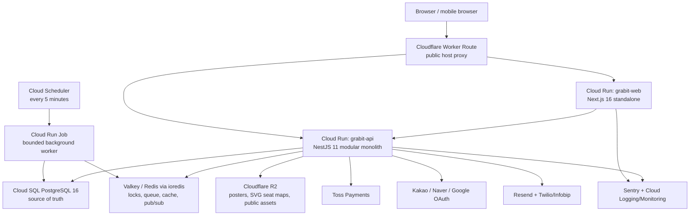

# Grabit Architecture

## 1. Architecture Summary

Grabit is a pnpm monorepo with four runtime packages:

- `apps/web`: Next.js 16 App Router web application
- `apps/api`: NestJS 11 modular monolith API
- `apps/edge-proxy`: Cloudflare Worker Route proxy for the public Web/API hosts
- `packages/shared`: shared Zod schemas, TypeScript types, constants, i18n keys, and runtime flag helpers

The production architecture is intentionally simple:

Core principles:

- PostgreSQL is the durable system of record.
- Redis/Valkey is used only for low-latency state: seat locks, queue, throttling, cache, and Socket.IO pub/sub.
- API remains a modular monolith. Module boundaries follow business capability, not deployment boundaries.
- Shared schemas/types prevent web/API drift where payloads cross package boundaries.
- Production startup fails closed for unsafe runtime configuration instead of silently degrading.

## 2. Package And Runtime Truth

| Layer | Current implementation |
| --- | --- |
| Workspace | `pnpm@10.28.1`, Node.js `>=22`, Turborepo tasks |
| Web | Next.js 16, React 19, TypeScript 5.9, Tailwind CSS v4, next-intl, TanStack Query, Zustand, React Hook Form, Toss web SDK |
| API | NestJS 11, Drizzle ORM, PostgreSQL driver, ioredis, Socket.IO, pg-boss, Sentry, Passport strategies |
| Shared | Zod schemas/types/constants exported from `packages/shared/src/index.ts` |
| Deployment | Docker images built by GitHub Actions and deployed to Cloud Run; Cloudflare Worker deployed separately with Wrangler |
| Storage | Cloud SQL PostgreSQL, Redis/Valkey, Cloudflare R2 |

Installed versions are governed by `package.json` and `pnpm-lock.yaml`; documentation must not override manifest truth.

## 3. Frontend Architecture

### 3.1 Route Surface

Current App Router files:

| Route area | Files |
| --- | --- |
| Home/search/catalog | `/`, `/search`, `/genre/[genre]`, `/performance/[id]` |
| Auth | `/auth`, `/auth/callback`, 비밀번호 재설정 route, `/auth/verify-email` |
| Booking | `/booking/[performanceId]`, `/booking/[performanceId]/confirm`, `/booking/[performanceId]/complete` |
| My Page | `/mypage`, `/mypage/reservations/[id]` |
| Field | `/field/check-in` |
| Legal | `/legal/terms`, `/legal/privacy`, `/legal/marketing` |
| Runtime flags | `/api/runtime-flags` |
| Admin | `/admin`, `/admin/performances`, `/admin/performances/new`, `/admin/performances/[id]/edit`, `/admin/bookings`, `/admin/operations`, `/admin/support-content`, `/admin/banners`, `/admin/translations`, `/admin/seat-operations`, `/admin/field-monitor`, `/admin/settlement`, `/admin/security`, `/admin/audit`, `/admin/consent-audit`, `/admin/users`, `/admin/cutover` |

### 3.2 State And Data Flow

| State type | Tooling | Examples |
| --- | --- | --- |
| Server state | TanStack Query hooks | performances, search, booking, reservations, admin dashboards, field monitor |
| Client booking state | Zustand | selected floor/seats, booking progress, auth session state |
| Forms | React Hook Form + Zod | signup, profile, booking terms, admin event forms |
| Realtime | Socket.IO client | seat status updates by showtime room |
| Locale | next-intl routing + shared locale constants | `ko`, `en`, `th`, `zh-CN` |

### 3.3 Component Boundaries

The web app is grouped by operational surface:

- `components/home`: banners and home sections
- `components/performance`: cards, grids, status and pagination
- `components/auth`: login, signup, phone verification, profile, auth guard
- `components/booking`: date/showtime picker, floor selector, SVG seat viewer, selection panel, payment deadline, Toss widget, completion QR
- `components/reservation`: reservation list/detail, QR card, refund timeline, cancellation modal
- `components/field`: QR image helper, scanner check-in, offline sync status, field monitor
- `components/admin`: performance form, floor editor, booking table/export, support content, operations inbox, settlement, security, audit, users
- `components/ui`: shared primitives used by the app

Admin screens are dense operational tools. Public pages can be more visual, but booking and field surfaces prioritize clarity and speed over decorative layout.

## 4. Backend Architecture

### 4.1 NestJS Module Layout

`AppModule` imports the current modules:

| Module | Responsibility |
| --- | --- |
| `AuthModule` | registration, login, refresh, logout, social callbacks, email verification, auth completion |
| `UserModule` | current user profile and account withdrawal |
| `SmsModule` | phone verification send/verify |
| `ConsentModule` | consent item list, capture, admin consent audit |
| `PerformanceModule` | public performances, detail, home banners/hot/new |
| `SearchModule` | public search |
| `BookingModule` | seat locks, lock ownership, seat status, Socket.IO seat gateway, Redis client/provider |
| `QueueModule` | performance queue entry/session and booking admission guard |
| `ReservationModule` | reservation prepare, payment confirm, my reservations, detail, cancellation |
| `PaymentModule` | payment branch selection and Toss webhook handling |
| `RefundModule` | refund preview/request/admin refund and retry scheduling |
| `TicketModule` | QR ticket issue/read/verify and QR email scheduling |
| `FieldOperationsModule` | check-in verify/consume, offline sync, monitor summary/logs |
| `AdminModule` | admin event, booking, support, banner, user, audit, security, cutover, settlement, upload APIs |
| `TranslationModule` | admin translation source/draft/review/publish |
| `FeatureFlagsModule` | API runtime booking flag authority |
| `TrafficModule` | app-layer rate/throttle policies |
| `PrewarmModule` | protected Cloud Run prewarm control |
| `HealthModule` | `/api/v1/health` |
| `PgbossModule` / `JobsModule` | pg-boss provider and workers |

### 4.2 HTTP Prefix And Guards

- `main.ts` sets global prefix `api/v1`.
- `ThrottlerGuard` is global.
- `JwtAuthGuard` is global; public endpoints use the `@Public` decorator.
- Admin authorization uses role and capability guards.
- Global validation uses the Zod validation pipe.
- Global filters include generic HTTP exception formatting and Toss payment exception formatting.
- CORS origins are derived from `FRONTEND_URL`, with production requiring HTTPS origins.
- `helmet` and `cookie-parser` are installed at bootstrap.

### 4.3 API Surface

The following table summarizes actual controller groups. It is intentionally grouped by controller responsibility rather than pretending every action has a separate public product feature.

| Group | Endpoints |
| --- | --- |
| Health | `GET /api/v1/health` |
| Auth | `GET /api/v1/auth/email-availability`, `POST /api/v1/auth/register`, `POST /api/v1/auth/login`, `POST /api/v1/auth/refresh`, `POST /api/v1/auth/logout`, email verification endpoints, auth recovery endpoints, Kakao/Naver/Google social start/callback, `POST /api/v1/auth/social/complete-registration` |
| User | `GET/PATCH /api/v1/users/me`, `POST /api/v1/users/me/withdrawal` |
| SMS | `POST /api/v1/sms/send-code`, `POST /api/v1/sms/verify-code` |
| Consent | `GET /api/v1/consent/items`, `POST /api/v1/consent/capture`, `GET /api/v1/admin/consent-audit` |
| Performance | `GET /api/v1/performances`, `GET /api/v1/performances/:id`, `GET /api/v1/home/banners`, `GET /api/v1/home/hot`, `GET /api/v1/home/new` |
| Search | `GET /api/v1/search` |
| Queue | `POST /api/v1/queue/performances/:performanceId/enter`, `GET /api/v1/queue/sessions/:queueSessionId` |
| Booking | `POST /api/v1/booking/seats/lock`, `DELETE /api/v1/booking/seats/lock/:showtimeId/:seatId`, `GET /api/v1/booking/my-locks/:showtimeId`, `DELETE /api/v1/booking/seats/lock-all/:showtimeId`, `GET /api/v1/booking/schedules/:showtimeId/seats` |
| Reservation/payment confirm | `POST /api/v1/reservations/prepare`, `POST /api/v1/payments/confirm`, `GET /api/v1/users/me/reservations`, `GET /api/v1/reservations`, `GET /api/v1/reservations/:id`, `PUT /api/v1/reservations/:id/cancel`, `PUT /api/v1/reservations/:id/cancel-pending` |
| Payment | `POST /api/v1/payments/branch`, `POST /api/v1/payments/toss/webhook` |
| Refund | `GET /api/v1/reservations/:id/refund-preview`, `POST /api/v1/reservations/:id/refund` |
| Ticket | `GET /api/v1/tickets/reservations/:id` |
| Field | `POST /api/v1/field/check-in/verify`, `POST /api/v1/field/check-in/consume`, `POST /api/v1/field/check-in/offline-sync`, `GET /api/v1/field/monitor/summary`, `GET /api/v1/field/monitor/logs` |
| Prewarm | `POST /api/v1/internal/prewarm/services/:serviceName`, `POST /api/v1/internal/prewarm/services/:serviceName/step-down` |
| Admin performance/content | `GET/POST /api/v1/admin/performances`, `GET/PUT/DELETE /api/v1/admin/performances/:id`, `POST /api/v1/admin/performances/:id/publish`, `POST /api/v1/admin/performances/:id/seat-map`, upload endpoints, banner endpoints, support-content endpoints, translation endpoints |
| Admin operations | dashboard summary/revenue/genre/payment/top-performances, bookings list/detail/export/refund/manual-open, operations inbox, signup failures, seat operations, field monitor, settlement, security, audit, users, cutover gates |

Any new endpoint documentation should be generated from the controller files, not from product guesses.

## 5. Data Architecture

### 5.1 Source Of Truth

The Drizzle schema under `apps/api/src/database/schema/*` is the database source of truth. `packages/shared/src/*` defines cross-package contracts but does not replace the database schema.

Current schema groups:

| Area | Schema files |
| --- | --- |
| Identity | `users.ts`, `social-accounts.ts`, `refresh-tokens.ts`, `email-verification-tokens.ts` |
| Consent/legal | `consent-items.ts`, `consent-audit-logs.ts`, `terms-agreements.ts`, `legal-content.ts` |
| Catalog | `performances.ts`, `venues.ts`, `showtimes.ts`, `castings.ts`, `price-tiers.ts`, `banners.ts` |
| Layout/seats | `venue-layouts.ts`, `venue-layout-floors.ts`, `venue-layout-sections.ts`, `venue-layout-seats.ts`, `seat-maps.ts`, `performance-seat-tiers.ts`, `performance-seat-assignments.ts`, `seat-inventories.ts` |
| Booking/payment | `booking-policies.ts`, `reservations.ts`, `reservation-seats.ts`, `payments.ts`, `payment-webhook-events.ts`, `refunds.ts` |
| QR/entry | `tickets.ts`, `ticket-scan-events.ts` |
| Admin/audit | `admin-audit-logs.ts`, `booking-operation-audit-logs.ts`, `admin-access-allowlist.ts`, `seat-operation-history.ts`, `account-merge.ts` |
| Support/translation | `support-threads.ts`, `support-messages.ts`, `support-faqs.ts`, `support-notices.ts`, `translation-sources.ts`, `translation-drafts.ts` |

### 5.2 Shared Contracts

`packages/shared` exports:

- `schemas/auth.schema.ts`
- `schemas/user.schema.ts`
- `schemas/consent.schema.ts`
- `schemas/performance.schema.ts`
- `schemas/booking.schema.ts`
- `schemas/field-operations.schema.ts`
- `schemas/admin-operations.schema.ts`
- `schemas/admin-dashboard.schema.ts`
- related `types/*`, `constants/*`, and `flags.ts`

Use shared schemas for request/response validation and UI contract tests whenever the payload crosses web/API boundaries.

### 5.3 Migrations

- Drizzle config lives in `apps/api/drizzle.config.ts`.
- Migration SQL is stored in `apps/api/src/database/migrations`.
- CI and deploy workflows run Drizzle migration steps before production deploy.
- Production migration should run through the workflow/runbook, not through ad hoc local mutation.

## 6. Booking And Concurrency

### 6.1 Seat Locks

Seat locks are managed by `BookingService` and Redis/Valkey.

- Lock keyspace is showtime-scoped.
- Lock ownership is per user.
- Lock and unlock operations use Lua-compatible atomic checks.
- Max-ticket policy is enforced from performance booking policy.
- Seat lock state is reflected in `GET /api/v1/booking/schedules/:showtimeId/seats`.
- Seat updates are broadcast over Socket.IO rooms named by showtime.

Local development can use an in-memory Redis-compatible mock when Redis URL is absent. Production cannot silently use that fallback.

### 6.2 Queue Admission

`QueueModule` manages queue entry/session state. The admission guard protects booking mutations by validating:

- queue session binding,
- showtime or performance binding,
- admission activity window,
- order binding for payment confirm where needed.

Admin bypass exists for controlled tests and operational flows, not for normal buyers.

### 6.3 Reservation Prepare

`ReservationService.prepareReservation` validates before writing a pending reservation:

- booking flag,
- account verification,
- required consent rows,
- duplicate seats,
- showtime booking context,
- booking policy,
- active lock ownership,
- canonical seat/tier/price,
- queue admission.

The pending reservation stores server-side payment deadline and queue recovery timestamps.

### 6.4 Payment Confirm

`ReservationService.confirmAndCreateReservation` and payment services coordinate:

- payment confirm lock by order ID,
- amount and payment identity checks,
- lock extension before provider confirmation,
- conditional sold transition in PostgreSQL,
- compensation cancellation if provider confirmation succeeds but finalization fails,
- QR ticket issuance after confirmed payment.

Toss webhook processing records provider events, handles replay/idempotency, and verifies provider state before applying final mutations.

### 6.5 Refund And Cancelled Seat Reopen

`RefundModule` owns refund preview/request/admin refund. Buyer refund requests are blocked after showtime start; admin refund remains an operational override path. Refund state can be terminal or provider-processing. pg-boss schedules:

- refund cancel retry,
- delayed cancelled-seat release.

Admin refund writes audit evidence and can hold seats before manual reopening.

## 7. QR And Field Operations

### 7.1 QR Ticket Model

`TicketModule` owns QR issue/read/verify.

- QR tickets are reservation-level in the current implementation.
- `tickets` stores QR JTI, signing version, status, issue/email timestamps, use/revoke/expiry state.
- QR reminder email is scheduled through pg-boss when eligible.
- Reservation detail read path can self-heal missing QR for confirmed completed payments.
- Customer QR display is read-safe after field entry.

Credential validity and venue entry state are separate:

- credential status answers whether the QR credential is valid,
- `entryStatus` and `enteredAt` answer whether entry was processed.

### 7.2 Field Check-In

`FieldOperationsModule` provides:

- verify: parse token or QR URL, load ticket context, return processable outcome,
- consume: manually process entry when staff confirms, marking all active not-entered tickets for the same buyer account and showtime as entered,
- offline sync: server-reverify pending attempts and return synced/rejected state,
- monitor: KPI summary and scan logs.

Scanner-only access is represented through admin capability bundles, not a separate auth stack.

### 7.3 Settlement

Admin settlement supports:

- gross sales amount,
- paid reservation count,
- refunded amount/count,
- entered/no-show counts,
- entry rate,
- export datasets for entry status, no-show reservations, reservation/payment/refund summary, and accounting input.

External finance-system integration is outside the current code path.

## 8. Infrastructure And Deployment

### 8.1 Cloud Run Services

Production deploy uses two Cloud Run services and one bounded Cloud Run Job:

| Service | Image | Port | Notes |
| --- | --- | --- | --- |
| `grabit-api` | `apps/api/Dockerfile` | `8080` | NestJS built output, Cloud SQL attached, Redis/Valkey required in production |
| `grabit-web` | `apps/web/Dockerfile` | `3000` | Next.js standalone output |
| `grabit-background-worker` | `apps/api/Dockerfile` | N/A | runs `dist/worker-main.js` for a bounded pg-boss/expiration processing window |

Both images are built from the monorepo root so `packages/shared` can be built before app packages.

During the no-sale managed-demo posture, Web and API use minimum instances `0`, request-based CPU, and maximum instances `4`. Cloud Scheduler executes the bounded worker every five minutes so refund retries, QR reminders, cancelled-seat releases, and pending-payment expiration do not depend on an always-warm API instance. Ticket-opening capacity restoration is governed by ADR 0009 and `docs/runbooks/managed-demo-cost-floor.md`.

`apps/edge-proxy` maps only `heygrabit.com`, `www.heygrabit.com`, and `api.heygrabit.com` to stable Cloud Run service origins. It streams requests/responses, preserves WebSocket upgrades, overwrites forwarded-host metadata, and rejects unknown hosts. Production Worker Routes are a separate, explicitly authenticated cutover and are not deployed by the GCP workflow.

### 8.2 CI

`.github/workflows/ci.yml` runs on pull requests and manual dispatch:

1. checkout,
2. install with pnpm,
3. lint,
4. typecheck,
5. unit tests,
6. API integration tests with testcontainers,
7. Drizzle migrations against a Postgres service container,
8. seed test data,
9. verify Toss test credentials are configured for non-fork events,
10. install Playwright Chromium,
11. build API,
12. run API server,
13. login smoke,
14. web E2E tests.

### 8.3 Deploy

`.github/workflows/deploy.yml` runs on push to `main` and manual dispatch:

1. validate production origins,
2. install dependencies,
3. authenticate to GCP via Workload Identity Federation,
4. start Cloud SQL Auth Proxy for migration,
5. run Drizzle migrations,
6. build and push API image,
7. build and push web image,
8. deploy and smoke the bounded background worker Job from the API image,
9. when scale-to-zero is selected, verify the separately provisioned five-minute schedule is enabled, then deploy API,
10. deploy web after API deploy.

API deploy injects runtime values through Cloud Run environment variables and Secret Manager bindings. Documentation must name required settings without printing raw values.

Important non-sensitive production invariants:

- region: `asia-northeast3`
- services: `grabit-api`, `grabit-web`
- API `NODE_ENV=production`
- API/worker `VALKEY_MODE` comes from a repository variable and defaults to `cluster` until the managed Valkey cutover
- API uses Cloud SQL attachment
- API requires Redis/Valkey runtime wiring
- managed-demo Web/API minimum instances are `0`, with a maximum of `4`; repository variables select this posture while workflow defaults preserve the warm ticket-opening posture
- worker interval is disabled inside the Job and replaced by one immediate sweep plus a 30-second bounded processing window
- web build receives public API/WS/R2/Sentry/Toss public values at image build time

### 8.4 Runtime Configuration

Local development convention:

- root `.env` is the local environment file.
- `apps/web/next.config.ts` explicitly loads root `.env`.
- `apps/api/app.module.ts` loads `../../.env`.
- local ports are web `3000`, API `8080`.

Production convention:

- no `.env` file in Cloud Run.
- Cloud Run environment variables and Secret Manager bindings provide runtime configuration.
- API validates production frontend origin and Redis/Valkey pub/sub readiness at bootstrap.
- Missing production Redis URL or invalid Valkey mode fails startup.

### 8.5 Object Storage And Uploads

Cloudflare R2 stores poster images, detail images, SVG seat maps, and uploaded public assets. API upload endpoints issue presigned upload data or local-upload fallbacks where configured for local development.

SVG seat maps are product-critical and must be treated as data with validation/safety constraints, not as arbitrary HTML.

## 9. Observability And Operations

- Sentry is initialized in both web and API.
- Cloud Run stdout/stderr and Cloud Logging are the primary runtime log stream.
- Health endpoint includes Redis/Valkey health evidence.
- Phase 26/27 scripts under `scripts/phase26` and `scripts/phase27` provide gate validation, infra evidence, load evidence recording, field scan smoke, and retrospective validation.
- `docs/runbooks/phase26-cutover-ops.md` remains the active cutover incident runbook referenced by Phase 26 evidence scripts; older phase runbooks are historical artifacts unless a live tool references them.

Operational truth order for production incidents:

1. live Cloud Run revision/service state,
2. live API response,
3. runtime flags and Cloud Run environment shape,
4. logs/Sentry,
5. database/cache evidence,
6. local code hypothesis.

## 10. Security Model

### 10.1 API Security

- Public endpoints require explicit `@Public`.
- JWT guard protects authenticated endpoints by default.
- Roles guard and admin capability guard protect admin operations.
- Throttler guard is global and can use Redis-backed storage when real Redis is configured.
- Request IP handling is centralized for audit and allowlist features.
- Toss payment exceptions are filtered to avoid leaking provider internals.

### 10.2 Admin Capabilities

Shared admin capability bundles include:

- `operator`
- `reviewer`
- `approver`
- `finance`
- `scanner`
- `admin`

Scanner-only accounts can verify/consume/sync field scan attempts but must not gain broad admin, finance, support, user, security, refund, or raw export authority.

### 10.3 Data Redaction

Documents, evidence, UI tests, and logs must not include:

- raw QR payloads,
- full JTI values,
- cookies,
- OTP values,
- raw customer export rows,
- unmasked phone/email values where not required,
- provider credential values,
- full payment identifiers in public surfaces.

Use masked references and evidence paths instead.

## 11. Testing Strategy

| Area | Current commands |
| --- | --- |
| Workspace build | `pnpm build` |
| Workspace lint | `pnpm lint` |
| Workspace typecheck | `pnpm typecheck` |
| Workspace tests | `pnpm test` |
| API integration | `pnpm --filter @grabit/api test:integration` |
| Web E2E | `pnpm --filter @grabit/web test:e2e` |
| Shared focused tests | `pnpm --dir packages/shared exec vitest run <files>` |
| API focused tests | `pnpm --filter @grabit/api exec vitest run <files>` |
| Web focused tests | `pnpm --filter @grabit/web exec vitest run <files>` |

Docs-only updates normally require:

- `git diff --check`
- stale-term search for removed architecture/product claims
- sensitive-pattern search for accidental credential or raw payload exposure

## 12. Documentation Ownership

- This architecture document describes current implementation, not target-state aspirations.
- If code and this document disagree, trust code and update the document.
- Public API descriptions must be refreshed from controller files.
- Data model descriptions must be refreshed from Drizzle schema files.
- Cross-package contracts must be refreshed from `packages/shared/src`.
- Deployment descriptions must be refreshed from `.github/workflows/ci.yml`, `.github/workflows/deploy.yml`, and Dockerfiles.
