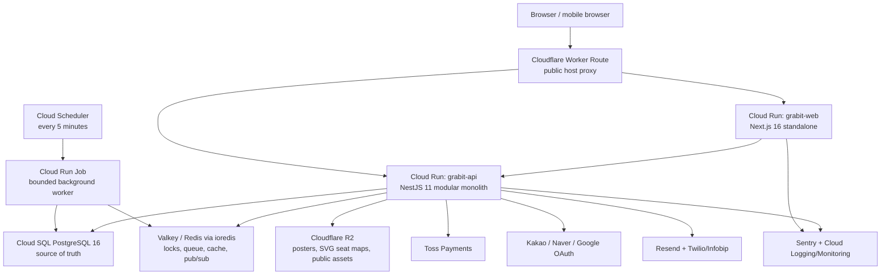

# Grabit Architecture

## 1. Architecture Summary

Grabit is a pnpm monorepo with four runtime packages:

- `apps/web`: Next.js 16 App Router web application
- `apps/api`: NestJS 11 modular monolith API
- `apps/edge-proxy`: Cloudflare Worker Route proxy for the public Web/API hosts
- `packages/shared`: shared Zod schemas, TypeScript types, constants, i18n keys, and runtime flag helpers

The production architecture is intentionally simple:

```mermaid
flowchart TB
  Browser["Browser / mobile browser"]
  Edge["Cloudflare Worker Route\npublic host proxy"]
  Web["Cloud Run: grabit-web\nNext.js 16 standalone"]
  API["Cloud Run: grabit-api\nNestJS 11 modular monolith"]
  Worker["Cloud Run Job\nbounded background worker"]
  Scheduler["Cloud Scheduler\nevery 5 minutes"]
  PG["Cloud SQL PostgreSQL 16\nsource of truth"]
  Valkey["Valkey / Redis via ioredis\nlocks, queue, cache, pub/sub"]
  R2["Cloudflare R2\nposters, SVG seat maps, public assets"]
  Toss["Toss Payments"]
  OAuth["Kakao / Naver / Google OAuth"]
  Msg["Resend + Twilio/Infobip"]
  Obs["Sentry + Cloud Logging/Monitoring"]

  Browser --> Edge
  Edge --> Web
  Edge --> API
  Web --> API
  Scheduler --> Worker
  Worker --> PG
  Worker --> Valkey
  API --> PG
  API --> Valkey
  API --> R2
  API --> Toss
  API --> OAuth
  API --> Msg
  Web --> Obs
  API --> Obs
```

Core principles:

- PostgreSQL is the durable system of record.
- Redis/Valkey is used only for low-latency state: seat locks, queue, throttling, cache, and Socket.IO pub/sub.
- API remains a modular monolith. Module boundaries follow business capability, not deployment boundaries.
- Shared schemas/types prevent web/API drift where payloads cross package boundaries.
- Production startup fails closed for unsafe runtime configuration instead of silently degrading.

## 2. Package And Runtime Truth

| Layer | Current implementation |
| --- | --- |
| Workspace | `pnpm@10.28.1`, Node.js `>=22`, Turborepo tasks |
| Web | Next.js 16, React 19, TypeScript 5.9, Tailwind CSS v4, next-intl, TanStack Query, Zustand, React Hook Form, Toss web SDK |
| API | NestJS 11, Drizzle ORM, PostgreSQL driver, ioredis, Socket.IO, pg-boss, Sentry, Passport strategies |
| Shared | Zod schemas/types/constants exported from `packages/shared/src/index.ts` |
| Deployment | Docker images built by GitHub Actions and deployed to Cloud Run; Cloudflare Worker deployed separately with Wrangler |
| Storage | Cloud SQL PostgreSQL, Redis/Valkey, Cloudflare R2 |

Installed versions are governed by `package.json` and `pnpm-lock.yaml`; documentation must not override manifest truth.

## 3. Frontend Architecture

### 3.1 Route Surface

Current App Router files:

| Route area | Files |
| --- | --- |
| Home/search/catalog | `/`, `/search`, `/genre/[genre]`, `/performance/[id]` |
| Auth | `/auth`, `/auth/callback`, 비밀번호 재설정 route, `/auth/verify-email` |
| Booking | `/booking/[performanceId]`, `/booking/[performanceId]/confirm`, `/booking/[performanceId]/complete` |
| My Page | `/mypage`, `/mypage/reservations/[id]` |
| Field | `/field/check-in` |
| Legal | `/legal/terms`, `/legal/privacy`, `/legal/marketing` |
| Runtime flags | `/api/runtime-flags` (`bookingEnabled` plus the web server clock `serverNow`, `Cache-Control: no-store`) |
| Admin | `/admin`, `/admin/performances`, `/admin/performances/new`, `/admin/performances/[id]/edit`, `/admin/bookings`, `/admin/operations`, `/admin/support-content`, `/admin/banners`, `/admin/translations`, `/admin/seat-operations`, `/admin/field-monitor`, `/admin/settlement`, `/admin/security`, `/admin/audit`, `/admin/consent-audit`, `/admin/users`, `/admin/cutover` |

### 3.2 State And Data Flow

| State type | Tooling | Examples |
| --- | --- | --- |
| Server state | TanStack Query hooks | performances, search, booking, reservations, admin dashboards, field monitor |
| Client booking state | Zustand | selected floor/seats, booking progress, auth session state |
| Forms | React Hook Form + Zod | signup, profile, booking terms, admin event forms |
| Realtime | Socket.IO client | seat status updates by showtime room |
| Locale | next-intl routing + shared locale constants | `ko`, `en`, `th`, `zh-CN` |
| Runtime flags | TanStack Query (`useRuntimeFlags`) | A failed `/api/runtime-flags` read is retried (full-jitter backoff, at least any `Retry-After`) and keeps the last good value; until a value loads, booking stays closed with a "checking" message, never "opens later", and the read is repeated on a jittered interval growing from 10s to 60s |
| Server clock | `lib/server-clock.ts` | Offset measured from `serverNow` in `/api/runtime-flags`; booking open, seat-lock, queue-access and payment countdowns, and the My Page resume-payment and cancel deadlines compare server instants with `getServerNowMs()` instead of the device clock (device clock until a sample exists) |

### 3.3 Component Boundaries

The web app is grouped by operational surface:

- `components/home`: banners and home sections
- `components/performance`: cards, grids, status and pagination
- `components/auth`: login, signup, phone verification, profile, auth guard
- `components/booking`: date/showtime picker, floor selector, SVG seat viewer, selection panel, payment deadline, Toss widget, completion QR
- `components/reservation`: reservation list/detail, QR card, refund timeline, cancellation modal
- `components/field`: QR image helper, scanner check-in, offline sync status, field monitor
- `components/admin`: performance form, floor editor, booking table/export, support content, operations inbox, settlement, security, audit, users
- `components/ui`: shared primitives used by the app

Admin screens are dense operational tools. Public pages can be more visual, but booking and field surfaces prioritize clarity and speed over decorative layout.

## 4. Backend Architecture

### 4.1 NestJS Module Layout

`AppModule` imports the current modules:

| Module | Responsibility |
| --- | --- |
| `AuthModule` | registration, login, refresh, logout, social callbacks, email verification, auth completion |
| `UserModule` | current user profile and account withdrawal |
| `SmsModule` | phone verification send/verify |
| `ConsentModule` | consent item list, capture, admin consent audit |
| `PerformanceModule` | public performances, detail, home banners/hot/new |
| `SearchModule` | public search |
| `BookingModule` | seat locks, lock ownership, seat status, Socket.IO seat gateway, Redis client/provider |
| `QueueModule` | performance queue entry/session and booking admission guard |
| `ReservationModule` | reservation prepare, payment confirm, my reservations, detail, cancellation |
| `PaymentModule` | payment branch selection and Toss webhook handling |
| `RefundModule` | refund preview/request/admin refund and retry scheduling |
| `TicketModule` | QR ticket issue/read/verify and QR email scheduling |
| `FieldOperationsModule` | check-in verify/consume, offline sync, monitor summary/logs |
| `AdminModule` | admin event, booking, support, banner, user, audit, security, cutover, settlement, upload APIs |
| `TranslationModule` | admin translation source/draft/review/publish |
| `FeatureFlagsModule` | API runtime booking flag authority |
| `TrafficModule` | app-layer rate/throttle policies |
| `PrewarmModule` | protected Cloud Run prewarm control |
| `HealthModule` | `/api/v1/health` |
| `PgbossModule` / `JobsModule` | pg-boss provider and workers |

### 4.2 HTTP Prefix And Guards

- `main.ts` sets global prefix `api/v1`.
- `ThrottlerGuard` is global and runs after `JwtAuthGuard`. Its `default` throttler (60/min per route) tracks the JWT-verified user, otherwise the trusted client IP (IPv6 grouped by /64). It never tracks client-chosen cookies, admission tokens or headers, because a fresh value per request would get a fresh bucket. `TrafficDefenseService` adds named policies on top: booking mutations, signup per IP, `login-account` and `email-verification-verify` per email + IP, `password-reset-email` and `email-verification-send` (anonymous request/resend) per email across IPs, `account-email-send` per signed-in user + email, and `account-email-address` per email across accounts. Policies match the template of the Express route that dispatched the request, lower-cased, because Express 5 routes case-insensitively and ignores a trailing slash; matching the raw URL would let `/auth/LOGIN` skip them. HEAD counts as GET. Each email policy reads the email from the same place the route does; for login that is passport-local's body-then-query lookup. The throttle runs before the route's validation pipe, so every route with a per-address bucket shared across IPs or accounts declares its body schema with `@ThrottleEmailBody`. A body the route rejects (400, no mail) only counts against the route's default bucket (per IP, or per user when signed in). An accepted body is keyed by its parsed email, trimmed and lower-cased. The account lookup must ignore case as well, otherwise a case variant spends the owner's budget without mail. An accepted request for an address without a usable account sends nothing, but then nobody can use the flow for that address. For an address with an account, the anonymous routes mail the owner on every accepted request, so whoever spends an owner's budget also delivers fresh codes or links to that owner. `account-email/request` answers 409 without mail for an address another account owns. Its address bucket (`account-email-address`, 10 per 15 min) is therefore separate from the anonymous one, so that owner keeps request/resend. Remaining risk: two or more phone-verified accounts can fill that bucket for an address nobody owns yet, so another account cannot switch to it for the rest of the window. Each slot they fill mails the address. Route overrides live in `modules/traffic/route-throttles.ts`. Auth endpoints get per-IP limits with shared-NAT headroom (code verify matches the signup allowance, 300 per 15 min), and cookie-less `POST /auth/refresh` is not counted. Signed-in account-email verification routes are also limited per user. Field operations and `GET /users/me` use 600/min per user and client network, because a gate phone reloads the check-in page for every scanned QR link. The Toss webhook skips IP throttling and relies on its secret guard and event ledger. With Valkey, `modules/traffic/throttler-storage.ts` replaces the @nest-lab Redis storage script so that requests rejected while a bucket is blocked are not counted. Otherwise they would fill the next window and renew the block indefinitely.
- `JwtAuthGuard` is global; public endpoints use the `@Public` decorator.
- Admin authorization uses role and capability guards.
- Global validation uses the Zod validation pipe.
- Global exception filters are registered through `createGlobalExceptionFilters()` (`apps/api/src/common/filters/`): a catch-all HTTP exception filter first, then the Toss payment exception filter, because Nest matches global filters from the last registered.
  - `HttpException` responses keep every extra field of an object response (`code`, `blockers`, `retryAfterMs`, `errors`, `errorCode`, ...) next to `statusCode`, `message` and `timestamp`.
  - Any other error answers `500 {"statusCode":500,"message":"Internal server error"}` without its internal message; 4xx errors that carry an HTTP status (body-parser 413) keep that status.
  - 5xx responses, including unexpected errors and Toss provider failures answered with `502`, are reported to Sentry. The unexpected-error log line redacts bound SQL parameters and appends the cause chain (pool timeout, deadlock).
  - A failed public `GET /api/v1/health` answers `503` with the Terminus result (`status`, `info`, `error`, `details`): the same Redis/Valkey metadata the `200` body already exposes plus the sanitized indicator message, so probes and smoke scripts can see which dependency is down.
- CORS origins are derived from `FRONTEND_URL`, with production requiring HTTPS origins. `FRONTEND_URL` may list several origins separated by commas; REST CORS and the `/booking` and `/queue` Socket.IO gateways accept every listed origin through `apps/api/src/config/frontend-origins.ts`, while redirects and email links that need one URL use the first entry.
- `helmet` and `cookie-parser` are installed at bootstrap.

### 4.3 API Surface

The following table summarizes actual controller groups. It is intentionally grouped by controller responsibility rather than pretending every action has a separate public product feature.

| Group | Endpoints |
| --- | --- |
| Health | `GET /api/v1/health` |
| Auth | `GET /api/v1/auth/email-availability`, `POST /api/v1/auth/register`, `POST /api/v1/auth/login`, `POST /api/v1/auth/refresh`, `POST /api/v1/auth/logout`, email verification endpoints, auth recovery endpoints, Kakao/Naver/Google social start/callback, `POST /api/v1/auth/social/complete-registration` |
| User | `GET/PATCH /api/v1/users/me`, `POST /api/v1/users/me/withdrawal` |
| SMS | `POST /api/v1/sms/send-code`, `POST /api/v1/sms/verify-code` |
| Consent | `GET /api/v1/consent/items`, `POST /api/v1/consent/capture`, `GET /api/v1/admin/consent-audit` |
| Performance | `GET /api/v1/performances`, `GET /api/v1/performances/:id`, `GET /api/v1/home/banners`, `GET /api/v1/home/hot`, `GET /api/v1/home/new` |
| Search | `GET /api/v1/search` |
| Support content | `GET /api/v1/support-content?locale=` (public; Valkey cache 30s per locale cleared by admin mutations, 120 req/min per client, scheduled/ended notices filtered, urgent/maintenance/payment notices fall back en → ko by translation group) |
| Queue | `POST /api/v1/queue/performances/:performanceId/enter`, `GET /api/v1/queue/sessions/:queueSessionId` |
| Booking | `POST /api/v1/booking/seats/lock`, `DELETE /api/v1/booking/seats/lock/:showtimeId/:seatId`, `GET /api/v1/booking/my-locks/:showtimeId`, `DELETE /api/v1/booking/seats/lock-all/:showtimeId`, `GET /api/v1/booking/schedules/:showtimeId/seats` |
| Reservation/payment confirm | `POST /api/v1/reservations/prepare`, `POST /api/v1/payments/confirm`, `GET /api/v1/users/me/reservations`, `GET /api/v1/reservations`, `GET /api/v1/reservations/:id`, `PUT /api/v1/reservations/:id/cancel`, `PUT /api/v1/reservations/:id/cancel-pending` |
| Payment | `POST /api/v1/payments/branch`, `POST /api/v1/payments/branch/release`, `POST /api/v1/payments/async-return`, `POST /api/v1/payments/toss/webhook` |
| Refund | `GET /api/v1/reservations/:id/refund-preview`, `POST /api/v1/reservations/:id/refund` |
| Ticket | `GET /api/v1/tickets/reservations/:id` |
| Field | `POST /api/v1/field/check-in/verify`, `POST /api/v1/field/check-in/consume`, `POST /api/v1/field/check-in/offline-sync`, `GET /api/v1/field/monitor/summary`, `GET /api/v1/field/monitor/logs` |
| Prewarm | `POST /api/v1/internal/prewarm/services/:serviceName`, `POST /api/v1/internal/prewarm/services/:serviceName/step-down` |
| Admin performance/content | `GET/POST /api/v1/admin/performances`, `GET/PUT/DELETE /api/v1/admin/performances/:id`, `POST /api/v1/admin/performances/:id/publish`, `POST /api/v1/admin/performances/:id/seat-map`, upload endpoints, banner endpoints, support-content endpoints, translation endpoints |
| Admin operations | dashboard summary/revenue/genre/payment/top-performances, bookings list/detail/export/refund/manual-open, operations inbox, signup failures, seat operations, field monitor, settlement, security, audit, users, cutover gates |

Any new endpoint documentation should be generated from the controller files, not from product guesses.

## 5. Data Architecture

### 5.1 Source Of Truth

The Drizzle schema under `apps/api/src/database/schema/*` is the database source of truth. `packages/shared/src/*` defines cross-package contracts but does not replace the database schema.

Current schema groups:

| Area | Schema files |
| --- | --- |
| Identity | `users.ts`, `social-accounts.ts`, `refresh-tokens.ts`, `email-verification-tokens.ts` |
| Consent/legal | `consent-items.ts`, `consent-audit-logs.ts`, `terms-agreements.ts`, `legal-content.ts` |
| Catalog | `performances.ts`, `venues.ts`, `showtimes.ts`, `castings.ts`, `price-tiers.ts`, `banners.ts` |
| Layout/seats | `venue-layouts.ts`, `venue-layout-floors.ts`, `venue-layout-sections.ts`, `venue-layout-seats.ts`, `seat-maps.ts`, `performance-seat-tiers.ts`, `performance-seat-assignments.ts`, `seat-inventories.ts` |
| Booking/payment | `booking-policies.ts`, `reservations.ts`, `reservation-seats.ts`, `payments.ts`, `payment-webhook-events.ts`, `refunds.ts` |
| QR/entry | `tickets.ts`, `ticket-scan-events.ts` |
| Admin/audit | `admin-audit-logs.ts`, `booking-operation-audit-logs.ts`, `admin-access-allowlist.ts`, `seat-operation-history.ts`, `account-merge.ts` |
| Support/translation | `support-threads.ts`, `support-messages.ts`, `support-faqs.ts`, `support-notices.ts`, `translation-sources.ts`, `translation-drafts.ts` |

### 5.2 Shared Contracts

`packages/shared` exports:

- `schemas/auth.schema.ts`
- `schemas/user.schema.ts`
- `schemas/consent.schema.ts`
- `schemas/performance.schema.ts`
- `schemas/booking.schema.ts`
- `schemas/field-operations.schema.ts`
- `schemas/admin-operations.schema.ts`
- `schemas/admin-dashboard.schema.ts`
- related `types/*`, `constants/*`, and `flags.ts`

Use shared schemas for request/response validation and UI contract tests whenever the payload crosses web/API boundaries.

### 5.3 Migrations

- Drizzle config lives in `apps/api/drizzle.config.ts`.
- Migration SQL is stored in `apps/api/src/database/migrations`.
- CI and deploy workflows run Drizzle migration steps before production deploy.
- Production migration should run through the workflow/runbook, not through ad hoc local mutation.

### 5.4 Public Catalog Cache And View Counts

`PerformanceService` serves public list, detail, home hot/new, and home banner reads through `CacheService.getOrLoad` (read-through Valkey cache, TTL up to 300 seconds and capped at the next booking start or banner schedule boundary).

- Every cache key embeds a generation token (`cache:generation:catalog:{list|home|banner|detail:<id>}`). Readers fetch the token before reading PostgreSQL. After each committed admin mutation, translation publish, or translation source edit, `CatalogFreshnessService` replaces the token and deletes the scope's keys (`cache:performances:list:*`, `cache:home:*`, `cache:home:banners*`, `cache:performances:detail:<id>*`). A read that raced the commit can only fill the superseded key, so stale data is not republished after invalidation. If the token cannot be read, the request bypasses the shared cache.
- Each API instance memoizes a token for 250 ms. A warm public read therefore costs one Valkey `GET` for the payload, plus at most one token `GET` per scope per instance every 250 ms. A bump is visible at once on the instance that made it and within 250 ms on the others.
- A rejected token write is retried once after 200 ms and then logged as an error. Public detail cache hits do not re-check `publish_state` in PostgreSQL, so if Valkey rejected writes while a performance was unpublished or deleted, save it again in the admin UI once Valkey recovers. Until then the cached detail can stay public for up to 300 seconds. Reservation and booking gates read PostgreSQL and are not affected.
- Concurrent misses for one key share one in-process load (single-flight), so a TTL expiry at a booking opening rebuilds each key once per API instance.
- Public detail reads do not write to PostgreSQL. `PerformanceViewCounter` counts views in process. Every 10 seconds each instance folds them into `performances.view_count` with one simple-protocol message: `SET LOCAL lock_timeout` 1s and `statement_timeout` 3s, an ordered `FOR NO KEY UPDATE` pass, and one batched `UPDATE`. PostgreSQL runs the message as one implicit transaction and commits before replying, so no client round trip happens while row locks are held. After a failure the transaction rolls back and the deltas are retried on the next flush.
- The flush timer runs in every API instance regardless of `BACKGROUND_PROCESSING_ENABLED`. With `--cpu-throttling` it can fire late, when the next request wakes the instance. Views not yet flushed are lost if an instance stops without a graceful shutdown.
- Guarded admin detail reads are neither cached nor counted, and return the stored `status` rather than the derived public status.
- List query input is bounded by `performanceQuerySchema` (`sub` ≤ 100 characters, `page` ≤ 1000). `sub` is hashed into the key, and empty pages are cached for at most 10 seconds. The web clamps `?page=` to the same range.
- `GET /api/v1/home/banners` returns only banners with `isActive=true`, a home placement (`home_hero`, `home_secondary`), and status `active` or `scheduled`, whose `startsAt`/`endsAt` window contains the current time. A `scheduled` banner without `startsAt` stays hidden. `paused`, `draft`, and `expired` banners are never public.
- Visibility changes made directly in SQL bypass these invalidations and can stay cached for up to 300 seconds. After such a change, save the performance or banner once in the admin UI to invalidate the cache.

## 6. Booking And Concurrency

### 6.1 Seat Locks

Seat locks are managed by `BookingService` and Redis/Valkey.

- Lock keyspace is showtime-scoped.
- Lock ownership is per user.
- Lock and unlock operations use Lua-compatible atomic checks.
- Max-ticket policy is enforced from performance booking policy. Seat lock, prepare and
  confirm count the confirmed tickets of every Buyer Account that verified the same phone
  number (E.164 identity via `parseE164`); an account without a verified phone counts alone.
  SQL narrows candidates through `idx_users_verified_phone_suffix` (last 8 digits) and the
  confirm-time advisory lock uses the same phone scope (`apps/api/src/database/ticket-limit.ts`).
  Seat lock and prepare also count seats the other accounts of that phone hold in unexpired
  `PENDING_PAYMENT` reservations (read through `idx_reservation_seats_reservation_id`), so a
  second account stops before payment; the buyer's own pending orders and the confirm-time
  snapshot stay on confirmed tickets.
- Showtime sales close at `showtimes.date_time`: seat lock and prepare (new and retried
  orders) reject a started showtime with 403, including Admin Booking Bypass.
- Seat lock state is reflected in `GET /api/v1/booking/schedules/:showtimeId/seats`. The endpoint is public, accepts only UUID showtime IDs, and has its own default-throttler budget of 60 requests per 10 seconds, counted per account when the request carries a valid access token and per trusted client IP otherwise (cookies never select the bucket). Its snapshot is cached for at most 1 second (shared Valkey key `seat-status-cache:{showtimeId}`, a 500 ms per-instance copy, and one in-flight computation per showtime per instance). Every seat change an instance sends (its own lock and unlock, and every `seat-update` it broadcasts for payment, cancellation, release or admin seat operations) is applied on top of any snapshot not read more than 100 ms (clock skew allowance) after that change, so a client re-reading after its own lock or unlock on the same instance sees it without forcing a recomputation; a snapshot read clearly later wins. The response carries `generatedAt`, the server time the underlying snapshot was read. Lock, prepare and confirm decisions never read this snapshot.
- Snapshot staleness persists on the client: a re-read routed to an instance that has not seen a change (or a re-read during a socket reconnect) can return a snapshot up to 1 second older than a `seat-update` event the client already applied, and replacing the cached map with it shows the older state for that seat until its next event or re-read. Clients should keep `seat-update` events received after the response's `generatedAt` (server time) when replacing their map.
- The seat status read does not modify `{showtimeId}:locked-seats`. Members whose lock key expired by TTL are removed by an atomic sweep that runs at most once per 10 seconds per showtime across instances, triggered when a snapshot is recomputed.
- Seat updates are broadcast over Socket.IO rooms named by showtime. The rooms are unauthenticated, so `seat-update` carries only the seat and its state, never the user who locked or bought it; a client learns the result of its own lock from the lock API response.
- Contexts without a Socket.IO server, such as the bounded background worker, publish seat updates straight to Valkey in the `@socket.io/redis-adapter` format, so cancelled-seat releases processed by the Job still reach open seat maps.

Local development can use an in-memory Redis-compatible mock when Redis URL is absent. Production cannot silently use that fallback.

The web seat selection page (`BookingPage` + `useSeatLockController`) keeps the selection aligned with the server locks:

- Each lock request is awaited on its own promise; at most one lock request per seat is in flight. A seat dropped while its lock is pending (double tap, showtime change, reset) is released when the lock lands, and a lock is never sent while a release of the same seat or of the whole showtime is in flight. While the page's own lock/release of a seat is in flight, the seat map shows that seat as held (still selected) or available (dropped) instead of as another user's, so it can be picked again right away. A lock that fails without a definite answer (no response, or a 5xx) for a seat the user already dropped is released explicitly, because the server may hold it anyway.
- `seat-update` broadcasts only update the seat map. They never say whose lock a seat is (the room is unauthenticated), so a `locked` event never removes a selected seat: the seat's own lock response decides (a 409 rolls it back) and `my-locks` read-backs detect a hold the user lost.
- Changing the date or showtime releases the previous showtime's locks; re-selecting the current showtime keeps them. If the previous showtime's `my-locks` never loaded, lock-all is sent anyway (it only releases the caller's own locks). A selection that is not an open showtime of the current performance (another performance, or a showtime that started) is released and reset.
- Showtimes whose `date_time` has passed are not offered and close while the page is open (`now >= date_time`, same cutoff as the server).
- `my-locks` snapshots reconcile the selection (drop seats the server no longer holds, restore held seats) only when requested after every lock/unlock response of that showtime and after the page mounted, so a released seat is never restored from an older or previously cached snapshot. Seat requests for another showtime (releasing the showtime just left) do not hold back the new showtime's snapshot. A lock that lands while the first `my-locks` load is still in flight is followed by one more read after that load. Checkout starts only after a `my-locks` read requested after the click; if no such read succeeds, the user is asked to try again.
- The hold timer always follows the latest server deadline and clears when no seat is selected; when the seat hold (not the queue access window, see §6.2) expires the page re-reads `my-locks` before releasing anything, and the checkout handoff carries the server deadline capped by the queue access window. An expiry notice is dismissed only by a deadline that is still ahead.
- Lock success patches seat status locally. A seat-level lock conflict (409: held by someone else, sold, refund in progress, disabled) marks only that seat locally. A "held by someone else" 409 (the server answers the same when the seat is already the user's, e.g. from another tab), a per-user limit 409 or a transport/5xx failure re-reads `my-locks` at most once per 10 s per showtime (one trailing read for later failures). Lock failures never reload the whole seat map. Seat status is polled while the tab is visible (30–60 s connected, 10–20 s while the socket is down, per-viewer jitter; a window focus refetches it only when older than 15 s) because Redis TTL expiry is not broadcast. After the first room join it is read once more, after any load that was already in flight (that load predates the join); reconnects reload it after a random delay of up to 3 s.

### 6.2 Queue Admission

`QueueModule` manages queue entry/session state. The admission guard protects booking mutations by validating:

- queue session binding,
- showtime or performance binding,
- admission activity window,
- order binding for payment confirm where needed.

Admin bypass exists for controlled tests and operational flows, not for normal buyers.
Only a full admin (`resolveAdminCapabilitySnapshot(...).superuser`: the `admin` bundle or a
legacy admin without bundle/capabilities) may bypass the queue, the Sitewide Booking Gate,
Performance Publication and the sale start time (`apps/api/src/common/admin-booking-bypass.ts`).
Restricted bundles such as scanner or finance also carry `role=admin` but queue and book
like Buyers. Callers must forward the capability claims; without them the bypass is denied.
The admission token is cookie-only: it is not stored on the Reservation and API responses
return the `cookie-bound` marker instead. Migration 0039 replaced historical raw values with
`sha256:<hex>` digests (rerun after a rolling cutover, see the relaunch runbook).

Queue time and slot contract:

- A WAITING session expires after 30 minutes without a heartbeat. Each status poll or re-entry slides the expiry forward (at most one write per minute) while the waiting-line score stays the first `enteredAt`, so a buyer who keeps the queue page open never loses the position.
- Admission grants a 10-minute active window plus a 3-minute re-entry grace. Seat lock and prepare need the active window; prepare enables payment recovery until the re-entry grace ends.
- Payment confirm is authorised by the pending order binding first: the reservation's queue session, refresh token family and device slot must match the current browser session, and the server payment deadline (including the provider handoff grace, at most 15 minutes after prepare) must not have passed. A confirmed order stays allowed for idempotent retries. The admission cookie is not required for confirm; the Redis session window is only the fallback for orders whose binding does not match.
- A successful `POST /payments/confirm` returns the active slot right away (best effort, never fails the confirm). Payments finalised outside that endpoint keep the slot until the admission window ends.
- Remaining seats are the performance capacity minus `sold`, `held_cancelled` and `disabled` inventory and the live seat locks. Members of `{showtimeId}:locked-seats` whose lock key already expired are removed during the count.
- Queue entry and status requests drive reconcile (at most one run per performance per second, exclusive by lock); seat lock, prepare and confirm never run it inline. Admission follows queue order; an entry is admitted directly only when every session ahead of it also fits into the free slots.
- Session state changes (create, admit, token rotation, heartbeat, payment recovery, expiry, slot return) are Lua scripts on the `{queue:<performanceId>}` slot that rewrite only their own fields of the stored record, so concurrent re-entry and reconcile cannot overwrite each other. One browser identity owns at most one session per performance.

Queue entry validates the performance before any queue key is created:

- a malformed `performanceId` is `400`; an unknown performance (or, for non-admins, an unpublished one) is `404` with `errorCode: PERFORMANCE_NOT_FOUND`;
- an `ended` performance is `403` with `errorCode: BOOKING_ENDED` for every role;
- when no showtime is still sellable (`now < showtimes.date_time`), entry is `403` with `errorCode: NO_BOOKABLE_SHOWTIME` for every role (`이미 시작된 회차는 예매할 수 없습니다.`, or `예매 가능한 회차가 없습니다.` without showtimes);
- before the booking start, non-admin entry is `403` with `errorCode: BOOKING_NOT_OPEN`, `bookingStartsAt` and `serverNow`.

The admission guard rejects a malformed `showtimeId` with `400` before it reaches the database.

The waiting ETA is a range derived from the admission algorithm, not a per-position constant or a sample of recent movement (admission moves in waves, so short samples under-report). Reconcile keeps at most `min(remainingSeats, 1000)` sessions active. A slot returns when that session's authority window ends, at most active window + payment-recovery grace (780s) after admission, plus one reconcile interval (20s); a successful payment confirm returns it right away, so a slot has no guaranteed minimum hold (`QUEUE_SLOT_MIN_HOLD_SECONDS = 0`). Position `p` is admitted in cycle `ceil(p / min(remainingSeats, 1000))`, so a waiting snapshot reports `etaSeconds = cycles * 800` as the upper bound at the current remaining seats and `etaMinSeconds = (cycles - 1) * QUEUE_SLOT_MIN_HOLD_SECONDS`, which is `0`. Seats sold or locked while waiting shrink the cycle capacity, so later snapshots can report a longer range. With no remaining seat, no rank, or an upper bound above 3 hours it reports `etaUnavailable: true` and `etaSeconds = 10800`. No per-session ETA key is stored. The web shows `N분 이내` while the lower bound is 0 (and `약 N~M분` for a non-zero lower bound), `산정 불가` without remaining seats and `3시간 넘게 걸릴 수 있음` beyond the cap.

The web booking route shows a countdown for `BOOKING_NOT_OPEN`, corrects it with the server time (`serverNow`, or the error body `timestamp`), and re-enters automatically at the open time plus up to 3 seconds of jitter. Pre-open waits are re-checked at least every 5 minutes, and an unknown open time every 15 seconds (plus jitter). If the 403 body lacks `bookingStartsAt`, it reads the open time from the public performance detail, reuses it for at most 60 seconds, and reads it again when that time has passed but entry is still refused (a postponed open). A refusal after the known open time backs off 2s, 4s, 8s … up to 60s. When the automatic re-entry hits `429`, `5xx` or a network error it keeps the not-open surface and retries after 2s, 4s and 8s before showing the manual retry surface. It shows a closed surface for the closed-sale codes (with separate "not found" copy and a home link for `PERFORMANCE_NOT_FOUND` and `400`), moves a waiting session whose status poll returns `404`/`403` to the re-entry surface, and closes the `/queue` Socket.IO connection once the booking screen is shown. While on the booking screen it confirms the end of the admission window with one status request at `activeUntilAt` (or `reentryGraceUntilAt` in payment recovery) instead of the socket event.

Because seat lock and prepare need the active window (`activeUntilAt`) and payment recovery only extends payment confirm, the web seat screen counts down to whichever ends first, the seat lock or `activeUntilAt`, warns two minutes ahead, and switches to the queue-expired screen when the window closes. Rejoining from there issues a new queue position; when the rejoin request finds the old admission already expired by the server, the route enters once more on its own so one click is enough.

The server keeps reusing an admission whose window has closed until it expires it: a reconcile does so after `max(activeUntilAt, paymentRecoveryUntilAt)`, and a seat lock or prepare does so at once. A `PAYMENT_RECOVERY` admission (prepare ran, then payment was abandoned) therefore comes back from `enter` for up to the 3-minute reentry grace. When the route receives an admission whose window had already closed on arrival, it does not count it down or trap it on the expired screen; it keeps the pre-existing seat screen, where the first seat lock is rejected and expires the session, and a pending rejoin then takes the new position automatically.

The confirm step inherits the same earlier deadline and keeps `activeUntilAt` separately (`queueAccessExpiresAt` in the booking store). When that window ends before the seat lock, the pay button is blocked with an access-ended notice and a rejoin action (which cancels any pending order, releases the seats and returns to the booking route) instead of the seat-lock message; a seat-lock or payment deadline that passes while the page is open also blocks the pay button on time.

### 6.3 Reservation Prepare

`ReservationService.prepareReservation` validates before writing a pending reservation:

- booking flag,
- account verification,
- required consent rows (booking requires `terms` and `privacy` on an active document version; see the [consent document versions runbook](runbooks/consent-document-versions.md)),
- duplicate seats,
- showtime booking context,
- booking policy, including `allowedPaymentMethods` for a new order or a changed method
  (409 `CHECKOUT_PAYMENT_METHOD_NOT_ALLOWED_MESSAGE` from `@grabit/shared` before seat TTLs
  change; an unchanged fixed method is not re-checked; a missing policy row means the
  platform default `['CARD']`, as in the public performance policy),
- showtime sales cutoff,
- active lock ownership,
- canonical seat/tier/price,
- queue admission.

Checkout treats that 409 as a payment-method choice, not a seat failure: it keeps the seats
and order identity and asks for another method. With the performance policy cached, it also
disables payment for a method outside the policy before prepare. The Toss widget cannot hide
individual methods, so the widget variant configuration must match the policy. The admin
performance form offers `CHECKOUT_CONFIGURABLE_PAYMENT_METHODS` from `@grabit/shared`
(`CARD`, `TRANSFER`, `SIMPLE_PAY`, `FOREIGN_EASY_PAY`): exactly the categories the checkout
widget mapping can submit, so every method prepare may reject is one an admin can allow.

Reservation numbers are `GRP-<KST date>-<8 base32 CSPRNG chars>`. A unique collision
regenerates the number (bounded retries); a concurrent prepare that lost the `toss_order_id`
race answers through the idempotent existing-order path.

The pending reservation stores server-side payment deadline, queue recovery timestamps,
Checkout Payment Method and Provider Charge Quote. Authenticated order lookup reads the
Reservation even before a Payment exists, so full-document returns can recover the same
order, seats and deadline. Provider handoff freezes its method and quote after validating
owned seat locks; an unknown in-flight checkout cannot be abandoned during its active
window. A fail URL alone never cancels or replaces an order. See
[the prepared checkout ADR](adr/0010-preserve-prepared-checkout-across-provider-returns.md).

The browser validates the live widget selection and payment-terms status before handoff.
When the Toss SDK rejects before its checkout opens (for example `NEED_CARD_PAYMENT_DETAIL`),
or the branch response is lost or comes back as a 5xx, it calls
`POST /api/v1/payments/branch/release`; the server clears the handoff only for
merchant-confirmed methods, within 45 seconds, with no Payment row, under the order's confirm
lease, and only when no payment confirm was ever attempted for the order. Payment confirm
records that attempt in Valkey (`{payment-confirm-attempt}:<orderId>`, 30 minutes) before it
can call Toss, because its lease ends with the request even when the outcome is unknown.
The pending-payment worker fails a handoff whose release never arrived only after deadline +
45 minutes and only when the Toss transaction ledger of every configured MID key has no
transaction for the order (`AbandonedPaymentHandoffService`;
`PAYMENT_HANDOFF_ABANDON_SWEEP_ENABLED=false` disables it). Orders it cannot conclude are
deferred in Valkey (`{payment-handoff-review}:*`: 30 minutes after a lookup error or page
cap, 24 hours after a provider transaction is found) and the scan resumes from a cursor, so
they never block newer orphans. Asynchronous wallets are never released or failed this way.

### 6.4 Payment Confirm

`ReservationService.confirmAndCreateReservation` and payment services coordinate:

- payment confirm lock by order ID (contention or loss is a retryable 503, never a compensation cancel),
- a confirm-attempt marker recorded under that lock (Valkey, 30 minutes), which keeps Provider Handoff release closed after the request ends,
- amount, payment identity and frozen checkout method checks,
- lock extension before provider confirmation,
- a provider confirm marker (Valkey `{payment-provider-confirm}:<orderId>`, 24 hours) written right before every Toss confirm call; an order without it was never sent to Toss confirm, so the rejections below skip the provider lookup,
- pre-approval rejections (expired hold, ticket limit, lost seat hold) on an order with the marker and without a payment row first look up the same paymentKey; an approval left by an earlier attempt is claimed with a `DONE`/`cancel_pending` payment row (so neither a commit nor a late DONE webhook can issue it), compensated and recorded before the rejection, and a failed lookup is a 503,
- showtime sales cutoff (`now >= showtimes.date_time`) right before provider confirmation; an already approved payment is not rejected by it, and a failed provider lookup is a 503 rather than a 403,
- provider approval validation (paymentKey/orderId, `DONE`, currency, amount in KRW or USD cents, allowed method) with immediate compensation cancel on mismatch,
- bounded Toss timeouts; an unknown outcome is resolved by a provider lookup of the same paymentKey, otherwise answered with 503 without cancelling,
- conditional sold transition in PostgreSQL, retried on transient DB failures after re-reading the committed state; a dropped connection whose commit cannot be read back is a 503, not a cancel,
- compensation cancellation if provider confirmation succeeds but finalization definitively fails, or if the order was already committed with another payment,
- best-effort QR ticket issuance after the commit (failures self-heal on the next read),
- a client-independent `payment-confirm-reconcile` pg-boss job for every approval that may be left unrecorded (unknown-outcome 503, failed or pending compensation cancel, failed duplicate cancel, unexpected post-approval error). It runs under the same order lease as confirm and the webhooks, never issues tickets, waits while a client confirm could still finalize the order, and then records the order, or claims, cancels and records the approval, retrying with backoff for about eight hours.

The confirm contract and its operational alerts are detailed in the [show relaunch runbook](runbooks/show-relaunch-reliability.md#결제-승인-확인-계약-2026-09-30-오픈-감사-반영).

`POST /api/v1/payments/confirm?locale=` returns the Reservation detail in the buyer's
display locale, like reservation lookup.

Only the returning browser holds the paymentKey, so the complete page repeats the confirm
POST on transient failures (lost request/response, 408/425/429/5xx without a decided
outcome, and a busy confirm lease) up to three times with 1s/2s/4s backoff, then offers a
manual resend. Definite rejections go straight to order lookup. Once the order is confirmed,
whether by the confirm response or by order lookup after a failed confirm, the page replaces
the one-time provider return parameters with `pending=true&orderId=...`, so a reload reads the
order instead of confirming again.

Toss webhook processing records provider events, handles replay/idempotency, and verifies provider state before applying final mutations. Successful and duplicate deliveries return HTTP 200; validation and processing failures retain non-200 responses. An authentic out-of-order event whose status the provider has already moved past is acknowledged with `IGNORED_STALE_PROVIDER_STATE`; identity disagreements (paymentKey, orderId, amount, unknown cancel request) stay 400. Cancel events are matched by `cancelRequestId` through local primary keys and the full id stored on seat-level commands, refund attempts and compensation records.

Async DONE (webhook or pending return) is issued only when the provider-verified charge matches the reservation in amount and currency: a stored USD quote requires a USD/`MUSD` charge, otherwise KRW; PayPal DONE events are checked the same way but stay acknowledgements of the synchronous confirm. For a `PENDING_PAYMENT` order the buyer's checkout locks are extended through the commit, or a reservation-scoped recovery lock is taken when they expired; a late `FAILED` order only takes seats nobody holds under that recovery lock, because the same buyer's live lock then belongs to a newer checkout. A seat held by another checkout is never taken. A DONE that cannot be issued (seat conflict, ticket limit, amount or currency mismatch, unsupported provider such as TrueMoney, a second paymentKey for an order whose payment is already accepted, cancelled or compensated) is cancelled in full and tracked in `payments.provider_metadata` while the row stays `DONE/cancel_pending`; the webhook stale filter forwards such a different-paymentKey DONE instead of ignoring it. `payments.amount` stays the integer KRW ledger, so an unquoted non-KRW charge is stored as the reservation total and the provider amount stays in the compensation record. `AsyncDoneCompensationRecoveryWorker` re-checks unfinished compensations, re-cancels provider `ABORTED` or lost requests with bounded retries, converges completed ones to `CANCELED/compensation_cancelled`, and marks `attention` with a payment failure diagnostic and an error log when retries are exhausted or the provider query has kept failing for an hour. The pending-return endpoint skips the provider query for an order whose same payment is already settled and has its own per-account rate limit. The admin booking list counts every failed reservation carrying one of these compensation diagnostics (`ASYNC_DONE_*_CANCELLED`) in the `compensated_cancel` payment failure bucket, not as a buyer cancellation.

### 6.5 Refund And Cancelled Seat Reopen

`RefundModule` owns refund preview/request/admin refund. Buyer refund requests are blocked after the Cancellation Window (`cancel_deadline`) and after showtime start. Default admin refund follows the same window; after it only the Administrative Full Refund Override can refund (show cancellation, company fault, mistaken entry together with Entered Ticket Override). Refund state can be terminal or provider-processing. pg-boss schedules:

- refund cancel retry,
- delayed cancelled-seat release.

Admin refund writes audit evidence and can hold seats before manual reopening.

Refund failure handling (2026-10):

- Before revoking any right, the request compares the provider balance with the local ledger and refuses with 409 on a known mismatch. The admin preview runs the same check and returns `blockedReason`.
- Only definite provider rejections (`NOT_CANCELABLE_*`, `INVALID_REQUEST`, `REFUND_REJECTED`, `EXCEED_MAX_REFUND_DUE` …) are final, and rights are restored only when the provider balance proves no money moved. Toss 5xx codes, `FORBIDDEN_CONSECUTIVE_REQUEST`, unknown codes and non-JSON gateway pages are ambiguous: the refund stays `sent_to_pg` and the same frozen command is retried with backoff 1m→2m→5m→10m→30m→1h→2h→4h→8h→12h→daily until the 15-day provider idempotency window closes. After three unresolved attempts the refund shows the customer-service CTA and `manualReviewRequired`; polling a matching asynchronous provider cancel that is still `IN_PROGRESS` is the normal path and never raises them (the buyer timeline still shows the CTA after 3 days).
- A frozen command is not resent after the window, nor when the provider balance is lower than the frozen ledger (unknown cancellation); those refunds become `failed` for manual review with rights still revoked. A provider balance higher than the frozen ledger, or a provider-aborted async cancel with an unchanged balance, restores the rights.
- Retry jobs are claimed per attempt (`refundCancelRetryClaim`), so duplicated jobs never fork into parallel chains. Every background-processing process (and each bounded worker run) sweeps non-terminal refunds whose `refundCancelRetry.nextAttemptAt` is more than 10 minutes overdue, or that never recorded a schedule for 20 minutes, and runs the attempt inline without depending on pg-boss. Each swept row is first pushed back 30 minutes with a conditional update, so a concurrent sweep skips it and a row the attempt cannot move does not starve the others. On shutdown the sweeps stop taking rows and the bounded worker waits (bounded) for the row in flight before closing the database.
- Pressing admin refund again on a stuck refund reconciles it with the provider first: a matching completed cancel is finalized, an untouched balance inside the idempotency window resumes the same frozen command (the stored quote the preview shows), and an unknown provider cancellation is refused for manual reconciliation. Past the window, or after the provider aborted the command, the rights are restored and the request stops with 409: the new attempt needs a fresh quote, so the operator re-checks the refreshed preview and requests again. The inline admin attempt counts as the next attempt and defers the sweep for the attempt lease, so it never runs concurrently with a sweep or a stray job.
- A quote with nothing refundable (a 0 KRW tier after the booking day) is cancelled locally without a provider call; the captured payment keeps its status and the refund completes with `NO_PROVIDER_REFUND`.
- The cancellation transaction writes the preallocated release job id onto held seats before the job is sent; if the send fails the seats are marked `JOB_ENQUEUE_FAILED`. Background-processing processes sweep `held_cancelled` seats whose hold expired more than 15 minutes ago and release them with the release worker's guards (no active/pending Ticket Item on the seat, never within 5 minutes of showtime). This covers whole-reservation and single Ticket Item cancellations. A partial index on `seat_inventories.reopen_hold_until` (non-null only for held seats) keeps the sweep off the full table.
- A provider-cancelled reservation finalizes even when a Ticket Item never received a QR credential; it aborts only if a credential of a cancelled item would stay valid. A quote-less provider cancellation (for example a PG console cancel) cancels only still-valid Ticket Items and leaves earlier seat cancellations, their fees and their seats untouched. The provider amount of that cancellation (cancelled total minus the refunds already recorded) is compared with the remaining items' price + service fee: a single remaining item records the provider amount as its refund, several items keep price + service fee and the difference is stored on the payment as `quotelessCancellationReconciliation` (`UNATTRIBUTED`), and non-KRW or incomplete provider amounts are marked `UNVERIFIED` for finance reconciliation.

When a definitive provider rejection restores rights, Benefit Entitlements revoked as
`cancellation_pending` are re-validated under the showtime benefit lock: a limited right
returns only while its run is still the latest completed live run, an included right only
while the current configuration still includes it for the tier, and included rights added
meanwhile are created (`apps/api/src/database/benefit-entitlement-restoration.ts`).

Admin refund contract (`POST /api/v1/admin/bookings/:id/refund`):

- The admin refund preview runs the same provider amount and PG balance check as the buyer preview. It returns `providerRefund` (including USD minor units) and `blockedReason`. A PG query failure does not block the admin preview (it is logged and the request path keeps the refund retryable); a quote that cannot become a PG cancel command is blocked up front because the request path would reject it too. A blocked or already-requested preview is not requestable.
- The request carries the amounts the operator confirmed (`expectedRefundableAmount`, `expectedProviderRefundAmountMinor`). If the server quote changed, for example after a KST fee-tier boundary, the request returns 409 before any PG call. An admin recovery that had to restore rights (see above) also stops with 409. The UI then shows the message and reloads the preview.
- The response is `AdminRefundResult.outcome`. `completed` means the PG cancel finished. `processing` means the PG has not confirmed yet (sent/processing, automatic retry). `rights_restored` means the PG rejected the cancel and tickets/payment stay valid. `failed` means manual follow-up is needed. Only `completed` is shown as a finished refund. The admin audit status is `failed` for `rights_restored`/`failed` and `success` otherwise, with `after.refund.outcome` and `currentState`.

Admin booking list (`GET /api/v1/admin/bookings`): list and aggregate reads run in a read-only transaction with `SET LOCAL statement_timeout = 5000`. A timed-out statement returns 503 with a message to narrow the scope by event, showtime or date. Filter-wide `stats`/`tierStats` (and `total`) are cached in Valkey for 30 seconds under a hashed key of all filters except the page, so paging and repeated clicks reuse one aggregation. Rows on the page are always read live.

## 7. QR And Field Operations

### 7.1 QR Ticket Model

`TicketModule` owns QR issue/read/verify.

- QR credentials are seat-level: each Ticket Item has at most one active `tickets` row (`tickets.ticket_item_id`, unique partial index `idx_tickets_ticket_item_active`), per ADR 0001/0003. A reservation with several seats therefore has several independent QR credentials.
- Legacy reservation-level rows (`ticket_item_id IS NULL`, guarded by `idx_tickets_legacy_*`) are compatibility-only. Issue, read and venue-entry paths join through `ticket_items` and reject them; do not reissue, scan or repair QR at reservation level.
- `tickets` stores QR JTI, signing version, status, issue/email timestamps, use/revoke/expiry state.
- Reservation detail read path can self-heal missing QR for confirmed completed payments. Reads that find every credential stay lock-free; a missing credential is issued only inside a transaction that share-locks the reservation row and re-reads Ticket Item status, so it serializes with cancellation prepare, full refund, rights restoration and field consume (all lock the reservation first). A `cancellation_pending` Ticket Item never receives a new active credential, and concurrent issuers converge through `idx_tickets_ticket_item_active` (`ON CONFLICT DO NOTHING`).
- QR reminder email is one pg-boss job per reservation, sent D-1 (or at issue when closer). The `qr-ticket-email-resend` queue uses pg-boss' standard policy, so `singletonKey` does not deduplicate. Scheduling records the job with a compare-and-set on `tickets.email_job_id`; a job whose id is not the recorded one is skipped. The worker claims `email_sent_at` on every active credential of the reservation before sending and releases the claim if delivery fails (pg-boss retries). A process crash between claim and send loses that reminder rather than duplicating it. Because `email_sent_at` doubles as the claim, the buyer `lastSentAt` and admin support evidence `sentAt` mean "claimed or sent", not inbox delivery (`inboxReceipt` stays `unverified`). Worker logs carry the reservation and pg-boss job id: `QR reminder claimed` followed by `QR reminder sent` is a delivered reminder; a `claimed` line without a matching `sent` (often followed by `skipped: already sent or claimed` on the retry) is a lost reminder, and the buyer can resend from reservation detail. A separate claim/lease column is a follow-up for the next migration slot.
- Ticket emails (manual `POST /tickets/reservations/:id/email` and the reminder) list every active seat with its Seat Identity and seat-level token, in seat order, plus the reservation detail link.
- QR signing uses `QR_TICKET_SECRET`/`QR_TICKET_SECRET_VERSION` and verification keeps earlier versions in `QR_TICKET_SECRET_KEYRING_JSON`. A buyer read or ticket email for a credential whose version is missing from the keyring returns HTTP 500 (reported to Sentry), not 401, so the web client does not refresh the session. Field scans of such tokens stay `tampered`. At startup the API compares the keyring with the versions of `active`/`used` credentials and reports missing versions as critical, and reports a keyring JSON entry for the current version that differs from `QR_TICKET_SECRET` (a mismatched secret/version pair; `QR_TICKET_SECRET` wins on that instance). Keyring lookups match own entries only, so a token-supplied version such as `constructor` is rejected as `tampered`. Rotation follows the [QR secret rotation runbook](runbooks/qr-ticket-secret-rotation.md).
- Customer QR display is read-safe after field entry.

Credential validity and venue entry state are separate:

- credential status answers whether the QR credential is valid,
- `entryStatus` and `enteredAt` answer whether entry was processed.

The API `entryStatus`/`enteredAt` fields on a QR ticket are derived values (from the credential row's `used_at`, written in the same transaction as the consume). The admission source of truth is the Ticket Item: `ticket_items.admission_state` and `ticket_items.entered_at`. Manual recovery and CS investigation read admission per Ticket Item.

### 7.2 Field Check-In

`FieldOperationsModule` provides:

- showtimes: scanner showtime choices from the start of the current KST day (or 12 hours ago, whichever is earlier), nearest first,
- verify: parse token or QR URL, load ticket context, return processable outcome; a non-processable or unverifiable result is recorded in `ticket_scan_events` once per scanner attempt (`deviceAttemptId`), skipping the re-check of an attempt consume already recorded; a scanned Ticket Item in `cancellation_pending` keeps the `refunded_cancelled` outcome but returns `ticket.cancellationPending=true`, a `resultLabel` headline (`취소 처리 중 · 입장 불가`) that the scanner shows instead of the refunded label, and a distinct rejection reason (cancellation not yet confirmed, refuse entry and escalate) that is also stored on the scan event; consume and its receipt replay return the same fields,
- consume: manually process only the scanned Ticket Item after staff confirms, preserving companion seats and the buyer's QR access (ADR 0011),
- offline sync: requires `field.scan.sync` and `field.scan.consume`; server-reverify pending attempts and return pending/synced/rejected state; transient failures remain pending,
- monitor: KPI summary and scan logs. Admission counts come from valid Ticket Items; duplicate/rejection counts, alerts and logs come from `ticket_scan_events` attributed to the gate showtime (`requested_showtime_id`). Unverifiable QR scans have no ticket identity. Device-local pending attempts are not observable by the server.

Scanner-only access is represented through admin capability bundles, not a separate auth stack.

The `/field/check-in` web client keeps these device-side rules ([runbook](runbooks/seat-level-field-operations.md)):

- the scanner's showtime choice is stored per account in localStorage. It is restored in camera-opened tabs only when it is at most 12 hours old, still listed with the same start time, and today in KST or within 12 hours of now.
- the raw `?ticket=`/`?token=` value moves into memory, is removed from the URL with `history.replaceState`, never goes into the `/auth` returnTo, and is masked by the browser Sentry `beforeSend`/`beforeSendTransaction`/`beforeSendSpan`/`beforeBreadcrumb` hooks.
- an offline pending scan is stored only for a ticket verified before the connection dropped. A QR first scanned while offline shows an offline notice and is not queued. The IndexedDB queue allows one unsynced record per QR token, and that check and the write run in one readwrite transaction.
- unsynced records of every account and showtime on the device stay visible. A scanner with both `field.scan.sync` and `field.scan.consume` (the server's offline sync requirement) syncs all of its own records automatically when online; this widens ADR 0011's scanner/showtime-scoped sync to every showtime of the account. Synced/rejected receipts, which no longer hold the token, are pruned after 7 days.

### 7.3 Settlement

Admin settlement uses `FinanceLedgerService` through `GET /admin/settlement/ledger` and `POST /admin/settlement/ledger/export`:

- explicit event/showtime, KST approval or cancellation date range, and evidence cutoff;
- original order, stored approved payment, completed/pending refunds, remaining tickets and retained fees;
- saved provider charge/cancellation amounts in separate KRW and USD integer minor units;
- optional current PG settlement reads by sold date or payout date, including cancelled payments and signed cancellation rows;
- payment, ticket and provider CSVs from the same reader, with scope/time/currency, no buyer contact fields, reason and export audit.

Unknown amounts are nullable. Missing/failed PG evidence cannot become a successful zero result or a bank-deposit/closing confirmation. Legacy summary/reconciliation/export endpoints return authenticated HTTP 410 with migration guidance; their ambiguous monetary implementation is removed. Browser URLs are retained. See [ADR 0012](adr/0012-finance-evidence-ledger.md) and the [finance runbook](runbooks/finance-ledger-reconciliation.md). External bank evidence and finance-system integration remain separate.

## 8. Infrastructure And Deployment

### 8.1 Cloud Run Services

Production deploy uses two Cloud Run services and one bounded Cloud Run Job:

| Service | Image | Port | Notes |
| --- | --- | --- | --- |
| `grabit-api` | `apps/api/Dockerfile` | `8080` | NestJS built output, Cloud SQL attached, Redis/Valkey required in production |
| `grabit-web` | `apps/web/Dockerfile` | `3000` | Next.js standalone output |
| `grabit-background-worker` | `apps/api/Dockerfile` | N/A | runs `dist/worker-main.js` for a bounded pg-boss/expiration processing window |

Both images are built from the monorepo root so `packages/shared` can be built before app packages.

During the no-sale managed-demo posture, Web and API use minimum instances `0`, request-based CPU, and maximum instances `4`. The API sets `BACKGROUND_PROCESSING_ENABLED=false`: pg-boss remains available for durable job enqueueing, while its scheduler, supervisor, queue workers, and the pending-payment interval do not run inside a CPU-throttled request service. Cloud Scheduler executes the bounded worker every five minutes with background processing explicitly enabled, so refund retries, payment confirm reconciles, QR reminders, cancelled-seat releases, and pending-payment expiration remain real without depending on an always-warm API instance. Ticket-opening capacity restoration is governed by ADR 0009 and `docs/runbooks/managed-demo-cost-floor.md`.

`apps/edge-proxy` maps only `heygrabit.com`, `www.heygrabit.com`, and `api.heygrabit.com` to stable Cloud Run service origins. It streams requests/responses, preserves WebSocket upgrades, overwrites forwarded-host metadata, and rejects unknown hosts. Production Worker Routes are a separate, explicitly authenticated cutover and are not deployed by the GCP workflow.

### 8.2 CI

`.github/workflows/ci.yml` runs on pull requests and manual dispatch:

1. checkout,
2. install with pnpm,
3. lint,
4. typecheck,
5. unit tests,
6. managed-demo deploy script tests (background-worker payload, deploy guards, Valkey posture),
7. API integration tests with testcontainers,
8. Drizzle migrations against a Postgres service container,
9. seed test data,
10. verify Toss test credentials are configured for non-fork events,
11. install Playwright Chromium,
12. build API,
13. run API server,
14. login smoke,
15. web E2E tests.

### 8.3 Deploy

`.github/workflows/deploy.yml` runs on push to `main` and manual dispatch:

1. validate production origins and repository-variable deploy inputs (exports migration `lock_timeout`/`statement_timeout` as `PGOPTIONS`),
2. install dependencies,
3. authenticate to GCP via Workload Identity Federation,
4. refuse to reopen a live closed `BOOKING_ENABLED` API/Web unless a manual dispatch sets `allow_booking_reopen=true`,
5. start Cloud SQL Auth Proxy for migration,
6. database preflight: read back the session timeouts, enforce `MIGRATION_FREEZE`, report or enforce the connection budget,
7. run Drizzle migrations,
8. build and push API image,
9. build and push web image,
10. validate and patch the bounded background worker Job through the Cloud Run v2 API, then smoke it from the API image,
11. when scale-to-zero is selected, verify the separately provisioned five-minute schedule is enabled; re-read the live API `BOOKING_ENABLED` (a close made during the run is kept, an unreadable value fails the job), then deploy API,
12. re-read the live Web `BOOKING_ENABLED` the same way, then deploy web after API deploy.

API deploy injects runtime values through Cloud Run environment variables and Secret Manager bindings. Documentation must name required settings without printing raw values.

Important non-sensitive production invariants:

- region: `asia-northeast3`
- services: `grabit-api`, `grabit-web`
- API `NODE_ENV=production`
- API/worker `VALKEY_MODE` comes from a repository variable and defaults to `cluster` until the managed Valkey cutover
- API uses Cloud SQL attachment
- API requires Redis/Valkey runtime wiring
- managed-demo Web/API minimum instances are `0`, with a maximum of `4`; repository variables select this posture while workflow defaults preserve the warm ticket-opening posture
- managed-demo API background processing is producer-only; the bounded Job always enables processing, and the warm ticket-opening default restores continuous API workers
- worker interval is disabled inside the Job and replaced by one immediate sweep plus a 30-second bounded processing window; the async DONE compensation recovery sweep also runs once at the start of each window (`ASYNC_DONE_COMPENSATION_RECOVERY_INTERVAL_MS`, default 60000, `0` disables it); a sweep failure does not skip the window, and both a sweep failure and a pg-boss that is not processing jobs end the execution with a non-zero exit code; if handles still hold the process 5 seconds after cleanup (for example timers of a pg-boss instance discarded after a failed start), the Job exits with that status instead of running until the task timeout
- web build receives public API/WS/R2/Sentry/Toss public values at image build time
- API, Web and worker `BOOKING_ENABLED` come from one repository variable (unset deploys `true`); a deploy never writes `true` over a live closed API/Web without `allow_booking_reopen=true`; see the kill switch in `docs/runbooks/managed-demo-cost-floor.md`
- API request timeout is `3600s` for Socket.IO; startup and liveness probes use `/api/v1/health`, which checks only Valkey so database blips do not restart instances
- prewarm changes the service-level minimum (no new revision; `PREWARM_SCALING_SCOPE=template` is the revision-template fallback), is capped by `API_MAX_INSTANCES`, and confirms completion by reading the service back (`run.services.get`), not the operation

### 8.4 Runtime Configuration

Local development convention:

- root `.env` is the local environment file.
- `apps/web/next.config.ts` explicitly loads root `.env`.
- `apps/api/app.module.ts` loads `../../.env`.
- local ports are web `3000`, API `8080`.

Production convention:

- no `.env` file in Cloud Run.
- Cloud Run environment variables and Secret Manager bindings provide runtime configuration.
- API validates production frontend origin and Redis/Valkey pub/sub readiness at bootstrap.
- Missing production Redis URL or invalid Valkey mode fails startup.
- pg-boss initialization is retried `PGBOSS_START_MAX_ATTEMPTS` times (default `3`); in production a final failure aborts startup instead of serving with background jobs disabled. Non-production processes keep a degraded producer that never enqueues.
- Each process has two PostgreSQL pools: the application pool (`DB_POOL_MAX`) and the pg-boss pool (`PGBOSS_POOL_MAX`, default `3` with background processing, `1` producer-only). The Deploy workflow's connection-budget preflight counts `PGBOSS_POOL_MAX` per process (default `3`, the worst case of these code defaults). Connections are labeled by `DB_APPLICATION_NAME` (`grabit-api` or `grabit-background-worker`, plus a `-pgboss` suffix). The connection budget is in `docs/runbooks/managed-demo-cost-floor.md`.
- The application pool observes connection loss (Cloud SQL failover or maintenance, `pg_terminate_backend`) on idle clients and on checked-out clients, including a client held by a transaction that is awaiting an external call, instead of crashing the process. The affected query or transaction fails and the client is discarded. Optional `DB_STATEMENT_TIMEOUT_MS` and `DB_IDLE_IN_TRANSACTION_SESSION_TIMEOUT_MS` session limits are unset by default; deploy configuration must pass them explicitly when the runbook gate sets them.
- The API enables Nest shutdown hooks for `SIGTERM` and `SIGINT` only. On SIGTERM pg-boss stops gracefully for up to 8 seconds and fails unfinished jobs back for retry before the HTTP server closes. It is then marked unavailable before its pool closes, so late producers take the "not enqueued" path.
- After startup, the shared ioredis client and the duplicated Socket.IO subscriber reconnect indefinitely with a bounded backoff (200 ms steps, capped at 1 second) in both standalone and cluster mode, so a Valkey failover or network flap does not leave an instance permanently disconnected. An unexpected `end` state is logged and reconnected. `/api/v1/health` reports Valkey reachability, but recovery does not depend on a probe restarting the instance.
- Commands issued while the shared client is disconnected wait in its offline queue and fail every `maxRetriesPerRequest + 1` (4) reconnect attempts instead of waiting for the outage to end and then running late (for example seat locks for requests that already timed out). Standalone ioredis does this itself; in cluster mode, whose offline queue has no per-request limit, the provider's `clusterRetryStrategy` drops the queue at the same cadence. Each standalone connect attempt is bounded by a 3 second connect timeout and each cluster attempt by the 1 second slot refresh timeout, so a queued request fails within about 4 seconds when connections are refused, and within about 16 seconds (standalone, 4 × (3 s + 1 s backoff)) or 8 seconds (cluster) when packets are dropped. The Socket.IO subscriber never drops queued commands, because its pending `SUBSCRIBE`/`PSUBSCRIBE` restore cross-instance delivery. `quit()` on a disconnected provider client fails queued commands and stops reconnecting, so the bounded worker can exit during an outage.
- `DEEPL_AUTH_KEY` is optional. With a DeepL Free API key, admin translation draft generation calls `api-free.deepl.com` (10-second timeout; a provider failure returns 503 without creating partial drafts). Without it, drafts contain the Korean source behind a `[manual-review:deepl-unavailable]` prefix. The API rejects review and publish while the text still starts with `[manual-review:`, so an operator must enter the translation by hand. Public pages also ignore already published drafts that carry the prefix and show the Korean source instead.
- Optional `EDGE_PROXY_SHARED_SECRET` (API env and edge Worker secret, same value) switches client-IP trust to the edge-secret check described in 10.1. Provision the Worker secret first, then the API. Unset keeps the Cloudflare-peer `cf-connecting-ip` fallback. The API accepts a comma-separated list for rotation; the Worker holds one value. Remove the API binding before any Worker rollback or load-balancer fallback that would not send the secret (managed-demo runbook, Phase 4).

### 8.5 Object Storage And Uploads

Cloudflare R2 stores poster images, detail images, SVG seat maps, and uploaded public assets. API upload endpoints issue presigned upload data or local-upload fallbacks where configured for local development.

SVG seat maps are product-critical and must be treated as data with validation/safety constraints, not as arbitrary HTML.

- Rendering boundary: every inline render (buyer seat viewer, admin visual tier editor) passes the parsed document through `apps/web/lib/svg/safety.ts` `sanitizeParsedSvg`. It is an allowlist: the root must be an SVG `<svg>`, comments and processing instructions are removed, CDATA becomes text, only allowlisted SVG elements and attributes survive (`data-*`/`aria-*` kept), `title`/`desc` keep text only, and URL-bearing attributes, event handlers, SMIL animation, external `url(...)` references and CSS escapes are dropped. This blocks XML→HTML re-serialization mXSS (`<!-->`, `<?x >`, HTML breakout tags). Do not inject seat-map markup without this function.
- Upload check: `hasUnsafeSvgPayload` rejects security-relevant content (script/style/foreignObject/animation, HTML breakout tags, markup-like comment/PI/CDATA data, unsafe URLs or styles, non-SVG roots) but accepts harmless design-tool metadata, which the renderer strips. Presigned PUT or an externally set `svgUrl` can bypass the upload check, so the rendering sanitizer is the security boundary.
- Seat viewer rendering: the SVG is parsed, sanitized and serialized once per SVG URL, floor and tier configuration. Realtime `seat-update` events only patch the attributes of seats whose visual state changed on the mounted DOM; they never re-parse the SVG or replace `innerHTML`. The desktop MiniMap is a static tier-color copy.

## 9. Observability And Operations

- Sentry is initialized in both web and API.
- Sentry redaction contract (API `apps/api/src/common/observability/`, web `apps/web/lib/sentry-redaction.ts`; `sentry-redaction.parity.spec.ts` keeps the two copies on the same results, and only the web copy also handles the Next.js request path): request bodies, cookies and query strings are never attached; `Authorization`, `Cookie`, Toss webhook secret and other credential-named headers are replaced with `[Filtered]`; query strings are stripped from request URLs, `Referer`, span URL attributes, breadcrumbs, the Next.js request path and URLs inside free text (exception values, messages, transaction and span names, console breadcrumbs); bound SQL parameter values (`DrizzleQueryError` `params: ...`, `drizzle.query.params`, `db.query.parameter.*`) become `[Filtered]`. Redaction is name- and pattern-based, so other personal data inside a free-form error message is not removed. Sentry project Data Scrubbers are the second layer; confirming them is a Gate 11 pre-research item in `docs/runbooks/ticketing-open-evidence-gates-2026-06-03.md`.
- API 5xx and Toss `502` responses create Sentry events; Cloud Run 5xx rate alerts are a separate Cloud Monitoring policy.
- Cloud Run stdout/stderr and Cloud Logging are the primary runtime log stream.
- Health endpoint includes Redis/Valkey health evidence.
- Phase 26/27 scripts under `scripts/phase26` and `scripts/phase27` provide gate validation, infra evidence, load evidence recording, field scan smoke, and retrospective validation.
- `docs/runbooks/phase26-cutover-ops.md` remains the active cutover incident runbook referenced by Phase 26 evidence scripts; older phase runbooks are historical artifacts unless a live tool references them.

Operational truth order for production incidents:

1. live Cloud Run revision/service state,
2. live API response,
3. runtime flags and Cloud Run environment shape,
4. logs/Sentry,
5. database/cache evidence,
6. local code hypothesis.

## 10. Security Model

### 10.1 API Security

- Public endpoints require explicit `@Public`.
- JWT guard protects authenticated endpoints by default.
- Roles guard and admin capability guard protect admin operations.
- Throttler guard is global and uses Redis-backed storage when real Redis is configured (block-aware script; blocked requests are not counted).
- Request IP handling is centralized in `common/request-ip.ts` for throttling, consent, audit and allowlist features. When `EDGE_PROXY_SHARED_SECRET` is set, the API trusts only `x-grabit-client-ip`, or else `cf-connecting-ip`, on requests whose `x-grabit-edge-secret` matches it (timing-safe). The Grabit edge Worker sets both headers. Every other request, including other Cloudflare Workers calling the public `run.app` origin, is identified by its peer IP. Until the secret is provisioned, a Cloudflare peer may name the client through `cf-connecting-ip` only. `True-Client-IP` and `X-Forwarded-For` are never trusted. Admin audit context uses the same resolver (`resolveTrustedRequestIp`) and bounds `user-agent` to the audit column length.
- The admin IP allowlist (`ADMIN_IP_ALLOWLIST_CIDRS` / `ADMIN_ACCESS_ALLOWLIST_CIDRS` env CIDRs and `admin_access_allowlist` rows) is monitoring-only: no guard, middleware or edge rule blocks admin requests by IP. `GET /admin/security/status` reports `mode=monitoring` in production (`disabled` elsewhere), never `enforced`, shows whether the current IP would match, and writes no audit row. Only allowlist record creation writes `security.allowlist.update`. Enforcing it requires a separate guard, deployed CIDRs and a field-scanner exemption policy.
- Toss payment exceptions are filtered to avoid leaking provider internals.
- Refresh tokens rotate per use inside a family. A just-rotated token replayed within 30 seconds returns the family's active child (multi-tab and retry safety); later reuse revokes the family, and logout revokes the presented token's whole family. The web serializes refreshes across tabs with a Web Lock, keeps its refresh retries within 20 seconds of the first attempt, and signs out only on a rejected refresh session, not on 5xx/429/network failures. See [Auth session runbook](runbooks/auth-session-operations.md).
- Social OAuth uses a signed, nonce-bound `state` checked against an httpOnly cookie before the provider code is exchanged. Social registration completion requires the httpOnly binding cookie issued to the browser that finished the provider login, and automatic identity linking never targets admin or scanner accounts.
- Login emails are stored in lower case for new accounts and looked up case-insensitively (`idx_users_email_lower`). Social-only accounts are email-verified at sign-up (and legacy ones on their next social login); a linked password account's email becomes verified through a social login only when the provider asserts verification of the same address.
- Post-auth `returnTo` values are normalized by `resolveAuthReturnTo` and rejected unless the normalized result is still a same-site path (no protocol-relative output after dot-segment removal).

### 10.2 Admin Capabilities

Shared admin capability bundles include:

- `operator`
- `reviewer`
- `approver`
- `finance`
- `scanner`
- `admin`

Scanner-only accounts can verify/consume/sync field scan attempts but must not gain broad admin, finance, support, user, security, refund, or raw export authority.

Permission update rules (`PATCH /admin/users/:id/permissions`, `security.manage`):

- The `admin` bundle is the superuser bundle. Stored capability lists are ignored for it, so the API rejects a narrowed list with this bundle and stores the canonical empty list. Narrowed access, including shared field scanner accounts, must use a non-admin bundle such as `scanner`.
- A non-admin bundle saved without capabilities stores that bundle's defaults explicitly. `role=user` clears bundle and capabilities in one request.
- Audit snapshots record the stored fields plus the guard-effective access (`adminSuperuser`, `effectiveAdminCapabilities`).
- Only a superuser can grant, change or remove superuser access. A non-superuser `security.manage` holder can only change or withdraw accounts whose before/after access stays within the actor's own capabilities, and cannot widen their own access.
- Admin withdrawal (`POST /admin/users/:id/withdrawal`) uses the same blocker as self-withdrawal: a `PENDING_PAYMENT` reservation or a `CONFIRMED` reservation whose showtime has not started returns 409 `ACCOUNT_WITHDRAWAL_BLOCKED`. Cancel/refund those reservations, or let the pending payment settle, before withdrawing the member.

`GET /api/v1/admin/consent-audit` requires `audit.read` and returns keyset-paginated pages (default 100, maximum 500 rows); without a `from` or user/email/IP filter it reads only the 7 days ending at `to` (or now), and every page of one query keeps the first page's window.

`/api/v1/admin/dashboard/*` requires `reservations.read` (the same capability as the admin home menu), and `GET /api/v1/admin/_sentry-test` requires `security.manage`. Legacy `role=admin` accounts with no bundle or capabilities remain superusers.

### 10.3 Data Redaction

Documents, evidence, UI tests, and logs must not include:

- raw QR payloads,
- full JTI values,
- cookies,
- OTP values,
- raw customer export rows,
- unmasked phone/email values where not required,
- provider credential values,
- full payment identifiers in public surfaces.

Use masked references and evidence paths instead.

### 10.4 Phone Verification Abuse Controls

`/sms/send-code` and `/sms/verify-code` skip the IP throttler because shared IPs (carrier NAT, venue Wi-Fi) blocked signups during the 2026-05 hotfix. `SmsService` applies limits that do not depend on client IP, backed by Valkey:

- per phone: 30-second resend cooldown, 5 sends per hour, 10 verify attempts per 15 minutes. `SMS_LOCAL_RATE_LIMITS_ENABLED=false` turns these off as an incident switch; unset means on.
- service-wide send budgets per fixed minute and per fixed hour: `SMS_GLOBAL_SEND_LIMIT_PER_MINUTE` (default `300`) caps bursts, `SMS_GLOBAL_SEND_LIMIT_PER_HOUR` (default `3000`) caps sustained cost; `0` disables either one. Requests over a budget get `429` and give back their per-phone and minute slots. The first rejection in each window sends a Sentry warning. Raise both values before a ticket opening that expects more new signups.
- optional destination allowlist: `SMS_ALLOWED_COUNTRIES` (comma-separated ISO alpha-2 codes, unset = all countries). Twilio Verify Geo Permissions remain the provider-side control. The API logs `sms.allowed_countries_unset` at startup in production when it is unset; it does not refuse to start.
- a failed provider call caused by a transient error (5xx, 429, network) returns every slot it reserved. So does a Valkey error part-way through reserving them.
- the verify counter counts only checks Twilio evaluated against a live verification. Twilio "no pending verification" (404/20404, also after expiry) and "max check attempts" (60202) give the slot back, so 11 requests for a number nobody sent a code to cannot lock it out. Someone who first triggers send-code for a number (under the send limits above) can still spend that number's verify attempts; Twilio also caps checks per verification.

Recommended production settings, checked before each opening: `SMS_ALLOWED_COUNTRIES` set to the countries buyers actually verify from (currently `KR,TH,CN`, plus any newly supported market), both global budgets sized for the expected new-signup rate, and Twilio balance, usage and Verify rate-limit alerts in place. A Cloudflare rate-limit rule or Turnstile on `/api/v1/sms/send-code` is the complementary edge control and is not in application code.

A phone verification token from `/sms/verify-code` backs exactly one write. Signup, social registration completion, and profile phone change claim the token nonce in Valkey (`SET NX`) right before their database write and release it if that write fails. A second use returns `400`. These three writes therefore also need Valkey: while Valkey is unavailable they fail with `500`, the same as send-code and verify-code.

## 11. Testing Strategy

| Area | Current commands |
| --- | --- |
| Workspace build | `pnpm build` |
| Workspace lint | `pnpm lint` |
| Workspace typecheck | `pnpm typecheck` |
| Workspace tests | `pnpm test` |
| API integration | `pnpm --filter @grabit/api test:integration` |
| Web E2E | `pnpm --filter @grabit/web test:e2e` |
| Shared focused tests | `pnpm --dir packages/shared exec vitest run <files>` |
| API focused tests | `pnpm --filter @grabit/api exec vitest run <files>` |
| Web focused tests | `pnpm --filter @grabit/web exec vitest run <files>` |

Docs-only updates normally require:

- `git diff --check`
- stale-term search for removed architecture/product claims
- sensitive-pattern search for accidental credential or raw payload exposure

## 12. Documentation Ownership

- This architecture document describes current implementation, not target-state aspirations.
- If code and this document disagree, trust code and update the document.
- Public API descriptions must be refreshed from controller files.
- Data model descriptions must be refreshed from Drizzle schema files.
- Cross-package contracts must be refreshed from `packages/shared/src`.
- Deployment descriptions must be refreshed from `.github/workflows/ci.yml`, `.github/workflows/deploy.yml`, and Dockerfiles.
