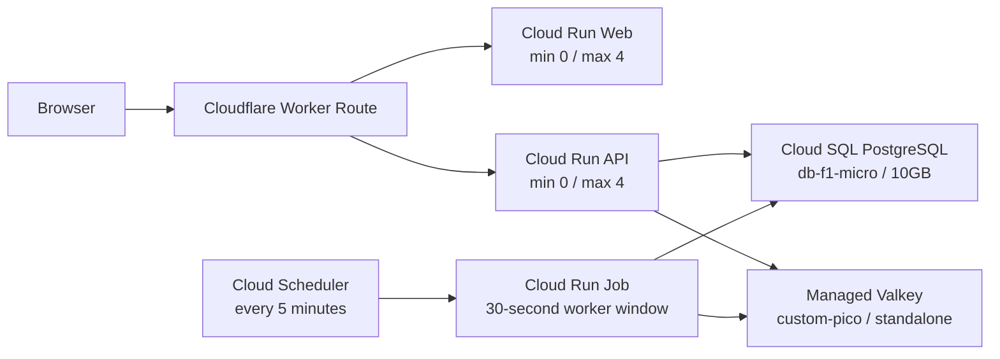

# Always-available managed demo cost floor

## Outcome and budget

The target is a fully functional, randomly accessible production demo at approximately USD 45–55 per month during periods with no scheduled ticket opening. The following remain real, not mocked: signup/login, payment and refund, SMS/email, queue and seat locks, QR ticket/check-in, and production admin writes.

Estimated steady-state list price at the currently observed near-zero traffic level:

| Component | Monthly estimate |
| --- | ---: |
| Cloud SQL `db-f1-micro` compute | `$9–11` |
| 10GB SSD, backups, and PITR storage | `$2–3` |
| Cloud SQL public IPv4 retained for GitHub-hosted migrations | `$7–9` |
| Valkey `custom-pico`, 1 shard, 0 replicas | `$22.5–28.8` |
| Cloud Run Web/API plus the five-minute bounded Job | `$0–2` |
| Secret Manager and protected Artifact Registry images | `$2.5–4` |
| Cloudflare Worker Route below free allowance | `$0` |
| **Operating target** | **about `$47–55`** |

This is an estimate, not a billing guarantee. A `$45` early-warning and `$55` hard-review budget alert must be enabled. The first cutover month can exceed the target by the prorated overlap cost while original resources are retained for rollback.

## Target topology



The Job boots only the modules needed for pg-boss, payment/refund retry, QR email, cancelled-seat release, and pending-payment expiration. It runs one immediate expiration sweep, processes queued jobs for 30 seconds, and closes pg-boss, Nest, Redis, and PostgreSQL clients. At a five-minute schedule this is roughly 262,800 vCPU-seconds per month before startup variance, close to the Cloud Run Jobs free allocation.

## Non-negotiable gates before mutation

1. Keep `docs/runbooks/managed-demo-baseline-2026-08-25.md` unchanged as the restoration ledger.
2. Create a new rollback export bucket; never overwrite an earlier export.
3. Export the full original database, record object generation, size, CRC32C, and MD5, and download or copy it to a second location.
4. Record `pg_database_size('grapit')` from the source and require at least 25% free headroom inside the `10GB` target. The compressed dump size is an integrity and transfer signal only; it is not a storage-capacity gate.
5. Import into a differently named Cloud SQL instance and reconcile schema migration state plus critical table counts before changing secrets.
6. Cut Valkey only when active seat-lock and admission-queue keys are zero. Valkey is transient and is not treated as a durable backup.
7. Add new Secret Manager versions; never destroy versions `database-url:2` or `redis-url:1` during the rollback window.
8. Keep the original SQL instance stopped for seven days and original Valkey for at least 24 hours after successful smoke tests.
9. Do not delete the GCP load balancer until the edge proxy passes HTTP, WebSocket, OAuth callback, webhook, and rollback tests.

## Phase 1 — database export and small-instance restore

Use unique values for `CUTOVER_ID` and the bucket name. Commands below are intentionally explicit about project and region.

The initiating identity needs Cloud SQL Editor or a custom role containing `cloudsql.instances.get` and `cloudsql.instances.export`. Import requires Cloud SQL Admin or a custom role containing `cloudsql.instances.get` and `cloudsql.instances.import`. The source/target Cloud SQL service account separately needs the documented Cloud Storage object permissions.

```bash
PROJECT_ID=grapit-491806
REGION=asia-northeast3
ZONE=asia-northeast3-a
SOURCE_SQL=grapit-db
TARGET_SQL=grabit-db-managed-demo
CUTOVER_ID=20260825-managed-demo
ROLLBACK_BUCKET=grapit-db-rollback-20260825
ROLLBACK_SECONDARY_BUCKET=grapit-db-rollback-secondary-20260825

gcloud storage buckets create "gs://${ROLLBACK_BUCKET}" \
  --project="${PROJECT_ID}" \
  --location="${REGION}" \
  --uniform-bucket-level-access

SQL_SERVICE_ACCOUNT=$(gcloud sql instances describe "${SOURCE_SQL}" \
  --project="${PROJECT_ID}" \
  --format='value(serviceAccountEmailAddress)')

gcloud storage buckets add-iam-policy-binding "gs://${ROLLBACK_BUCKET}" \
  --member="serviceAccount:${SQL_SERVICE_ACCOUNT}" \
  --role='roles/storage.objectAdmin'

gcloud sql export sql "${SOURCE_SQL}" \
  "gs://${ROLLBACK_BUCKET}/${CUTOVER_ID}/full.sql.gz" \
  --project="${PROJECT_ID}" \
  --database=grabit

gcloud storage objects describe \
  "gs://${ROLLBACK_BUCKET}/${CUTOVER_ID}/full.sql.gz" \
  --format='yaml(name,generation,size,crc32c,md5Hash,createTime)'

gcloud storage buckets create "gs://${ROLLBACK_SECONDARY_BUCKET}" \
  --project="${PROJECT_ID}" \
  --location=asia-northeast1 \
  --uniform-bucket-level-access

gcloud storage cp \
  "gs://${ROLLBACK_BUCKET}/${CUTOVER_ID}/full.sql.gz" \
  "gs://${ROLLBACK_SECONDARY_BUCKET}/${CUTOVER_ID}/full.sql.gz"
```

Through an authenticated source connection, record the uncompressed database size:

```sql
SELECT pg_database_size('grapit') AS database_bytes;
```

For a 10GiB target, abort if `database_bytes * 1.25 >= 10 * 1024^3`. Also measure `pg_database_size('grapit')` after the disposable restore because restored heap/index layout can differ from the source. Create the target only after the source-size and backup-integrity gates pass:

```bash
gcloud sql instances create "${TARGET_SQL}" \
  --project="${PROJECT_ID}" \
  --database-version=POSTGRES_16 \
  --edition=enterprise \
  --zone="${ZONE}" \
  --tier=db-f1-micro \
  --availability-type=zonal \
  --storage-type=SSD \
  --storage-size=10 \
  --storage-auto-increase \
  --assign-ip \
  --backup-start-time=03:00 \
  --retained-backups-count=7 \
  --enable-point-in-time-recovery \
  --deletion-protection
```

Re-create the application database user without printing its password, import the dump, and add a new `database-url` secret version. Record the new version number in the cutover log. The runbook operator must use stdin or an access-token REST request for password handling; raw passwords must not appear in shell history, process output, or documentation.

Before cutover, compare at minimum:

- Drizzle migration rows and schema version;
- users, performances, showtimes, reservations, payments, refunds, ticket items, tickets, entry events, and audit rows;
- sums of completed payment amounts and completed refund amounts;
- at least one historical reservation detail and QR read path;
- backup status and a test restore into a disposable database.

## Phase 2 — managed Valkey replacement

Create a differently named Cluster Mode Disabled instance. `custom-pico` is selected because it is the smallest current managed custom node type with SLA-capable hardware and is slightly cheaper than `shared-core-nano` at current list price. This one-node, zero-replica managed-demo posture itself has no availability SLA; restoring a ticket-opening posture requires replicas and load evidence.

```bash
gcloud memorystore instances create grabit-valkey-managed-demo \
  --project=grapit-491806 \
  --location=asia-northeast3 \
  --engine-version=VALKEY_8_0 \
  --node-type=custom-pico \
  --mode=cluster-disabled \
  --shard-count=1 \
  --replica-count=0 \
  --endpoints='[{"connections":[{"pscAutoConnection":{"network":"projects/grapit-491806/global/networks/default","projectId":"grapit-491806"}}]}]' \
  --zone-distribution-config-mode=single-zone \
  --zone-distribution-config=asia-northeast3-a \
  --deletion-protection-enabled
```

Some gcloud help output omits `custom-pico` even though the regional API accepts it. Submit the create request and verify the resulting instance reports `CUSTOM_PICO`; do not silently substitute `shared-core-nano` or `standard-small`.

After the new endpoint is active:

1. confirm zero active seat-lock and admission-queue keys on the original instance;
2. add a new `redis-url` secret version without printing the URL;
3. set GitHub Actions repository variable `VALKEY_MODE=standalone`;
4. deploy and verify API health reports the standalone managed Valkey connection;
5. keep the original `grabit-valkey` unchanged for at least 24 hours.

## Phase 3 — Cloud Run services and bounded worker

Set these GitHub Actions repository variables immediately before the managed-demo cutover:

- `API_MIN_INSTANCES=0`, `API_MAX_INSTANCES=4`;
- `WEB_MIN_INSTANCES=0`, `WEB_MAX_INSTANCES=4`;
- `API_CPU_ALLOCATION_FLAG=--cpu-throttling`;
- `DB_POOL_MAX=2`;
- `BACKGROUND_PROCESSING_ENABLED=false`;
- `VALKEY_MODE=standalone` after the Valkey secret cutover.

Without those variables, workflow defaults preserve the warm ticket-opening posture (`1/40` API, `1/50` Web, instance-based API CPU, pool size `4`, continuous background processing, cluster Valkey). In managed-demo mode the API remains a pg-boss producer but does not run scheduler, supervisor, queue-worker, or pending-payment timers while its CPU is throttled. The workflow deploys and synchronously smokes `grabit-background-worker` from the same immutable API image with background processing explicitly enabled. If `API_MIN_INSTANCES=0`, deployment refuses to change the API unless `grabit-background-worker-every-5m` already exists in `ENABLED` state.

API deploy uses `--set-cloudsql-instances`, not `--add-cloudsql-instances`, so the Secret-selected connection is the only mounted Cloud SQL instance after a cutover or rollback. Change `CLOUD_SQL_CONNECTION_NAME` before deployment and verify the resulting revision annotation contains exactly the intended instance.

The workflow renders the complete Job definition with `scripts/managed-demo/deploy-background-worker-v2.mjs`, validates it with the Cloud Run v2 `jobs.patch` `validateOnly` path, applies it through the same v2 API, and reads the image back before executing the smoke run. This preserves one deterministic Job configuration and avoids the legacy v1 deploy path that returned a false service-account `actAs` denial even after direct IAM and Policy Troubleshooter checks succeeded. The pure payload contract is covered by `deploy-background-worker-v2.test.mjs` in CI.

Safe rollout order is two-stage: first deploy with warm defaults to create/smoke the Job, then run the Scheduler script, set the managed-demo variables, and manually dispatch the deploy workflow again. Do not set `API_MIN_INSTANCES=0` before the Scheduler job exists.

Provision the schedule with the guarded script, then use these commands to execute and inspect the Job during an operator rehearsal:

```bash
scripts/managed-demo/configure-background-scheduler.sh --apply

gcloud run jobs execute grabit-background-worker \
  --project=grapit-491806 \
  --region=asia-northeast3 \
  --wait

gcloud run jobs executions list \
  --job=grabit-background-worker \
  --project=grapit-491806 \
  --region=asia-northeast3 \
  --limit=5

```

The accepted managed-demo delay is at most roughly five minutes for asynchronous retry, reminder, and expiration work. A failed scheduled execution, oldest pg-boss job age above ten minutes, or two consecutive missed schedules is an operational alert.

## Artifact Registry and billing guard

Before cleanup, add a dated `rollback-*` tag to the exact API and Web digests serving production. Apply the repository policy only after both tags resolve to those digests:

```bash
gcloud artifacts repositories set-cleanup-policies grabit \
  --project=grapit-491806 \
  --location=asia-northeast3 \
  --policy=scripts/managed-demo/artifact-registry-cleanup-policy.json \
  --no-dry-run
```

The policy deletes only untagged artifacts older than 14 days, keeps ten recent versions per package, and preserves `rollback-*` tags. Artifact Registry does not delete a Docker image still referenced by a parent manifest. Record repository size before and after the periodic policy run.

The billing account is denominated in KRW. Convert the USD 45/55 guardrails when the budget is changed, record the rate/date in the cutover log, and keep current-spend alerts near USD 45 and USD 55 plus a forecasted-spend alert near USD 55. A budget is a notification mechanism, not a hard spending cap.

## Phase 4 — Cloudflare edge proxy and load-balancer retirement

`apps/edge-proxy` is a host allow-listed streaming proxy. It overwrites forwarded-host metadata, preserves request bodies and WebSocket upgrades, and rewrites only same-origin redirects. It uses Worker Routes on the existing proxied DNS records, so the GCP load balancer remains the fallback during canary.

Cloudflare authentication is deliberately not stored in this repository. From an authenticated operator shell:

```bash
cd apps/edge-proxy
../../node_modules/.bin/wrangler deploy

# Smoke the workers.dev staging URL first, then deploy production Routes.
../../node_modules/.bin/wrangler deploy --env production
../../node_modules/.bin/wrangler versions list --env production
```

Required canary checks:

- `/`, search, performance detail, auth/login, and admin pages;
- API health, signup/login, OAuth callback URL, and cookie scope;
- seat lock/unlock plus Socket.IO connection and broadcast;
- payment confirm, Toss webhook, refund request/retry, QR display, and check-in;
- a deliberate origin redirect confirming no `run.app` hostname leaks;
- Worker rollback using the recorded previous version ID.

Only after at least 24 hours of clean canary evidence may the forwarding rule, HTTPS proxy, URL map, backend services, NEGs, and unused address be deleted. Capture each resource as YAML before deletion. Deletion order and exact resource names are in the baseline ledger.

Worker rollback:

If a previously verified production Worker version exists, use a version rollback:

```bash
cd apps/edge-proxy
../../node_modules/.bin/wrangler versions list --env production
../../node_modules/.bin/wrangler rollback PREVIOUS_VERSION_ID \
  --env production \
  --message='managed-demo rollback' \
  --yes
```

The first production deployment has no previous Worker version. During that
initial canary, remove only these three Worker Routes in the Cloudflare
dashboard, then verify the unchanged proxied DNS records fall through to the
retained GCP load balancer:

- `heygrabit.com/*`;
- `www.heygrabit.com/*`;
- `api.heygrabit.com/*`.

Preserve the Worker script and deployed version as evidence. Do not delete DNS
records, and do not use `wrangler delete` as the first rollback action.

## Immediate infrastructure rollback

Use this path during the retention window:

1. start `grapit-db` if it was stopped;
2. add a new `database-url` version containing the same value as preserved version `2`, or explicitly bind version `2` during an emergency deploy;
3. add a new `redis-url` version containing the same value as preserved version `1`, and set `VALKEY_MODE=cluster`;
4. set `BACKGROUND_PROCESSING_ENABLED=true`, then deploy the preserved image SHA or route Cloud Run traffic to `grabit-api-00242-2vn` and `grabit-web-00191-zw8`;
5. disable `grabit-background-worker-every-5m` only after an API instance is kept warm and its continuous workers are verified;
6. rollback/remove the Worker Route so traffic returns to the still-retained GCP load balancer;
7. run the full smoke checklist and reconcile any writes made after the cutover. Database rollback is not a blind pointer flip if both databases accepted writes; choose a source of truth and reconcile first.

## Restore for an actual ticket opening

Begin this process at least 14 days before sales open. The old baseline is a restoration reference, not proof that it is sale-ready.

1. Set `BOOKING_ENABLED=false` while capacity changes and verification are in progress.
2. Resize or replace Cloud SQL to at least the prior `db-custom-2-12288` capacity, then load-test. Reconsider REGIONAL availability before public sale or venue-entry windows.
3. Create a new Cluster Mode Enabled Valkey instance sized from load evidence, with replicas where availability requires them. Set `VALKEY_MODE=cluster`.
4. Restore Web/API minimum instances `1`; restore API instance-based CPU, set `BACKGROUND_PROCESSING_ENABLED=true`, and restore the tested maximums (`40` API / `50` Web were the prior ceilings).
5. Pause the five-minute Job only after continuous pg-boss workers are verified on the warm API revision.
6. Choose a ticket-opening edge: a tested Cloudflare Worker plan with adequate limits, or a rebuilt GCP load balancer whose new certificates are `ACTIVE`.
7. Pass load/concurrency, DB backup restore, signup/login, SMS/email, payment/webhook/refund, queue/seat-lock, QR/check-in/offline sync, admin write, logs/alerts, and rollback rehearsals.
8. Enable `BOOKING_ENABLED=true` only after the evidence gates pass.

Official references: [Cloud Run minimum instances and scale to zero](https://cloud.google.com/run/docs/configuring/min-instances), [Cloud Run Jobs v2 patch](https://cloud.google.com/run/docs/reference/rest/v2/projects.locations.jobs/patch), [Cloud Run WebSockets](https://cloud.google.com/run/docs/triggering/websockets), [Cloud SQL instance settings](https://cloud.google.com/sql/docs/postgres/instance-settings), [Memorystore for Valkey node specifications](https://cloud.google.com/memorystore/docs/valkey/instance-node-specification), [Cloudflare Worker Routes](https://developers.cloudflare.com/workers/configuration/routing/routes/), and [Cloudflare Workers pricing](https://developers.cloudflare.com/workers/platform/pricing/).
