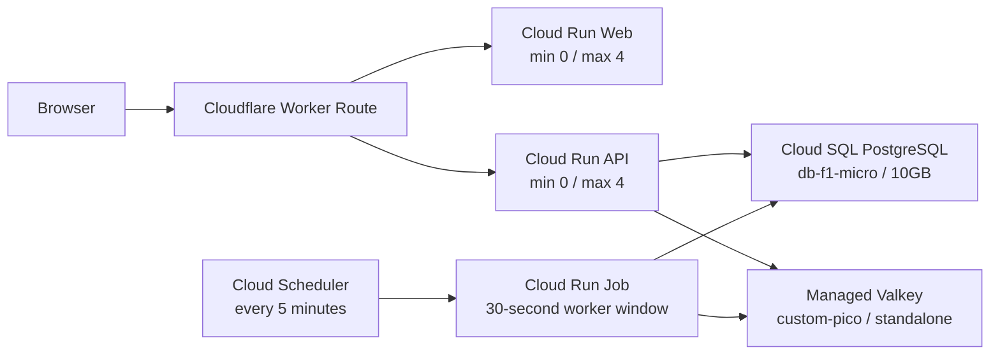

# Always-available managed demo cost floor

## Outcome and budget

The target is a fully functional, randomly accessible production demo at approximately USD 45–55 per month during periods with no scheduled ticket opening. The following remain real, not mocked: signup/login, payment and refund, SMS/email, queue and seat locks, QR ticket/check-in, and production admin writes.

Estimated steady-state list price at the currently observed near-zero traffic level:

| Component | Monthly estimate |
| --- | ---: |
| Cloud SQL `db-f1-micro` compute | `$9–11` |
| 10GB SSD, backups, and PITR storage | `$2–3` |
| Cloud SQL public IPv4 retained for GitHub-hosted migrations | `$7–9` |
| Valkey `custom-pico`, 1 shard, 0 replicas | `$22.5–28.8` |
| Cloud Run Web/API plus the five-minute bounded Job | `$0–2` |
| Secret Manager and protected Artifact Registry images | `$2.5–4` |
| Cloudflare Worker Route below free allowance | `$0` |
| **Operating target** | **about `$47–55`** |

This is an estimate, not a billing guarantee. A `$45` early-warning and `$55` hard-review budget alert must be enabled. The first cutover month can exceed the target by the prorated overlap cost while original resources are retained for rollback.

## Target topology


```mermaid
flowchart LR
  Browser --> CF[Cloudflare Worker Route]
  CF --> Web[Cloud Run Web\nmin 0 / max 4]
  CF --> API[Cloud Run API\nmin 0 / max 4]
  Scheduler[Cloud Scheduler\nevery 5 minutes] --> Job[Cloud Run Job\n30-second worker window]
  API --> SQL[Cloud SQL PostgreSQL\ndb-f1-micro / 10GB]
  Job --> SQL
  API --> Valkey[Managed Valkey\ncustom-pico / standalone]
  Job --> Valkey
```

The Job boots only the modules needed for pg-boss, payment/refund retry, payment confirm reconcile, QR email, cancelled-seat release, and pending-payment expiration. It runs one immediate expiration sweep, processes queued jobs for 30 seconds, and closes pg-boss, Nest, Redis, and PostgreSQL clients. A failed sweep is logged and still keeps the 30-second queue window open; the execution then exits non-zero. An execution whose pg-boss could not start or register workers also exits non-zero, so either case raises the failed-execution alert. At a five-minute schedule this is roughly 262,800 vCPU-seconds per month before startup variance, close to the Cloud Run Jobs free allocation.

## Non-negotiable gates before mutation

1. Keep `docs/runbooks/managed-demo-baseline-2026-08-25.md` unchanged as the restoration ledger.
2. Create a new rollback export bucket; never overwrite an earlier export.
3. Export the full original database, record object generation, size, CRC32C, and MD5, and download or copy it to a second location.
4. Record `pg_database_size('grapit')` from the source and require at least 25% free headroom inside the `10GB` target. The compressed dump size is an integrity and transfer signal only; it is not a storage-capacity gate.
5. Import into a differently named Cloud SQL instance and reconcile schema migration state plus critical table counts before changing secrets.
6. Cut Valkey only when active seat-lock and admission-queue keys are zero. Valkey is transient and is not treated as a durable backup.
7. Add new Secret Manager versions; never destroy versions `database-url:2` or `redis-url:1` during the rollback window.
8. Keep the original SQL instance stopped for seven days and original Valkey for at least 24 hours after successful smoke tests.
9. Do not delete the GCP load balancer until the edge proxy passes HTTP, WebSocket, OAuth callback, webhook, and rollback tests.

## Phase 1 — database export and small-instance restore

Use unique values for `CUTOVER_ID` and the bucket name. Commands below are intentionally explicit about project and region.

The initiating identity needs Cloud SQL Editor or a custom role containing `cloudsql.instances.get` and `cloudsql.instances.export`. Import requires Cloud SQL Admin or a custom role containing `cloudsql.instances.get` and `cloudsql.instances.import`. The source/target Cloud SQL service account separately needs the documented Cloud Storage object permissions.

```bash
PROJECT_ID=grapit-491806
REGION=asia-northeast3
ZONE=asia-northeast3-a
SOURCE_SQL=grapit-db
TARGET_SQL=grabit-db-managed-demo
CUTOVER_ID=20260825-managed-demo
ROLLBACK_BUCKET=grapit-db-rollback-20260825
ROLLBACK_SECONDARY_BUCKET=grapit-db-rollback-secondary-20260825

gcloud storage buckets create "gs://${ROLLBACK_BUCKET}" \
  --project="${PROJECT_ID}" \
  --location="${REGION}" \
  --uniform-bucket-level-access

SQL_SERVICE_ACCOUNT=$(gcloud sql instances describe "${SOURCE_SQL}" \
  --project="${PROJECT_ID}" \
  --format='value(serviceAccountEmailAddress)')

gcloud storage buckets add-iam-policy-binding "gs://${ROLLBACK_BUCKET}" \
  --member="serviceAccount:${SQL_SERVICE_ACCOUNT}" \
  --role='roles/storage.objectAdmin'

gcloud sql export sql "${SOURCE_SQL}" \
  "gs://${ROLLBACK_BUCKET}/${CUTOVER_ID}/full.sql.gz" \
  --project="${PROJECT_ID}" \
  --database=grabit

gcloud storage objects describe \
  "gs://${ROLLBACK_BUCKET}/${CUTOVER_ID}/full.sql.gz" \
  --format='yaml(name,generation,size,crc32c,md5Hash,createTime)'

gcloud storage buckets create "gs://${ROLLBACK_SECONDARY_BUCKET}" \
  --project="${PROJECT_ID}" \
  --location=asia-northeast1 \
  --uniform-bucket-level-access

gcloud storage cp \
  "gs://${ROLLBACK_BUCKET}/${CUTOVER_ID}/full.sql.gz" \
  "gs://${ROLLBACK_SECONDARY_BUCKET}/${CUTOVER_ID}/full.sql.gz"
```

Through an authenticated source connection, record the uncompressed database size:

```sql
SELECT pg_database_size('grapit') AS database_bytes;
```

For a 10GiB target, abort if `database_bytes * 1.25 >= 10 * 1024^3`. Also measure `pg_database_size('grapit')` after the disposable restore because restored heap/index layout can differ from the source. Create the target only after the source-size and backup-integrity gates pass:

```bash
gcloud sql instances create "${TARGET_SQL}" \
  --project="${PROJECT_ID}" \
  --database-version=POSTGRES_16 \
  --edition=enterprise \
  --zone="${ZONE}" \
  --tier=db-f1-micro \
  --availability-type=zonal \
  --storage-type=SSD \
  --storage-size=10 \
  --storage-auto-increase \
  --assign-ip \
  --backup-start-time=03:00 \
  --retained-backups-count=7 \
  --enable-point-in-time-recovery \
  --deletion-protection
```

Re-create the application database user without printing its password, import the dump, and add a new `database-url` secret version. Record the new version number in the cutover log. The runbook operator must use stdin or an access-token REST request for password handling; raw passwords must not appear in shell history, process output, or documentation.

Before cutover, compare at minimum:

- Drizzle migration rows and schema version;
- users, performances, showtimes, reservations, payments, refunds, ticket items, tickets, entry events, and audit rows;
- sums of completed payment amounts and completed refund amounts;
- at least one historical reservation detail and QR read path;
- backup status and a test restore into a disposable database.

## Phase 2 — managed Valkey replacement

Create a differently named Cluster Mode Disabled instance. `custom-pico` is selected because it is the smallest current managed custom node type with SLA-capable hardware and is slightly cheaper than `shared-core-nano` at current list price. This one-node, zero-replica managed-demo posture itself has no availability SLA; restoring a ticket-opening posture requires replicas and load evidence.

```bash
gcloud memorystore instances create grabit-valkey-managed-demo \
  --project=grapit-491806 \
  --location=asia-northeast3 \
  --engine-version=VALKEY_8_0 \
  --node-type=custom-pico \
  --mode=cluster-disabled \
  --shard-count=1 \
  --replica-count=0 \
  --endpoints='[{"connections":[{"pscAutoConnection":{"network":"projects/grapit-491806/global/networks/default","projectId":"grapit-491806"}}]}]' \
  --zone-distribution-config-mode=single-zone \
  --zone-distribution-config=asia-northeast3-a \
  --deletion-protection-enabled
```

Some gcloud help output omits `custom-pico` even though the regional API accepts it. Submit the create request and verify the resulting instance reports `CUSTOM_PICO`; do not silently substitute `shared-core-nano` or `standard-small`.

This demo instance keeps the Memorystore default `maxmemory-policy=volatile-lru` and has no maintenance window. Both are acceptable only while no sale is scheduled: a node restart or maintenance event wipes seat locks, confirmation leases and queue positions. `scripts/provision-valkey.sh` (single `shared-core-nano`, zero replicas) is legacy/demo only and refuses to run without `--legacy-demo`.

After the new endpoint is active:

1. confirm zero active seat-lock and admission-queue keys on the original instance;
2. add a new `redis-url` secret version without printing the URL;
3. set GitHub Actions repository variable `VALKEY_MODE=standalone`;
4. deploy and verify API health reports the standalone managed Valkey connection;
5. keep the original `grabit-valkey` unchanged for at least 24 hours.

## Phase 3 — Cloud Run services and bounded worker

Set these GitHub Actions repository variables immediately before the managed-demo cutover:

- `API_MIN_INSTANCES=0`, `API_MAX_INSTANCES=4`;
- `WEB_MIN_INSTANCES=0`, `WEB_MAX_INSTANCES=4`;
- `API_CPU_ALLOCATION_FLAG=--cpu-throttling`;
- `DB_POOL_MAX=2`;
- `BACKGROUND_PROCESSING_ENABLED=false`;
- `VALKEY_MODE=standalone` after the Valkey secret cutover.

`BOOKING_ENABLED` is a separate repository variable shared by API, Web and the bounded worker; when it is unset the workflow deploys `true`, which preserves the current production behaviour. See [Sitewide booking kill switch](#sitewide-booking-kill-switch).

Without those variables, workflow defaults preserve the warm ticket-opening posture (`1/40` API, `1/50` Web, instance-based API CPU, pool size `4`, continuous background processing, cluster Valkey). In managed-demo mode the API remains a pg-boss producer but does not run scheduler, supervisor, queue-worker, or pending-payment timers while its CPU is throttled. The one exception is the in-process view-count flush timer (every 10 seconds, in every API instance). While throttled it can fire late, when the next request arrives. Each flush is a single PostgreSQL message that commits before replying, so a throttled instance never holds a `performances` row lock idle in transaction. Unflushed views of an instance that is scaled in without a graceful shutdown are lost; they only affect popularity ordering. The workflow deploys and synchronously smokes `grabit-background-worker` from the same immutable API image with background processing explicitly enabled. If `API_MIN_INSTANCES=0`, deployment refuses to change the API unless `grabit-background-worker-every-5m` already exists in `ENABLED` state.

API deploy uses `--set-cloudsql-instances`, not `--add-cloudsql-instances`, so the Secret-selected connection is the only mounted Cloud SQL instance after a cutover or rollback. Change `CLOUD_SQL_CONNECTION_NAME` before deployment and verify the resulting revision annotation contains exactly the intended instance.

The workflow renders the complete Job definition with `scripts/managed-demo/deploy-background-worker-v2.mjs`, validates it with the Cloud Run v2 `jobs.patch` `validateOnly` path, applies it through the same v2 API, and reads the image back before executing the smoke run. This preserves one deterministic Job configuration and avoids the legacy v1 deploy path that returned a false service-account `actAs` denial even after direct IAM and Policy Troubleshooter checks succeeded. The pure payload contract is covered by `deploy-background-worker-v2.test.mjs` in CI, together with the deploy guards and Valkey posture check under `scripts/managed-demo/*.test.mjs`.

Safe rollout order is two-stage: first deploy with warm defaults to create/smoke the Job, then run the Scheduler script, set the managed-demo variables, and manually dispatch the deploy workflow again. Do not set `API_MIN_INSTANCES=0` before the Scheduler job exists.

Provision the schedule with the guarded script, then use these commands to execute and inspect the Job during an operator rehearsal:

```bash
scripts/managed-demo/configure-background-scheduler.sh --apply

gcloud run jobs execute grabit-background-worker \
  --project=grapit-491806 \
  --region=asia-northeast3 \
  --wait

gcloud run jobs executions list \
  --job=grabit-background-worker \
  --project=grapit-491806 \
  --region=asia-northeast3 \
  --limit=5

```

The accepted managed-demo delay is at most roughly five minutes for asynchronous retry, reminder, and expiration work. A failed scheduled execution, oldest pg-boss job age above ten minutes, or two consecutive missed schedules is an operational alert.

## Artifact Registry and billing guard

Before cleanup, add a dated `rollback-*` tag to the exact API and Web digests serving production. Apply the repository policy only after both tags resolve to those digests:

```bash
gcloud artifacts repositories set-cleanup-policies grabit \
  --project=grapit-491806 \
  --location=asia-northeast3 \
  --policy=scripts/managed-demo/artifact-registry-cleanup-policy.json \
  --no-dry-run
```

The policy deletes only untagged artifacts older than 14 days, keeps ten recent versions per package, and preserves `rollback-*` tags. Artifact Registry does not delete a Docker image still referenced by a parent manifest. Record repository size before and after the periodic policy run.

The billing account is denominated in KRW. Convert the USD 45/55 guardrails when the budget is changed, record the rate/date in the cutover log, and keep current-spend alerts near USD 45 and USD 55 plus a forecasted-spend alert near USD 55. A budget is a notification mechanism, not a hard spending cap.

## Phase 4 — Cloudflare edge proxy and load-balancer retirement

`apps/edge-proxy` is a host allow-listed streaming proxy. It overwrites forwarded-host metadata, preserves request bodies and WebSocket upgrades, and rewrites only same-origin redirects. It uses Worker Routes on the existing proxied DNS records, so the GCP load balancer remains the fallback during canary.

Cloudflare authentication is deliberately not stored in this repository. From an authenticated operator shell:

```bash
cd apps/edge-proxy
../../node_modules/.bin/wrangler deploy

# Smoke the workers.dev staging URL first, then deploy production Routes.
../../node_modules/.bin/wrangler deploy --env production
../../node_modules/.bin/wrangler versions list --env production
```

Required canary checks:

- `/`, search, performance detail, auth/login, and admin pages;
- API health, signup/login, OAuth callback URL, and cookie scope;
- seat lock/unlock plus Socket.IO connection and broadcast;
- payment confirm, Toss webhook, refund request/retry, QR display, and check-in;
- a deliberate origin redirect confirming no `run.app` hostname leaks;
- Worker rollback using the recorded previous version ID.

Only after at least 24 hours of clean canary evidence may the forwarding rule, HTTPS proxy, URL map, backend services, NEGs, and unused address be deleted. Capture each resource as YAML before deletion. Deletion order and exact resource names are in the baseline ledger.

Worker rollback:

If a previously verified production Worker version exists, use a version rollback:

```bash
cd apps/edge-proxy
../../node_modules/.bin/wrangler versions list --env production
../../node_modules/.bin/wrangler rollback PREVIOUS_VERSION_ID \
  --env production \
  --message='managed-demo rollback' \
  --yes
```

The first production deployment has no previous Worker version. During that
initial canary, remove only these three Worker Routes in the Cloudflare
dashboard, then verify the unchanged proxied DNS records fall through to the
retained GCP load balancer:

- `heygrabit.com/*`;
- `www.heygrabit.com/*`;
- `api.heygrabit.com/*`.

Preserve the Worker script and deployed version as evidence. Do not delete DNS
records, and do not use `wrangler delete` as the first rollback action.

## Immediate infrastructure rollback

Use this path during the retention window:

1. start `grapit-db` if it was stopped;
2. add a new `database-url` version containing the same value as preserved version `2`, or explicitly bind version `2` during an emergency deploy;
3. add a new `redis-url` version containing the same value as preserved version `1`, and set `VALKEY_MODE=cluster`;
4. set `BACKGROUND_PROCESSING_ENABLED=true`, then deploy the preserved image SHA or route Cloud Run traffic to `grabit-api-00242-2vn` and `grabit-web-00191-zw8`;
5. disable `grabit-background-worker-every-5m` only after an API instance is kept warm and its continuous workers are verified;
6. rollback/remove the Worker Route so traffic returns to the still-retained GCP load balancer;
7. run the full smoke checklist and reconcile any writes made after the cutover. Database rollback is not a blind pointer flip if both databases accepted writes; choose a source of truth and reconcile first.

## Restore for an actual ticket opening

Begin this process at least 14 days before sales open. The old baseline is a restoration reference, not proof that it is sale-ready.

1. Close the sitewide gate with the [kill-switch procedure](#sitewide-booking-kill-switch): set repository variable `BOOKING_ENABLED=false` first, then update the live API/Web/worker. Keep it closed while capacity changes and verification are in progress. Every deploy reads the same variable, so merges during preparation cannot reopen it.
2. Resize or replace Cloud SQL to at least the prior `db-custom-2-12288` capacity, then load-test. Reconsider REGIONAL availability before public sale or venue-entry windows.
3. Verify the PostgreSQL connection budget before load tests: `API_MAX_INSTANCES × (DB_POOL_MAX + PGBOSS_POOL_MAX)` for the API, plus `DB_POOL_MAX + PGBOSS_POOL_MAX` for the worker, plus `DB_CONNECTION_RESERVE`, must not exceed `max_connections` minus reserved connections. `PGBOSS_POOL_MAX` (workflow default `3`) is the per-process pg-boss pool the budget counts. Keep it at or above the cap the API and worker actually use: the code default is `3` with background processing and `1` for a producer-only API. The Deploy workflow does not pass this variable to the runtime, so a runtime override must be set on the services and Job separately. Size `DB_POOL_MAX` from a single-showtime confirm load test that records pool wait and showtime-lock wait. Then set `DB_CONNECTION_BUDGET_ENFORCE=true` so the deploy workflow's database preflight fails instead of only warning when the posture can exhaust connections. The formula counts one revision. During a deploy rollout, old and new revision instances overlap until the old ones drain, so either size `DB_CONNECTION_RESERVE` for that overlap or deploy only outside peak traffic.
   - Pass the [PostgreSQL connection budget](#postgresql-connection-budget) gate on the target instance: record `max_connections`, choose `DB_POOL_MAX` and `PGBOSS_POOL_MAX` within the budget, and decide `DB_STATEMENT_TIMEOUT_MS` and `DB_IDLE_IN_TRANSACTION_SESSION_TIMEOUT_MS`. These values take effect only when the deploy configuration passes them to the API and worker; confirm them on the deployed revision and in `pg_stat_activity` before step 10.
4. Create a new Cluster Mode Enabled Valkey instance sized from load evidence. These requirements are mandatory:
   - `--replica-count` of at least `1` with multi-zone distribution, so a node failure or maintenance fails over instead of wiping state;
   - an explicit weekly window (`--maintenance-policy-weekly-window=day=DAY,startTime=hours=HOUR`, UTC) that does not fall on the opening day or venue-entry days;
   - `maxmemory-policy=noeviction` with memory headroom from the load test. Seat locks, confirmation leases and queue keys carry TTLs, so `volatile-*` policies evict them first;
   - persistence is optional because Valkey state is transient by design.

   Set `VALKEY_MODE=cluster`, then record the posture as Gate 5 evidence:

   ```bash
   gcloud memorystore instances describe INSTANCE \
     --project=grapit-491806 --location=asia-northeast3 --format=json > valkey.json
   node scripts/managed-demo/verify-valkey-sale-posture.mjs valkey.json \
     --protect=OPEN_START_ISO/OPEN_END_ISO \
     --protect=ENTRY_START_ISO/ENTRY_END_ISO
   ```

   The check fails for zero replicas, single-zone placement, `shared-core-nano`, an evicting policy, a missing weekly window, or a weekly or already scheduled maintenance occurrence within six hours of a protected window. If `maintenanceSchedule` collides, move it with `gcloud memorystore instances reschedule-maintenance INSTANCE --location=asia-northeast3 --reschedule-type=SPECIFIC_TIME --schedule-time=UTC_ISO` and re-run the check. Rescheduling is possible up to 14 days from the original schedule, but not within one hour of its start. Memorystore sends maintenance notices at least one week ahead only to subscribed contacts, so subscribe the on-call address before the opening week.
5. Restore Web/API minimum instances `1`; restore API instance-based CPU, set `BACKGROUND_PROCESSING_ENABLED=true`, and restore the tested maximums (`40` API / `50` Web were the prior ceilings). Confirm `API_MAX_INSTANCES`/`API_MIN_INSTANCES` are not the managed-demo `4`/`0`.
6. Size API capacity for WebSockets, not only HTTP. Every waiting buyer holds one `/queue` Socket.IO connection, and an admitted buyer can also hold a `/booking` connection. Each one occupies a Cloud Run concurrency slot next to lock, prepare and confirm requests. Require `API_MAX_INSTANCES × API_CONCURRENCY ≥ 1.5 × (expected waiting + 2 × expected admitted + peak in-flight HTTP)`, adjusting `API_MAX_INSTANCES` or `API_CONCURRENCY`. The workflow pins the API request timeout to `3600s`, so sockets are not cut at the 300s default.
7. Pause the five-minute Job only after continuous pg-boss workers are verified on the warm API revision.
8. Prewarm is optional. If used, keep `grabit-prewarm-scale-up` and `grabit-prewarm-step-down` paused until the opening day. Schedule scale-up at least 15 minutes before the sale, and step-down only after the queue drains and traffic falls. Prewarm changes the service-level minimum, so it creates no new revision. Requests above the live API maximum are rejected. HTTP 200 means the service read back settled (not reconciling, Ready) with the requested minimum. `202` with `state: pending` means Cloud Run accepted the update but it had not settled within 45 seconds; check `gcloud run services describe grabit-api --format='value(scaling.minInstanceCount,reconciling)'`. The API confirms completion through `run.services.get`, which the runtime service account already holds on `grabit-api`. It never polls the operation, which would need a project-level `run.operations.get`. If prewarm is not used, keep both jobs paused. See [prewarm live verification](#prewarm-live-verification) before relying on it.
9. Choose a ticket-opening edge: a tested Cloudflare Worker plan with adequate limits, or a rebuilt GCP load balancer whose new certificates are `ACTIVE`.
10. Pass load/concurrency (including the concurrent WebSocket count from step 6), DB backup restore, signup/login, SMS/email, payment/webhook/refund, queue/seat-lock, QR/check-in/offline sync, admin write, logs/alerts, and rollback rehearsals.
11. Set `MIGRATION_FREEZE=true` from the day before the opening until venue entry ends. Hotfixes without schema changes still deploy; any pending migration fails the deploy before it touches the database.
12. Record the go/no-go decision. `/admin/cutover` shows `finalEnableAllowed:true` only for a Gate Ledger that names this opening (`opening.id`, `label`, `performanceIds`, `opensAt`) and was generated within `CUTOVER_GATE_LEDGER_MAX_AGE_DAYS` (default 30). The packaged phase26 ledger is a historical record and is reported as stale and unscoped. To use the screen for a new opening, store a regenerated ledger as a Secret Manager secret. Mount it on a path the image does not contain and that is not a symlink. `/var/run` is a symlink to `/run` in the Alpine base image, so do not use it. First verify on a tagged revision that takes no traffic:

   ```bash
   gcloud run services update grabit-api --project=grapit-491806 --region=asia-northeast3 \
     --update-secrets=/secrets/grabit-cutover/ledger.json=SECRET:latest \
     --update-env-vars=CUTOVER_GATE_LEDGER_PATH=/secrets/grabit-cutover/ledger.json \
     --no-traffic --tag=ledger-check
   ```

   Call `GET /api/v1/admin/cutover` on the `ledger-check` tag URL with an admin session. Confirm it returns this opening's `opening.id` and `freshness.state: fresh`, not `runtime_artifact_unreadable`. Then move traffic with `gcloud run services update-traffic grabit-api --to-latest`, remove the tag, and set repository variable `CUTOVER_GATE_LEDGER_PATH=/secrets/grabit-cutover/ledger.json` so the next deploy keeps it. Deploys merge secrets, so the mount persists. Without a fresh ledger, record the per-performance publication, sale-status and sale-time checks and the owner approval outside the ledger as the explicit waiver that Gate 1 requires.
13. Reopen `BOOKING_ENABLED=true` only after the evidence gates pass, using the kill-switch procedure in reverse or a manual Deploy dispatch with `allow_booking_reopen=true`.

## Sitewide booking kill switch

`BOOKING_ENABLED` is one sitewide gate. Per-performance opening is still controlled by publication, sale status and sale time. When it is false, the API rejects non-admin seat lock, prepare and confirm with 403 `예매는 추후 오픈 예정입니다`, and Web `/api/runtime-flags` reports `bookingEnabled:false`. API, Web and the worker get the same repository variable at deploy time.

Close (emergency or preparation):

```bash
gh variable set BOOKING_ENABLED --body false
gcloud run services update grabit-api --project=grapit-491806 --region=asia-northeast3 --update-env-vars=BOOKING_ENABLED=false
gcloud run services update grabit-web --project=grapit-491806 --region=asia-northeast3 --update-env-vars=BOOKING_ENABLED=false
gcloud run jobs update grabit-background-worker --project=grapit-491806 --region=asia-northeast3 --update-env-vars=BOOKING_ENABLED=false
```

Update the API first. It stops new seat locks and Toss confirm calls, so no new payment is approved through the confirm path; payments Toss has already approved still complete through the webhook and reconcile paths. Then update Web so the CTA and badges match. Verify that `https://heygrabit.com/api/runtime-flags` returns `bookingEnabled:false`, a non-admin seat lock or prepare returns 403, and API health returns 200.

If a Deploy run is in progress when you close (`gh run list --workflow=deploy.yml --status=in_progress`), wait for it to finish, then repeat the three checks above. If the flag reads `true` again, run the three close commands again.

Reopen only after the gates pass. Set the variable to `true` **before** any gcloud reopen, then run the same three updates with `BOOKING_ENABLED=true` (or dispatch the Deploy workflow with `allow_booking_reopen=true`), and verify the runtime flag and a buyer smoke. A gcloud-only reopen that leaves the variable at `false` closes sales again on the next push to `main`.

What the Deploy workflow guarantees:

- At the start of a run, the migrate job reads the live API and Web values. It fails the whole deploy before touching the database if it would switch a live `false` (or unreadable) service to `true`, unless the run is a manual dispatch with `allow_booking_reopen=true`.
- `deploy-api` and `deploy-web` read their own service again right before `deploy-cloudrun`. That is several minutes later, after image builds and the worker smoke. If the service was closed in the meantime, the job deploys `false` and keeps it closed, and the run shows a warning. If the live value cannot be read at that point, the job fails without deploying that service. A close made during a run is therefore preserved. The remaining window is the few seconds between that re-read and the Cloud Run update, which is why the post-run check above exists.
- Closing through the variable never needs approval. When a deploy switches a live `true` service to `false`, the run shows a warning annotation and step summary, so an unintended close is visible.
- The background worker receives the variable as is. It serves no buyer request, so its value does not open or close sales.

## Deploy safety settings

The Deploy workflow validates these repository variables before any job changes the database or Cloud Run:

| Variable | Default | Purpose |
| --- | --- | --- |
| `BOOKING_ENABLED` | `true` | Sitewide gate for API, Web and worker. Must be exactly `true` or `false`. |
| `MIGRATION_LOCK_TIMEOUT` | `5s` | `lock_timeout` for every migration-job session, applied through `PGOPTIONS`. |
| `MIGRATION_STATEMENT_TIMEOUT` | `60s` | `statement_timeout` for the same sessions. |
| `MIGRATION_FREEZE` | `false` | `true` fails the deploy when any migration is pending. |
| `API_CONCURRENCY` | `250` | API Cloud Run concurrency. |
| `PGBOSS_POOL_MAX`, `DB_CONNECTION_RESERVE`, `DB_CONNECTION_BUDGET_ENFORCE` | `3`, `5`, `false` | Connection budget inputs. `PGBOSS_POOL_MAX` must be at least the runtime pg-boss pool cap (code default `3`, `1` producer-only). `true` makes an over-budget posture fail the deploy. |
| `CUTOVER_GATE_LEDGER_PATH`, `CUTOVER_GATE_LEDGER_MAX_AGE_DAYS` | packaged phase26 ledger, `30` | Runtime-replaceable Gate Ledger and its freshness limit. |
| `PREWARM_SCALING_SCOPE` | `service` | `service` patches the service-level minimum. `template` is the revision-template fallback; see [prewarm live verification](#prewarm-live-verification). |

Drizzle applies all pending migrations in one transaction. If a migration cannot get its lock within `MIGRATION_LOCK_TIMEOUT`, it fails and rolls back instead of queueing every reservation and payment query behind it, and the API and Web deploy jobs do not run. Re-run the deploy in a quiet period. The database preflight reads the session settings back and refuses to migrate if `PGOPTIONS` was not applied. Build large indexes with `CREATE INDEX CONCURRENTLY` through a separate approved runbook, because the single migration transaction cannot run it.

Both timeouts apply per statement, not per transaction. Once an earlier statement holds a hot-table lock, every later statement in the batch can run up to `MIGRATION_STATEMENT_TIMEOUT` while that lock stays held. Cloud SQL runs PostgreSQL 16, which has no `transaction_timeout` (added in 17). Ship hot-table DDL in its own deploy, without long backfills in the same batch. The preflight warns when more than one migration is pending.

The API service is deployed with `--timeout=3600`, an HTTP startup probe, and an HTTP liveness probe on `/api/v1/health` (period 15s, timeout 5s, 4 failures). That endpoint checks only Valkey, so a brief Cloud SQL outage cannot cause a restart loop. An instance whose Valkey client stopped reconnecting is replaced after about one minute of continuous failures. Keep `/api/v1/health` free of database checks. `PREWARM_MAX_MIN_INSTANCES` follows `API_MAX_INSTANCES`.

Probe trade-off: Cloud Run stops a container that fails liveness with SIGKILL, without graceful shutdown. If Valkey itself is down or failing over for more than about 60 seconds, every API instance fails the probe at the same time. All of them restart together, which drops queue and seat sockets and any in-flight confirm request. Replacement instances also stay unready until Valkey answers, because the startup probe uses the same route. A Valkey outage stops seat locks and the queue anyway, so this mostly costs reconnect load and confirm retries. It still means a Valkey failover must finish well within one minute; the replica requirement in step 4 covers that. Once the Valkey client reconnects on its own (audit #7 code fix), revisit `periodSeconds`/`failureThreshold` (for example `10s × 6`) so a slow failover does not restart the fleet.

### Prewarm live verification

The service-level PATCH is the documented Cloud Run API ([minimum instances](https://cloud.google.com/run/docs/configuring/min-instances)). Phase 24-21 (2026-05) switched to `template.scaling.minInstanceCount`. The only live failure recorded then was a missing self `roles/iam.serviceAccountUser` binding, and that binding is now in place. The service-level form has not been exercised against production since. Before an opening that relies on prewarm, verify it once in a quiet period:

1. Resume both Scheduler jobs only for the test. Run scale-up with a small value no higher than the API maximum, wait for HTTP 200, then run step-down.
2. In Cloud Audit Logs, the `google.cloud.run.v2.Services.UpdateService` entries must show `scaling.minInstanceCount`, not `template.scaling`. `gcloud run revisions list --service=grabit-api` must show no new revision.
3. `gcloud run services describe grabit-api --format='value(scaling.minInstanceCount)'` must read back the stepped-down value.

If Cloud Run rejects the service-level update (Scheduler sees `503 PREWARM_SCALE_UPDATE_FAILED:400`), set repository variable `PREWARM_SCALING_SCOPE=template` and redeploy. The template form rolls a new revision on every call, so step down only after traffic falls. Cloud Run applies the highest minimum, so clear the level you leave: when moving to `template`, run `gcloud run services update grabit-api --min=0` to clear the service-level minimum; when moving back to `service`, the redeploy resets the template minimum to `API_MIN_INSTANCES`. Pause both jobs again after the test.

Official references: [Cloud Run minimum instances and scale to zero](https://cloud.google.com/run/docs/configuring/min-instances), [Cloud Run Jobs v2 patch](https://cloud.google.com/run/docs/reference/rest/v2/projects.locations.jobs/patch), [Cloud Run WebSockets](https://cloud.google.com/run/docs/triggering/websockets), [Cloud SQL instance settings](https://cloud.google.com/sql/docs/postgres/instance-settings), [Memorystore for Valkey node specifications](https://cloud.google.com/memorystore/docs/valkey/instance-node-specification), [Cloudflare Worker Routes](https://developers.cloudflare.com/workers/configuration/routing/routes/), and [Cloudflare Workers pricing](https://developers.cloudflare.com/workers/platform/pricing/).

### PostgreSQL connection budget

Every API and worker process opens two PostgreSQL pools: the application pool (`DB_POOL_MAX`, code default `10`, workflow default `4`, managed-demo `2`) and the pg-boss pool (`PGBOSS_POOL_MAX`, code default `3` when background processing runs in the process and `1` for a producer-only API; the Deploy workflow's `PGBOSS_POOL_MAX` repository variable, default `3`, is only the budget input). Before changing `API_MAX_INSTANCES`, `DB_POOL_MAX`, `PGBOSS_POOL_MAX`, or the Cloud SQL tier, verify:

```text
API_MAX_INSTANCES × (DB_POOL_MAX + PGBOSS_POOL_MAX)
+ worker Job (DB_POOL_MAX + PGBOSS_POOL_MAX), unless the Job is paused
+ rollout overlap (old and new revisions both running during a deploy)
+ migration, Cloud SQL Auth Proxy, and operator sessions
< max_connections − superuser_reserved_connections
```

- Workflow defaults at ticket opening: `40 × (4 + 3) = 280` for the API. Read the real limits with `SHOW max_connections;` and `SHOW superuser_reserved_connections;` on the target instance; do not assume a tier default.
- Do not deploy during a sale window. If a deploy cannot be avoided, budget a second API term for the overlapping revision.
- Managed demo (`db-f1-micro`): `4 × (2 + 1) + (2 + 3) = 17` before rollout overlap and operator sessions, so keep manual sessions short and avoid parallel deploys.
- During the load test, record pool usage per process and pool. Expected `application_name` values are `grabit-api`, `grabit-api-pgboss`, `grabit-background-worker`, and `grabit-background-worker-pgboss` (a value embedded in `DATABASE_URL` overrides them):

  ```sql
  SELECT application_name, state, count(*)
  FROM pg_stat_activity
  WHERE datname = current_database()
  GROUP BY 1, 2
  ORDER BY 3 DESC;
  ```

- Treat any `timeout exceeded when trying to connect` log line during the confirm-concentrated load test as a failed capacity gate: raise `DB_POOL_MAX` within the budget above or lower API concurrency, then repeat the test.
- `DB_STATEMENT_TIMEOUT_MS` and `DB_IDLE_IN_TRANSACTION_SESSION_TIMEOUT_MS` are unset by default, so production has no statement or idle-in-transaction limit until the deploy configuration passes them. Set them only from load evidence:
  - `DB_IDLE_IN_TRANSACTION_SESSION_TIMEOUT_MS` must exceed the longest external call made inside a transaction. The legacy reservation cancel awaits a Toss cancel inside its transaction, and that call has no client timeout (the only Toss client timeout in the code, 65 seconds, is on settlement queries). Start at `120000` and lower it only with evidence. A session killed by this limit after Toss accepted the cancel leaves a PG/DB mismatch; reconcile it with [Ticket cancellation reconciliation](ticket-cancellation-reconciliation.md).
  - `DB_STATEMENT_TIMEOUT_MS` also applies to admin reports and CSV exports. Measure the slowest export on production-sized data first and set the limit above it. Leave it unset if that measurement is unavailable.
- Production API and worker processes retry pg-boss startup `PGBOSS_START_MAX_ATTEMPTS` times (default `3`, 1s then 2s backoff) and then exit non-zero, so Cloud Run replaces the instance instead of serving without background jobs. A revision that keeps failing startup after a capacity change usually means exhausted connection slots or an unreachable database; check this budget first.
- On SIGTERM (scale-in, prewarm step-down, revision replacement) the API stops pg-boss gracefully for up to 8 seconds and fails unfinished jobs back to pg-boss (`retry`, or `failed` once the retry limit is used), so they are retried immediately instead of after the 15-minute expiration.
- Migration `0038_booking_lookup_indexes` adds `reservation_seats(reservation_id)` and `payments(toss_order_id)` indexes with plain `CREATE INDEX` inside the Drizzle migration transaction, which blocks writes to those tables while each index builds. Apply it through the normal deploy migration outside a sale window and confirm with `EXPLAIN` that `SELECT * FROM reservation_seats WHERE reservation_id = $1` uses `idx_reservation_seats_reservation_id`.
- Ask Cloud SQL for a maintenance deny period covering the sale and venue-entry windows. Connections dropped by maintenance, failover, or `pg_terminate_backend` no longer crash API or worker processes: idle clients are logged and replaced, and a client checked out by a query or transaction is logged and discarded when released. That query or transaction still fails, so a confirm in flight at that moment takes its existing failure path.

### Relaunch incident regression requirement

Before the next actual ticket opening, complete the [40-item relaunch handoff](show-relaunch-reliability.md). Pending reservation sweeps now rely on each Redis lock's TTL and never unlock a user's current selection. The worker's `unlockedSeats=0` is expected; inspect expired reservation counts, actual lock TTL and queue admission delay separately. Migration 0033 and the reviewed missing-benefit repair have separate preflight and approval boundaries.

The same sweep also reviews card/transfer/easy-pay/overseas-card/PayPal handoffs that never reached Toss (deadline + 45 minutes, no Payment row). It reads the Toss transaction ledger (`GET /v1/transactions`, 65-second timeout, one read per overlapping time window, at most 20 orders and a 65-second budget per sweep) with every distinct configured MID key, and fails only orders absent from all of them, recording `PAYMENT_HANDOFF_ABANDONED` with `provider_check_status=no_provider_transaction`. An order with a lookup error or page-cap overflow is looked at again after 30 minutes. A `CRITICAL: provider transaction exists for an unrecorded payment handoff` log means Toss has a transaction for an order without a local Payment: reconcile it with the Toss console before releasing seats or refunding, as in the [cancellation reconciliation runbook](ticket-cancellation-reconciliation.md). It repeats once a day per order until reconciled. Review state lives in Valkey under `{payment-handoff-review}:*`; deleting it only makes the next sweeps look again. Set `PAYMENT_HANDOFF_ABANDON_SWEEP_ENABLED=false` on the API service and the background worker job to stop the review without a code change.
